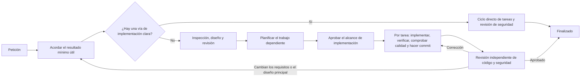

# codex-workflows

[](https://developers.openai.com/codex/cli)
[](https://developers.openai.com/codex/skills/)
[](https://opensource.org/licenses/MIT)

[English](README.md) | [简体中文](README.zh-CN.md) | [日本語](README.ja.md) | **Español** | [한국어](README.ko.md) | [Português (Brasil)](README.pt-BR.md)

En trabajos de producto grandes, Codex puede perseguir una coherencia técnica que va más allá de lo que el usuario necesita. Cubrir hasta el último caso límite y forzar un resultado determinista en cada camino puede acabar cambiando lo que ve el usuario, aunque el resultado acordado no lo requiera.

codex-workflows mantiene el trabajo dentro del resultado mínimo aprobado. Primero deja claro qué comportamiento visible puede cambiar y qué debe permanecer intacto; después exige pruebas antes de dar el trabajo por terminado. Dentro de esos límites, Codex elige detalles de implementación reversibles a partir de lo que ya existe en el repositorio.

Los flujos se instalan como Agent Skills y agentes personalizados para [OpenAI Codex CLI](https://developers.openai.com/codex/cli). La sesión principal de Codex confirma el alcance y el coste aproximado antes de diseñar, se hace cargo del avance y de las decisiones de revisión, y lleva el trabajo aprobado desde la implementación hasta una verificación independiente.

---

## ¿Por qué no usar Codex directamente?

Codex por sí solo es la mejor opción para una corrección bien acotada, un experimento desechable o un script puntual. Cuando el resultado esperado y el límite seguro de implementación ya están claros, es más rápido y económico.

Usa codex-workflows cuando una decisión técnica pueda ampliar el producto, alterar el comportamiento visible o deba conservarse al cambiar de contexto.

Por ejemplo, una petición para ampliar un flujo de autenticación existente puede desembocar en un segundo mecanismo —técnicamente más limpio—, más validaciones y un contrato de respuesta nuevo. El frontend puede adaptarse y todas las pruebas pueden pasar, pero el usuario termina recibiendo un comportamiento que nunca se aprobó.

codex-workflows evita que el alcance crezca sin control durante toda la ejecución:

| Control | Qué cambia |
|---|---|
| Alcance | El flujo contrasta la petición con el resultado deseado, las exclusiones expresas, el código existente y el coste aproximado. Lo que no justifica su coste se descarta antes de convertirse en arquitectura. |
| Controles entre fases | Los requisitos, el diseño y el plan se revisan antes de autorizar la siguiente fase. Los agentes nuevos leen las decisiones aprobadas y la evidencia que necesitan, en vez de reconstruir la intención a partir de una conversación larga. |
| Ejecución | Una vez aprobado el alcance de implementación, Codex ejecuta el conjunto de tareas de forma autónoma. Cada tarea supera su verificación específica y las comprobaciones aplicables del repositorio antes del commit de implementación. |
| Finalización | Las revisiones independientes de código y seguridad comprueban que el cambio terminado se ajuste al alcance aprobado y no contenga fallos importantes. Las correcciones obligatorias vuelven al mismo ciclo de implementación y calidad. |

Este flujo requiere más llamadas a agentes y más tokens que una ejecución directa. Úsalo cuando proteger el resultado acordado compense ese coste.

Un caso límite no exige trabajo solo porque Codex sepa resolverlo. Añadir validaciones, hacer determinista un comportamiento o crear otra abstracción debe servir para proteger un requisito aprobado o un contrato observable, o para corregir un fallo demostrado.

### Un caso real

La [integración del proveedor BytePlus Seedream en mcp-image](https://github.com/shinpr/mcp-image/pull/114) añadió un tercer proveedor externo de imágenes en 18 archivos. Ocho tareas planificadas permitieron evolucionar la implementación específica del proveedor sin modificar los contratos públicos de solicitud MCP, cliente, guardado de archivos ni URI de archivo.

Antes del merge, una evaluación contra el servicio real fijó el enrutamiento final de modelos, los límites del prompt, el timeout y el tratamiento de respuestas. Las revisiones independientes también detectaron una lectura de archivos sin límite, una vía para saltarse la validación, una ruta FIFO bloqueante y una normalización incoherente de claves API. Se corrigieron los cuatro problemas y el PR superó 303 pruebas repartidas en 19 archivos, además de una llamada real al proveedor sin reintentos. Los contratos públicos aprobados se mantuvieron intactos durante las ocho tareas y las cuatro correcciones.

---

## Inicio rápido

Necesitas Node.js 22 o posterior y la última versión de [Codex CLI](https://developers.openai.com/codex/cli).

### Instalar y ejecutar

```bash
cd your-project
npx codex-workflows install
```

Después, invoca un flujo desde Codex CLI:

```
$recipe-implement Añade autenticación de usuarios con JWT
```

El prefijo `$` invoca una skill de forma explícita. Escribe `$recipe-` para ver los flujos disponibles.

### Elige el punto de entrada

| ¿Qué necesitas? | Empieza por |
|---|---|
| Entregar un cambio de principio a fin y dejar que el flujo elija la ruta de backend, frontend o fullstack | `$recipe-implement` |
| Diseñar ahora e implementar más adelante | `$recipe-design` → `$recipe-plan` → `$recipe-build` |
| Diseñar y construir un frontend web con React / TypeScript | `$recipe-front-design` → `$recipe-front-plan` → `$recipe-front-build` |
| Empezar directamente con flujos de diseño separados para backend y frontend React | `$recipe-fullstack-implement` |
| Revisar una implementación frente a su diseño | `$recipe-review` o `$recipe-front-review` |
| Definir o actualizar reglas de calidad propias del repositorio | `$recipe-quality-profile` |
| Investigar un problema sin tocar el código | `$recipe-diagnose` |
| Hacer un experimento desechable o un script puntual | Usa Codex directamente |

---

## Cómo funciona



La ruta depende del número de decisiones independientes de producto y diseño, no de cuántos archivos cambien ni de cuántos casos límite sea capaz de encontrar Codex.

| Tamaño | Qué necesita el cambio | Qué ocurre |
|--------|------------------------|-----------|
| Pequeño | Un resultado que sigue un patrón existente en una parte del sistema | Tarea confirmada → implementación → controles de calidad y seguridad |
| Mediano | Un resultado que exige coordinar varias partes del sistema o tomar una decisión de diseño duradera | Design Doc revisado, más UI Spec / ADR si corresponde → verificación de integración/E2E seleccionada → Work Plan revisado → ciclos autónomos de tareas → verificación final |
| Grande | Varios resultados que requieren decisiones de diseño independientes | PRD y Design Docs revisados, más UI Spec / ADR si corresponde → verificación de integración/E2E seleccionada → Work Plan revisado → ciclos autónomos de tareas → verificación final |

Solo se crea un ADR para una decisión duradera dentro del alcance actual cuando existen al menos dos opciones materialmente distintas. Si hay varias decisiones que cumplen estas condiciones, sus ADR se revisan en conjunto. Una prueba de integración o E2E solo se elige cuando otra prueba más barata no puede demostrar la interacción necesaria. Hay cambios que no necesitan ninguna de las dos cosas.

Únicamente las decisiones que afectan al producto o a la implementación del repositorio pasan a documentos permanentes del proyecto. La aprobación de terceros, el acceso a producción, la ejecución de una release y otras tareas operativas ajenas no se convierten en bloqueos de implementación.

Tras aprobar el alcance, el orquestador ejecuta las tareas, sus verificaciones específicas, los controles aplicables del repositorio y un commit de implementación por tarea. Primero resuelve los problemas a partir de los documentos aprobados y de las pruebas del repositorio. El comportamiento visible sigue siendo una frontera de producto: la implementación no puede ajustarlo por su cuenta para lograr coherencia interna. El orquestador solo consulta al usuario cuando avanzar exige un requisito de producto nuevo, cambiar una decisión principal ya aprobada, usar una autorización que solo posee el usuario o realizar una acción irreversible que no se autorizó.

Cada especialista recibe un trabajo acotado, los documentos y rutas pertinentes y un resultado claro que debe entregar. Se encarga del trabajo hasta completarlo, mientras la sesión principal conserva las decisiones de producto y del flujo, interviene solo cuando hace falta tomar una decisión o resolver un bloqueo concreto y comprueba el resultado antes de pasar a la siguiente fase. Así, los especialistas pueden trabajar con autonomía sin tener autoridad para ampliar el resultado aprobado.

### Cómo se conservan las decisiones al cambiar de contexto

Separar los contextos evita que exploración, diseño, implementación y revisión compartan supuestos de forma implícita. La [plantilla de Work Plan](.agents/skills/documentation-criteria/references/plan-template.md) incluida enlaza cada tarea de implementación con su sección del Design Doc y sus criterios de aceptación:

```markdown
### P1-T1: Conservar el contrato de respuestas de error

- **Fuente**: `docs/design/example-design.md`, contrato de API, AC-2
- **Alcance**: Actualizar la implementación del repositorio y sus pruebas específicas
- **Dependencias**: ninguna
- **Verificación**: Ejecutar la prueba de contrato y comprobar la estructura de respuesta documentada
```

El [Task File Contract](.agents/skills/llm-friendly-context/references/task-template.md) lleva a la implementación la fuente, el resultado esperado, los archivos afectados y una verificación ejecutable. Solo añade un `Verification Focus` cuando una prueba podría pasar sin demostrar un comportamiento importante. Tras ejecutar la tarea, se aplican al cambio completo todos los controles pertinentes del repositorio antes del commit. Los revisores finales comparan el código terminado con los documentos aprobados. También buscan cambios fuera del alcance aprobado y problemas importantes de calidad del código. Cuando se acepta una corrección, la siguiente revisión se centra en los controles que esa corrección podría afectar. Ejecuta `$recipe-quality-profile` para definir en `docs/project-context/quality.yaml` las reglas de calidad del repositorio que se usarán durante la implementación y la revisión.

---

## Instalación

### Requisitos

- [Codex CLI](https://developers.openai.com/codex/cli) (última versión)
- Node.js >= 22

### Instalar

Instala los flujos en el proyecto actual:

```bash
cd your-project
npx codex-workflows install
```

Se copiarán estos elementos al proyecto:

- `.agents/skills/`: skills de Codex (fundamentos y flujos)
- `.codex/agents/`: definiciones TOML de subagentes
- Un manifiesto para controlar los archivos gestionados

Para que los flujos estén disponibles en todos tus proyectos, instálalos en el `CODEX_HOME` del usuario:

```bash
npx codex-workflows install --user
```

Las skills se instalan en `$CODEX_HOME/skills/` y los agentes en `$CODEX_HOME/agents/`. Si `CODEX_HOME` no está definido, se usa `~/.codex`.

### Personalizar agentes

Las definiciones de los agentes son archivos TOML normales. En una instalación de proyecto, edita los archivos de `.codex/agents/`; en una instalación de usuario, edita los de `$CODEX_HOME/agents/`. Puedes cambiar `model`, `sandbox_mode` o `developer_instructions`. Los archivos que edites se conservan durante las actualizaciones, como se explica a continuación.

### Actualizar

```bash
# Previsualizar los cambios
npx codex-workflows update --dry-run

# Aplicar la actualización
npx codex-workflows update

# Actualizar una instalación de usuario
npx codex-workflows update --user
```

El actualizador conserva los archivos que hayas modificado localmente. Compara cada archivo con su hash en el momento de la instalación y omite los que hayan cambiado. El historial de actualizaciones versionado aplica en orden los movimientos y eliminaciones, de modo que los cambios locales siguen a un archivo trasladado hasta su ruta actual. Los archivos modificados que se retiran sin sustituto se mueven a `.codex-workflows-preserved/<version>/`. Los archivos nuevos se añaden automáticamente.

```bash
# Consultar la versión instalada
npx codex-workflows status

# Consultar una instalación de usuario
npx codex-workflows status --user
```

---

## Referencia de flujos

Invoca un flujo con `$recipe-name` en Codex. Escribe `$recipe-` y usa el autocompletado con Tab para ver todas las opciones.

<details>
<summary>Ver todos los puntos de entrada</summary>

### Backend y uso general

| Flujo | Qué hace | Cuándo usarlo |
|-------|----------|---------------|
| `$recipe-implement` | Ciclo completo con selección de capa (backend/frontend/fullstack) | Funcionalidades nuevas (entrada universal) |
| `$recipe-task` | Una sola tarea con selección de reglas | Correcciones y cambios pequeños |
| `$recipe-design` | Requisitos → documentos de producto y diseño según el tamaño | Diseño de producto y arquitectura |
| `$recipe-plan` | Design Doc → esqueletos selectivos de integración/E2E → Work Plan | Planificación desde un Design Doc aprobado |
| `$recipe-prepare-implementation` | Prepara las herramientas locales ya existentes que necesita un Work Plan aprobado | Petición expresa de preparación o capacidad necesaria no disponible |
| `$recipe-build` | Ejecuta tareas de backend con validación entre pasos | Retomar una implementación de backend |
| `$recipe-review` | Revisa el alcance de implementación, el cumplimiento del Design Doc, la calidad del código y la seguridad; aplica las correcciones aprobadas por el usuario | Revisión tras implementar |
| `$recipe-quality-profile` | Define o actualiza reglas de calidad propias del repositorio en `docs/project-context/quality.yaml` | Configuración y mantenimiento de las reglas de calidad |
| `$recipe-diagnose` | Investigación → verificación del punto de fallo → solución | Investigación de errores |
| `$recipe-reverse-engineer` | Genera PRD y Design Docs a partir del código existente | Documentar sistemas heredados |
| `$recipe-add-integration-tests` | Añade pruebas de integración/E2E a partir del Design Doc | Mejorar la cobertura del código existente |
| `$recipe-update-doc` | Actualiza y revisa un Design Doc / PRD / ADR existente | Cambios de especificación y mantenimiento documental |

### Frontend (React/TypeScript)

| Flujo | Qué hace | Cuándo usarlo |
|-------|----------|---------------|
| `$recipe-front-design` | Requisitos → documentos de UI y diseño según el tamaño | Diseño de producto y arquitectura frontend |
| `$recipe-front-adjust` | Ajuste acotado de UI con pruebas del repositorio, material aportado o fuentes externas necesarias | Cambios puntuales de UI después de implementar |
| `$recipe-front-plan` | Design Doc frontend → esqueletos selectivos de integración/E2E → Work Plan | Planificación frontend |
| `$recipe-front-build` | Ejecuta tareas frontend con verificación específica y controles de calidad | Retomar una implementación frontend |
| `$recipe-front-review` | Revisa el alcance, el cumplimiento, la calidad del código y la seguridad del frontend; aplica las correcciones React aprobadas por el usuario | Revisión frontend posterior a la implementación |

### Fullstack (entre capas)

| Flujo | Qué hace | Cuándo usarlo |
|-------|----------|---------------|
| `$recipe-fullstack-implement` | Ciclo completo con un Design Doc separado por capa | Funcionalidades que cruzan capas |
| `$recipe-fullstack-build` | Ejecuta tareas asignando agentes según la capa | Retomar una implementación fullstack |

</details>

## Estado de trabajo

Los flujos usan `docs/plans/` como estado temporal para Work Plans, Task Files de implementación y Task Files provisionales de corrección o ampliación de pruebas. El avance de tareas y fases se actualiza allí después de cada commit de implementación aprobado por calidad, pero esos archivos de estado no entran en el commit. Añade el directorio al `.gitignore` del proyecto, salvo que el equipo quiera revisar expresamente esos archivos transitorios:

```gitignore
docs/plans/
```

Los PRD, ADR, UI Spec y Design Docs son documentación permanente del proyecto y sí deben incluirse en los commits.

---

## Orientaciones incluidas

Cada flujo carga las reglas adaptadas al repositorio que necesita la tarea actual. Rara vez tendrás que elegir estas skills a mano.

<details>
<summary>Ver skills fundamentales</summary>

| Skill | Qué aporta |
|-------|------------|
| `coding-rules` | Calidad de código, diseño de funciones, gestión de errores y refactorización |
| `testing` | TDD ajustado al alcance, selección de verificaciones observables, integridad de tests y verificaciones exigidas por el repositorio |
| `ai-development-guide` | Causa raíz respaldada por evidencia, análisis del impacto ajustado al alcance y control de calidad aplicable |
| `reviewee-judgment` | Evaluación basada en pruebas antes de convertir observaciones de revisión en trabajo |
| `documentation-criteria` | Reglas y plantillas para PRD, ADR, Design Doc y Work Plan |
| `requirement-convergence` | Resultado, capas de requisitos, exclusiones decididas por el usuario y coste aproximado antes del diseño |
| `implementation-approach` | MVP directo, ampliación justificada, recorte, división y frontera de verificación |
| `integration-e2e-testing` | Selección y diseño exclusivo de pruebas de integración/E2E que demuestran una interacción real necesaria |
| `external-resource-context` | Consulta acotada de una fuente externa necesaria para una decisión concreta |
| `llm-friendly-context` | Contexto claro para los agentes que lo usarán después: prompts, traspasos, artefactos generados, Task Files y observaciones de revisión |
| `task-analyzer` | Análisis de intención, clasificación de tareas y selección de skills |
| `subagent-delegation` | Delegar el trabajo a subagentes hasta que lo terminen, con consultas cuando haga falta una decisión |
| `subagents-orchestration-guide` | Coordinación multiagente, gestión de flujos y ejecución autónoma guiada |

También se incluyen referencias para TypeScript de frontend web, incluidas aplicaciones React (`coding-rules/references/typescript.md` y `testing/references/typescript.md`). No se aplican a TypeScript de backend.

</details>

---

## Agentes especializados

Codex crea estos agentes cuando un flujo los necesita. No hace falta aprender sus funciones de antemano: los flujos derivan cada trabajo al especialista adecuado y el orquestador mantiene el control general. Cada agente trabaja en su propio contexto, con instrucciones especializadas y las skills obligatorias nombradas de forma explícita.

<details>
<summary>Ver todos los agentes especializados</summary>

### Agentes de documentación

| Agente | Función |
|--------|---------|
| `requirement-analyzer` | Resume las señales de la petición y las pruebas del repositorio necesarias para decidir alcance y coste |
| `prd-creator` | Crea y estructura PRD |
| `technical-designer` | Crea un lote completo de ADR o un Design Doc (backend/general) |
| `technical-designer-frontend` | Crea un lote completo de ADR o un Design Doc frontend (React) |
| `ui-spec-designer` | Genera una UI Specification a partir del PRD y, opcionalmente, código de prototipo |
| `codebase-analyzer` | Recopila del repositorio solo la información necesaria para las decisiones técnicas, el diseño más sencillo y la verificación |
| `ui-analyzer` | Recoge hechos sobre la UI desde recursos externos (herramientas de diseño, documentación del sistema de diseño e interfaces desplegadas) y código frontend |
| `work-planner` | Crea el Work Plan a partir de Design Docs |
| `document-reviewer` | Revisa documentos frente a los requisitos y decisiones de diseño que los gobiernan |
| `design-sync` | Comprueba la coherencia entre documentos |

### Agentes de implementación

| Agente | Función |
|--------|---------|
| `task-decomposer` | Convierte el Work Plan en el menor número de Task Files ejecutables |
| `task-executor` | Implementa Task Files con verificación específica (backend) |
| `task-executor-frontend` | Implementa React con la verificación RTL de comportamiento aplicable |
| `quality-fixer` | Ejecuta los controles aplicables del repositorio y corrige problemas de calidad dentro del alcance (backend) |
| `quality-fixer-frontend` | Ejecuta y corrige controles aplicables de React, TypeScript, RTL y bundle |
| `acceptance-test-generator` | Genera esqueletos de las pruebas de integración/E2E seleccionadas |
| `integration-test-reviewer` | Revisa la calidad de las pruebas |

### Agentes de análisis

| Agente | Función |
|--------|---------|
| `code-reviewer` | Contrasta la implementación terminada con el alcance y los documentos aprobados, y señala problemas importantes de calidad del código |
| `code-verifier` | Comprueba la coherencia entre documentos y código |
| `security-reviewer` | Revisa la seguridad después de implementar |
| `rule-advisor` | Elige skills para tareas independientes no cubiertas por un flujo |
| `scope-discoverer` | Descubre el alcance del código para documentación inversa y agrupa unidades de PRD |
| `technical-spike` | Realiza una prueba acotada para medir un efecto o coste que puede cambiar una decisión de diseño |

### Agentes de diagnóstico

| Agente | Función |
|--------|---------|
| `investigator` | Recopila evidencia, traza rutas y localiza puntos de fallo |
| `verifier` | Valida la cobertura de rutas y evalúa los fallos de forma independiente |
| `solver` | Deriva soluciones y analiza sus trade-offs |

</details>

---

## Estructura del proyecto

Después de la instalación, el proyecto contiene:

<details>
<summary>Ver la estructura instalada</summary>

```
your-project/
├── .agents/skills/           # Skills de Codex
│   ├── coding-rules/         # Criterios fundamentales
│   ├── testing/
│   ├── ai-development-guide/
│   ├── reviewee-judgment/
│   ├── documentation-criteria/
│   ├── requirement-convergence/
│   ├── implementation-approach/
│   ├── integration-e2e-testing/
│   ├── external-resource-context/
│   ├── llm-friendly-context/
│   ├── task-analyzer/
│   ├── subagent-delegation/
│   ├── subagents-orchestration-guide/
│   └── recipe-*/             # Puntos de entrada ($recipe-*)
├── .codex/agents/            # Definiciones TOML de subagentes
│   ├── requirement-analyzer.toml
│   ├── technical-designer.toml
│   ├── ui-analyzer.toml
│   ├── task-executor.toml
│   └── ... (26 agentes en total)
└── docs/                     # Se crea al usar los flujos
    ├── prd/
    ├── design/
    ├── adr/
    ├── ui-spec/
    └── plans/
        └── tasks/
```

</details>

---

## Ecosistema

[Nautilus](https://github.com/shinpr/nautilus) valida ideas de producto y convierte los resultados en un PRD, mientras que [linear-prism](https://github.com/shinpr/linear-prism) convierte requisitos aprobados en incidencias de Linear listas para implementar. [claude-code-workflows](https://github.com/shinpr/claude-code-workflows) aplica el mismo enfoque a Claude Code y puede instalarse junto con codex-workflows.

### ¿Quieres usar Astra aquí?

Ejecutar un flujo completo con Astra agota el límite de uso enseguida. [codex-subagent-playbook](https://github.com/shinpr/codex-subagent-playbook) es un plugin de Codex que elige el modelo de cada subagente, así que solo usa Astra donde realmente cambia el resultado.

<details>
<summary>Configuración (2 pasos)</summary>

Ejecuta la sesión principal con Sol, o con Astra en reasoning effort bajo. Las skills del plugin deciden qué subagentes usan Astra y cuáles corren con un modelo más económico; la implementación va a Luna.

**1. Instala el plugin**

```bash
codex plugin marketplace add shinpr/codex-subagent-playbook
```

Abre `/plugins`, busca **Subagent Playbook** e instálalo.

**2. Desactiva la skill `subagent-delegation` de este repositorio**

Este repositorio y el plugin traen cada uno una skill de delegación, y ninguna tiene prioridad. Qué skill carga cada sesión varía, y nada lo indica ni da error, así que el comportamiento cambia de una ejecución a otra. Abre `~/.codex/config.toml` y añade una entrada que apunte a la skill `subagent-delegation` que instalaste.

Si instalaste con `--user`:

```toml
[[skills.config]]
path = "/Users/you/.codex/skills/subagent-delegation/SKILL.md"
enabled = false
```

Si instalaste en un proyecto:

```toml
[[skills.config]]
path = "/Users/you/your-project/.agents/skills/subagent-delegation/SKILL.md"
enabled = false
```

Sustituye `/Users/you` por tu propia ruta y escríbela completa, sin `~` ni variables de entorno. En los dos casos la entrada va en el `~/.codex/config.toml` del usuario: el `.codex/config.toml` del proyecto no funciona, porque Codex ignora ahí las entradas `[[skills.config]]` ([openai/codex#24237](https://github.com/openai/codex/issues/24237)).

La forma de usar los flujos no cambia. Las skills se cargan cuando corresponde y cada tarea se ejecuta con el modelo que le conviene.

</details>

---

## Motivos de diseño

<details>
<summary>Lecturas en las que se apoya el diseño</summary>

- [Why LLMs Are Bad at 'First Try' and Great at Verification](https://www.norsica.jp/blog/llm-verification-over-generation): por qué los ciclos de revisión y la separación de sesiones son más fiables que generar de una vez en trabajos complejos
- [When Better Models Make Old Agent Workflows Worse](https://www.norsica.jp/blog/when-better-models-make-old-agent-workflows-worse): por qué un flujo debe proteger límites y evidencia sin dictar el camino interno del modelo
- [Reasoning Effort Is Not a Quality Setting](https://www.norsica.jp/blog/reasoning-effort-is-not-a-quality-setting): por qué explorar más solo aporta valor cuando la fase puede seleccionar y descartar el trabajo adicional
- [Stop Putting Everything in AGENTS.md](https://www.norsica.jp/blog/stop-putting-everything-in-agents-md): por qué `AGENTS.md` debe ser breve y las reglas, documentos e instrucciones deben vivir cerca del lugar donde se usan

</details>

---

## Licencia

Licencia MIT. Puedes usar, modificar y distribuir el proyecto libremente.

---

Creado y mantenido por [@shinpr](https://github.com/shinpr).
