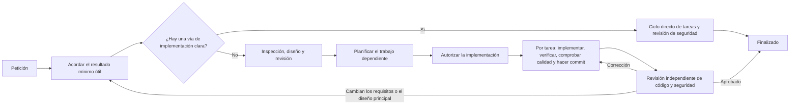

# codex-workflows

[](https://developers.openai.com/codex/cli)
[](https://developers.openai.com/codex/skills/)
[](https://opensource.org/licenses/MIT)

[English](README.md) | [简体中文](README.zh-CN.md) | [日本語](README.ja.md) | **Español** | [한국어](README.ko.md) | [Português (Brasil)](README.pt-BR.md)

En trabajos de producto grandes, Codex puede perseguir una coherencia técnica que va más allá de lo que el usuario necesita. Cubrir hasta el último caso límite y forzar un resultado determinista en cada camino puede acabar cambiando lo que ve el usuario, aunque el resultado acordado no lo requiera.

codex-workflows mantiene el trabajo dentro del resultado mínimo aprobado. Primero deja claro qué comportamiento visible puede cambiar y qué debe permanecer intacto; después exige pruebas antes de dar el trabajo por terminado. Dentro de esos límites, Codex elige detalles de implementación reversibles a partir de lo que ya existe en el repositorio.

Los flujos se instalan como Agent Skills y agentes personalizados para [OpenAI Codex CLI](https://developers.openai.com/codex/cli). La sesión principal de Codex confirma el alcance y el coste aproximado antes de diseñar, se hace cargo del avance y de las decisiones de revisión, y lleva el trabajo aprobado desde la implementación hasta una verificación independiente.

---

## ¿Por qué no usar Codex directamente?

Codex por sí solo es la mejor opción para una corrección bien acotada, un experimento desechable o un script puntual. Cuando el resultado esperado y el límite seguro de implementación ya están claros, es más rápido y económico.

Usa codex-workflows cuando una decisión técnica pueda ampliar el producto, alterar el comportamiento visible o deba conservarse al cambiar de contexto.

Por ejemplo, una petición para ampliar un flujo de autenticación existente puede desembocar en un segundo mecanismo técnicamente más limpio, más validaciones y un contrato de respuesta nuevo. El frontend puede adaptarse y todas las pruebas pueden pasar, pero el usuario termina recibiendo un comportamiento que nunca se aprobó.

codex-workflows evita que el alcance crezca sin control durante toda la ejecución:

| Control | Qué cambia |
|---|---|
| Alcance | El flujo contrasta la petición con el resultado deseado, las exclusiones expresas, el código existente y el coste aproximado. Lo que no justifica su coste se descarta antes de convertirse en arquitectura y, si aun así entró, se recorta después. |
| Controles entre fases | Los requisitos, el diseño y el plan se revisan antes de autorizar la siguiente fase. Los agentes nuevos leen las decisiones aprobadas y la evidencia que necesitan, en vez de reconstruir la intención a partir de una conversación larga. |
| Ejecución | Una vez que autorizas la implementación, Codex ejecuta el conjunto de tareas de forma autónoma. Cada tarea supera su verificación específica y las comprobaciones aplicables del repositorio antes del commit de implementación. |
| Finalización | Las revisiones independientes de código y seguridad comprueban que el cambio terminado se ajuste al alcance aprobado y no contenga fallos importantes. Las correcciones obligatorias vuelven al mismo ciclo de implementación y calidad. |

Este flujo requiere más llamadas a agentes y más tokens que una ejecución directa. Úsalo cuando proteger el resultado acordado compense ese coste. Cuando un cambio no necesita todos los controles, el [modo ligero](#modo-ligero) ejecuta menos.

Un caso límite no exige trabajo solo porque Codex sepa resolverlo. Añadir validaciones, hacer determinista un comportamiento o crear otra abstracción debe servir para proteger un requisito aprobado o un contrato observable, o para corregir un fallo demostrado. Y funciona en ambos sentidos: si una decisión de diseño acaba abarcando más de lo que el resultado necesita, el flujo la retira en vez de defenderla porque ya figure en un documento.

### Un caso real

La [integración del proveedor BytePlus Seedream en mcp-image](https://github.com/shinpr/mcp-image/pull/114) añadió un tercer proveedor externo de imágenes en 18 archivos. Ocho tareas planificadas permitieron evolucionar la implementación específica del proveedor sin modificar los contratos públicos de solicitud MCP, cliente, guardado de archivos ni URI de archivo.

Antes del merge, una evaluación contra el servicio real fijó el enrutamiento final de modelos, los límites del prompt, el timeout y el tratamiento de respuestas. Las revisiones independientes también detectaron una lectura de archivos sin límite, una vía para saltarse la validación, una ruta FIFO bloqueante y una normalización incoherente de claves API. Se corrigieron los cuatro problemas y el PR superó 303 pruebas repartidas en 19 archivos, además de una llamada real al proveedor sin reintentos. Los contratos públicos aprobados se mantuvieron intactos durante las ocho tareas y las cuatro correcciones.

---

## Inicio rápido

Necesitas Node.js 22 o posterior y la última versión de [Codex CLI](https://developers.openai.com/codex/cli).

### Instalar y ejecutar

```bash
cd your-project
npx codex-workflows install
```

Después, invoca un flujo desde Codex CLI:

```
$recipe-implement Añade autenticación de usuarios con JWT
```

El prefijo `$` invoca una skill de forma explícita. Escribe `$recipe-` para ver los flujos disponibles.

### Elige el punto de entrada

| ¿Qué necesitas? | Empieza por |
|---|---|
| Entregar un cambio de principio a fin y dejar que el flujo elija la ruta de backend, frontend o fullstack | `$recipe-implement` |
| Diseñar ahora e implementar más adelante | `$recipe-design` → `$recipe-plan` → `$recipe-build` |
| Diseñar y construir un frontend web con React / TypeScript | `$recipe-front-design` → `$recipe-front-plan` → `$recipe-front-build` |
| Empezar directamente con flujos de diseño separados para backend y frontend React | `$recipe-fullstack-implement` |
| Revisar una implementación frente a su diseño | `$recipe-review` o `$recipe-front-review` |
| Definir o actualizar reglas de calidad propias del repositorio | `$recipe-quality-profile` |
| Investigar un problema sin tocar el código | `$recipe-diagnose` |
| Hacer un experimento desechable o un script puntual | Usa Codex directamente |

---

## Cómo funciona


```mermaid
flowchart LR
    A[Petición] --> B[Acordar el resultado mínimo útil]
    B --> C{¿Hay una vía de implementación clara?}
    C -->|Sí| S[Ciclo directo de tareas y revisión de seguridad]
    S --> L[Finalizado]
    C -->|No| D[Inspección, diseño y revisión]
    D --> E[Planificar el trabajo dependiente]
    E --> F[Autorizar la implementación]
    F --> H[Por tarea: implementar, verificar, comprobar calidad y hacer commit]
    H --> K[Revisión independiente de código y seguridad]
    K -->|Corrección| H
    K -->|Cambian los requisitos o el diseño principal| B
    K -->|Aprobado| L[Finalizado]
```

La ruta depende del número de decisiones independientes de producto y diseño, no de cuántos archivos cambien ni de cuántos casos límite sea capaz de encontrar Codex.

Un cambio con un solo resultado que sigue un patrón existente en una parte del sistema pasa directamente a una tarea confirmada y después a la implementación, con controles de calidad y seguridad. Un cambio que exige coordinar varias partes del sistema o tomar una decisión de diseño duradera recibe primero un Design Doc y un Work Plan revisados, más una UI Spec o un ADR cuando alguna de sus decisiones lo requiera. Si el cambio tiene varios resultados que requieren decisiones de diseño independientes, también se crea un PRD, salvo que decidas omitirlo. Solo se escribe un ADR cuando una decisión duradera tiene al menos dos opciones sustancialmente distintas, y solo se elige una prueba de integración o E2E cuando otra más barata no puede demostrar la interacción.

Una vez autorizada la implementación, la sesión principal ejecuta las tareas, sus verificaciones específicas, los controles aplicables del repositorio y un commit de implementación por tarea. Primero resuelve los problemas a partir de los documentos aprobados y de la evidencia del repositorio. El comportamiento visible sigue siendo una frontera de producto: la implementación no puede ajustarlo por su cuenta para lograr coherencia interna. La sesión principal solo te consulta cuando avanzar exige un requisito de producto nuevo, cambiar algo que pediste o descartaste, usar una autorización que solo tú tienes o realizar una acción irreversible que no autorizaste. Encontrar una forma más acotada de llegar al mismo resultado no entra ahí, ni tampoco volver a pedir un permiso que ya diste. El flujo no añade la aprobación de terceros, el acceso a producción ni la ejecución de una release como condiciones para dar por terminada la implementación.

### Modo ligero

```
$recipe-implement Modo ligero. Añade una tabla ordenable a la página de informes
```

Pide el modo ligero en la petición de cualquier flujo. Las fases y los puntos de aprobación no cambian, pero Codex ejecuta menos controles: los Design Docs no se contrastan con el repositorio ni entre sí, y se omite la revisión de seguridad. Los controles del repositorio se ejecutan una sola vez después de la última tarea, en lugar de antes de cada commit, y la revisión final del código se mantiene. El modo ligero sigue activo durante el resto de la sesión hasta que le pidas a Codex que lo desactive.

---

## Instalación

### Instalar

Instala los flujos en el proyecto actual:

```bash
cd your-project
npx codex-workflows install
```

Se copiarán estos elementos al proyecto:

- `.agents/skills/`: skills de Codex (fundamentos y flujos)
- `.codex/agents/`: definiciones TOML de subagentes
- Un manifiesto para controlar los archivos gestionados

Para que los flujos estén disponibles en todos tus proyectos, instálalos en el `CODEX_HOME` del usuario:

```bash
npx codex-workflows install --user
```

Las skills se instalan en `$CODEX_HOME/skills/` y los agentes en `$CODEX_HOME/agents/`. Si `CODEX_HOME` no está definido, se usa `~/.codex`.

### Personalizar agentes

Las definiciones de los agentes son archivos TOML normales. En una instalación de proyecto, edita los archivos de `.codex/agents/`; en una instalación de usuario, edita los de `$CODEX_HOME/agents/`. Puedes cambiar `model`, `sandbox_mode` o `developer_instructions`. Los archivos que edites se conservan durante las actualizaciones, como se explica a continuación.

### Actualizar

```bash
# Previsualizar los cambios
npx codex-workflows update --dry-run

# Aplicar la actualización
npx codex-workflows update

# Actualizar una instalación de usuario
npx codex-workflows update --user
```

El actualizador conserva los archivos que hayas modificado localmente. Compara cada archivo con su hash en el momento de la instalación y omite los que hayan cambiado. Si una actualización traslada un archivo, tus cambios locales lo acompañan a la nueva ruta. Los archivos modificados que se retiran sin sustituto se mueven a `.codex-workflows-preserved/<version>/`. Los archivos nuevos se añaden automáticamente.

```bash
# Consultar la versión instalada
npx codex-workflows status

# Consultar una instalación de usuario
npx codex-workflows status --user
```

---

## Referencia de flujos

Invoca un flujo con `$recipe-name` en Codex. Escribe `$recipe-` y usa el autocompletado con Tab para ver todas las opciones.

<details>
<summary>Ver todos los puntos de entrada</summary>

### Backend y uso general

| Flujo | Qué hace | Cuándo usarlo |
|-------|----------|---------------|
| `$recipe-implement` | Ciclo completo con selección de capa (backend/frontend/fullstack) | Funcionalidades nuevas (entrada universal) |
| `$recipe-design` | Requisitos → documentos de producto y diseño según el tamaño | Diseño de producto y arquitectura |
| `$recipe-plan` | Design Doc → esqueletos selectivos de integración/E2E → Work Plan | Planificación desde un Design Doc aprobado |
| `$recipe-prepare-implementation` | Prepara las herramientas ya existentes en el repositorio que necesita un Work Plan aprobado | Petición expresa de preparación o capacidad necesaria no disponible |
| `$recipe-build` | Ejecuta tareas de backend con validación entre pasos | Retomar una implementación de backend |
| `$recipe-review` | Revisa el alcance de implementación, el cumplimiento del Design Doc, la calidad del código y la seguridad; aplica las correcciones aprobadas por el usuario | Revisión tras implementar |
| `$recipe-quality-profile` | Define o actualiza reglas de calidad propias del repositorio en `docs/project-context/quality.yaml` | Configuración y mantenimiento de las reglas de calidad |
| `$recipe-diagnose` | Investigación → verificación del punto de fallo → solución | Investigación de errores |
| `$recipe-reverse-engineer` | Genera PRD y Design Docs a partir del código existente | Documentar sistemas heredados |
| `$recipe-add-integration-tests` | Añade pruebas de integración/E2E a partir del Design Doc | Mejorar la cobertura del código existente |
| `$recipe-update-doc` | Actualiza y revisa un Design Doc / PRD / ADR existente | Cambios de especificación y mantenimiento documental |

### Frontend (React/TypeScript)

| Flujo | Qué hace | Cuándo usarlo |
|-------|----------|---------------|
| `$recipe-front-design` | Requisitos → documentos de UI y diseño según el tamaño | Diseño de producto y arquitectura frontend |
| `$recipe-front-adjust` | Ajuste acotado de UI con pruebas del repositorio, material aportado o fuentes externas necesarias | Cambios puntuales de UI después de implementar |
| `$recipe-front-plan` | Design Doc frontend → esqueletos selectivos de integración/E2E → Work Plan | Planificación frontend |
| `$recipe-front-build` | Ejecuta tareas frontend con verificación específica y controles de calidad | Retomar una implementación frontend |
| `$recipe-front-review` | Revisa el alcance, el cumplimiento, la calidad del código y la seguridad del frontend; aplica las correcciones React aprobadas por el usuario | Revisión frontend posterior a la implementación |

### Fullstack (entre capas)

| Flujo | Qué hace | Cuándo usarlo |
|-------|----------|---------------|
| `$recipe-fullstack-implement` | Ciclo completo con un Design Doc separado por capa | Funcionalidades que cruzan capas |
| `$recipe-fullstack-build` | Ejecuta tareas asignando agentes según la capa | Retomar una implementación fullstack |

</details>

## Estado de trabajo

Los flujos usan `docs/plans/` como estado temporal para Work Plans, Task Files de implementación y Task Files provisionales de corrección o ampliación de pruebas. Añade el directorio al `.gitignore` del proyecto, salvo que el equipo quiera revisar expresamente esos archivos transitorios:

```gitignore
docs/plans/
```

Los PRD, ADR, UI Spec y Design Docs son documentación permanente del proyecto y sí deben incluirse en los commits.

---

## Orientaciones incluidas

No hace falta invocar un flujo para aprovechar estas skills. Codex también las carga en una conversación normal, así que una corrección pequeña sigue los mismos criterios de causa raíz, alcance y verificación que un flujo completo.

<details>
<summary>Ver skills fundamentales</summary>

| Skill | Qué aporta |
|-------|------------|
| `coding-rules` | Calidad de código, diseño de funciones, gestión de errores y refactorización |
| `testing` | TDD ajustado al alcance, selección de verificaciones observables, integridad de tests y verificaciones exigidas por el repositorio |
| `ai-development-guide` | Causa raíz respaldada por evidencia, análisis del impacto ajustado al alcance y control de calidad aplicable |
| `reviewee-judgment` | Evaluación basada en pruebas antes de convertir observaciones de revisión en trabajo |
| `documentation-criteria` | Reglas y plantillas para PRD, ADR, Design Doc y Work Plan |
| `requirement-convergence` | Resultado, capas de requisitos, exclusiones decididas por el usuario y coste aproximado antes del diseño |
| `implementation-approach` | MVP directo, ampliación justificada, recorte, división y frontera de verificación |
| `integration-e2e-testing` | Selección y diseño exclusivo de pruebas de integración/E2E que demuestran una interacción real necesaria |
| `external-resource-context` | Consulta acotada de una fuente externa necesaria para una decisión concreta |
| `llm-friendly-context` | Contexto claro para los agentes que lo usarán después: prompts, traspasos, artefactos generados, Task Files y observaciones de revisión |
| `subagent-delegation` | Delegar el trabajo a subagentes hasta que lo terminen, con consultas cuando haga falta una decisión |
| `subagents-orchestration-guide` | Coordinación multiagente, gestión de flujos y ejecución autónoma guiada |

También se incluyen referencias para TypeScript de frontend web, incluidas aplicaciones React (`coding-rules/references/typescript.md` y `testing/references/typescript.md`). No se aplican a TypeScript de backend.

</details>

---

## Ecosistema

[Nautilus](https://github.com/shinpr/nautilus) valida ideas de producto y convierte los resultados en un PRD, mientras que [linear-prism](https://github.com/shinpr/linear-prism) convierte requisitos aprobados en incidencias de Linear listas para implementar. [claude-code-workflows](https://github.com/shinpr/claude-code-workflows) aplica el mismo enfoque a Claude Code y puede instalarse junto con codex-workflows. [outcome-doctor](https://github.com/shinpr/agent-clinic) usa Jev para comprobar si el enfoque de implementación de Codex se queda corto o se pasa respecto al objetivo, y necesita una clave de API de TypeSafe.

### ¿Quieres usar Astra aquí?

Ejecutar un flujo completo con Astra agota el límite de uso enseguida. [codex-subagent-playbook](https://github.com/shinpr/codex-subagent-playbook) es un plugin de Codex que elige el modelo de cada subagente, así que solo usa Astra donde realmente cambia el resultado.

<details>
<summary>Configuración (2 pasos)</summary>

Ejecuta la sesión principal con Sol, o con Astra en reasoning effort bajo. Las skills del plugin deciden qué subagentes usan Astra y cuáles corren con un modelo más económico; la implementación va a Luna.

**1. Instala el plugin**

```bash
codex plugin marketplace add shinpr/codex-subagent-playbook
```

Abre `/plugins`, busca **Subagent Playbook** e instálalo.

**2. Desactiva la skill `subagent-delegation` de este repositorio**

Este repositorio y el plugin traen cada uno una skill de delegación, y ninguna tiene prioridad. Qué skill carga cada sesión varía, y nada lo indica ni da error, así que el comportamiento cambia de una ejecución a otra. Abre `~/.codex/config.toml` y añade una entrada que apunte a la skill `subagent-delegation` que instalaste.

Si instalaste con `--user`:

```toml
[[skills.config]]
path = "/Users/you/.codex/skills/subagent-delegation/SKILL.md"
enabled = false
```

Si instalaste en un proyecto:

```toml
[[skills.config]]
path = "/absolute/path/to/your-project/.agents/skills/subagent-delegation/SKILL.md"
enabled = false
```

Escribe la ruta completa: aquí no funcionan `~` ni las variables de entorno.

La forma de usar los flujos no cambia. Las skills se cargan cuando corresponde y cada tarea se ejecuta con el modelo que le conviene.

</details>

---

## Motivos de diseño

<details>
<summary>Lecturas en las que se apoya el diseño</summary>

- [Why LLMs Are Bad at 'First Try' and Great at Verification](https://www.norsica.jp/blog/llm-verification-over-generation): por qué los ciclos de revisión y la separación de sesiones son más fiables que generar de una vez en trabajos complejos
- [When Better Models Make Old Agent Workflows Worse](https://www.norsica.jp/blog/when-better-models-make-old-agent-workflows-worse): por qué un flujo debe proteger límites y evidencia sin dictar el camino interno del modelo
- [Reasoning Effort Is Not a Quality Setting](https://www.norsica.jp/blog/reasoning-effort-is-not-a-quality-setting): por qué explorar más solo aporta valor cuando la fase puede seleccionar y descartar el trabajo adicional
- [Stop Putting Everything in AGENTS.md](https://www.norsica.jp/blog/stop-putting-everything-in-agents-md): por qué `AGENTS.md` debe ser breve y las reglas, documentos e instrucciones deben vivir cerca del lugar donde se usan

</details>

---

## Licencia

Licencia MIT. Puedes usar, modificar y distribuir el proyecto libremente.

---

Creado y mantenido por [@shinpr](https://github.com/shinpr).
