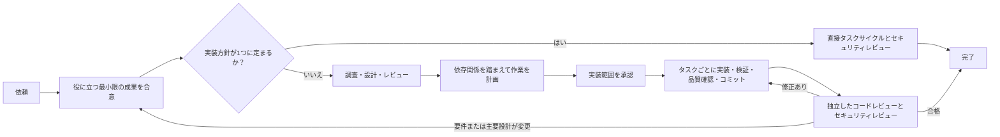

# codex-workflows

[](https://developers.openai.com/codex/cli)
[](https://developers.openai.com/codex/skills/)
[](https://opensource.org/licenses/MIT)

[English](README.md) | [简体中文](README.zh-CN.md) | **日本語** | [Español](README.es.md) | [한국어](README.ko.md) | [Português (Brasil)](README.pt-BR.md)

規模の大きなプロダクト開発では、Codexがユーザーの求める範囲を越えて、技術的な一貫性を追い求めてしまうことがあります。あらゆるエッジケースを処理し、すべての経路を決定論的にしようとすると、合意した成果には不要なはずの変更が、ユーザーから見える挙動にまで及びかねません。

codex-workflowsは、作業を「合意した最小限の成果」の内側に収めます。変更してよいユーザー向けの挙動と、変えてはいけないものを明確にし、完了前には根拠を求めます。その境界内の実装詳細は、リポジトリを踏まえてCodexが可逆的な選択を行います。

ワークフローは、[OpenAI Codex CLI](https://developers.openai.com/codex/cli)向けのAgent Skillsとカスタムエージェントとしてインストールされます。メインのCodexセッションが、設計前にスコープと概算コストを確認し、進行管理とレビュー判断を担い、承認済みの作業を実装から独立検証まで進めます。

---

## Codexをそのまま使うのではだめ？

範囲が明確な修正、使い捨ての検証、単発スクリプトなら、Codexを直接使うほうが適しています。求める結果と安全な実装範囲がすでにはっきりしている場合は、そのほうが速く、コストも抑えられます。

技術的な選択がプロダクトの範囲やユーザー向けの挙動を変えうる場合、あるいは判断を別のコンテキストへ引き継ぐ必要がある場合には、codex-workflowsを使ってください。

たとえば、既存の認証経路を拡張する依頼から、技術的にはきれいでも別の認証方式、より広いバリデーション、新しいレスポンス契約が生まれることがあります。フロントエンドが対応し、テストも通っていても、ユーザーには承認されていない挙動が提供されてしまいます。

codex-workflowsは、実行中を通してこうした拡大を抑えます。

| 制御 | 変わること |
|---|---|
| スコープ | 依頼内容を、目指す成果、明示的な除外事項、既存コード、実装の概算コストと照合します。コストに見合わない作業は、アーキテクチャになる前に取り除きます。 |
| フェーズゲート | 要件・設計・計画の成果物を確認し、合格したものだけが次のフェーズを開始できます。新しいエージェントは、長い会話から意図を組み立て直すのではなく、承認済みの判断と必要な根拠を読みます。 |
| 実行 | 実装が承認されると、Codexがタスク一式を自律的に実行します。各タスクは実装コミットの前に、対象を絞った検証と該当するリポジトリチェックを通過します。 |
| 完了 | 独立したコードレビューとセキュリティレビューで、完成した変更が承認済みの範囲に収まり、重大な問題がないことを確認します。必須の修正は同じ実装・品質サイクルに戻します。 |

このワークフローは、Codexを直接使う場合よりエージェント呼び出しとトークンを多く消費します。合意した成果を守る価値が、そのコストを上回るときに使ってください。

Codexが対応できるというだけで、エッジケースへの対応が必要になるわけではありません。追加のバリデーション、決定論的な挙動、新しい抽象化は、承認済みの要件や観測可能な契約を守るため、または実際に確認された不具合に対処するためのものでなければなりません。

### 実際のワークフロー例

[mcp-imageへのBytePlus Seedreamプロバイダー統合](https://github.com/shinpr/mcp-image/pull/114)では、18ファイルにまたがって3つ目の外部画像プロバイダーを追加しました。8つの計画済みタスクを通じ、プロバイダー固有の実装を発展させながら、公開MCPリクエスト、クライアント、ファイル保存、ファイルURIの各契約は変えませんでした。

マージ前に実サービスを使って評価し、最終的なモデルルーティング、プロンプト上限、タイムアウト、レスポンス処理を確定しました。独立レビューでは、上限のないファイル読み込み、バリデーションの迂回、ブロッキングするFIFOパス、APIキー正規化の不整合も発見されました。4件すべてを修正し、19ファイル・303件のテストに加え、リトライなしの実プロバイダー呼び出しにも合格しました。8つのタスクと4つの修正を通じ、承認済みの公開契約は維持されました。

---

## クイックスタート

Node.js 22以降と、最新の[Codex CLI](https://developers.openai.com/codex/cli)が必要です。

### インストールと実行

```bash
cd your-project
npx codex-workflows install
```

Codex CLIでレシピを呼び出します。

```
$recipe-implement JWTによるユーザー認証を追加する
```

`$`を付けるとスキルを明示的に呼び出せます。利用できるワークフローは、`$recipe-`まで入力すると確認できます。

### 目的に合う入口を選ぶ

| やりたいこと | 最初に使うもの |
|---|---|
| バックエンド、API、CLI、または一般的な変更を一貫して仕上げる | `$recipe-implement` |
| 先に設計し、実装はあとで行う | `$recipe-design` → `$recipe-plan` → `$recipe-build` |
| React / TypeScriptのWebフロントエンドを設計・実装する | `$recipe-front-design` → `$recipe-front-plan` → `$recipe-front-build` |
| バックエンドとReactフロントエンドをまとめて変更する | `$recipe-fullstack-implement` |
| 設計どおりに実装されているかレビューする | `$recipe-review` または `$recipe-front-review` |
| リポジトリ固有のレビュールールを定義・更新する | `$recipe-quality-profile` |
| コードを変えずに問題を調査する | `$recipe-diagnose` |
| 使い捨ての検証や単発スクリプトを実行する | Codexを直接使う |

---

## 仕組み



どの経路を通るかは、ファイル数やCodexが見つけたエッジケースの数ではなく、独立したプロダクト判断・設計判断の数で決まります。

| 規模 | 変更に必要なもの | 実行内容 |
|-------|------------------|----------|
| 小 | システム内の一領域で、既存パターンに沿って実現できる1つの成果 | 確定済みタスク → 実装 → 品質・セキュリティチェック |
| 中 | 複数領域の連携、または今後も残る設計判断を要する1つの成果 | レビュー済みDesign Doc（必要に応じてUI Spec / ADR）→ 選定した統合/E2E検証 → レビュー済みWork Plan → 自律タスクサイクル → 最終検証 |
| 大 | 個別の設計判断が必要な複数の成果 | レビュー済みPRDとDesign Doc（必要に応じてUI Spec / ADR）→ 選定した統合/E2E検証 → レビュー済みWork Plan → 自律タスクサイクル → 最終検証 |

ADRを作るのは、現在のスコープに属し、長く残る選択で、かつ実質的に異なる案が2つ以上ある場合だけです。該当する選択が複数あれば、ADRをまとめてレビューします。統合テストやE2Eテストを選ぶのも、より安価なテストでは必要な連携を証明できない場合だけです。どちらも不要な変更もあります。

長期的に残すプロジェクト文書へ引き継ぐのは、プロダクトまたはリポジトリ実装に影響する判断だけです。第三者の承認、本番環境へのアクセス、リリース作業、無関係な運用作業が実装のゲートになることはありません。

実装範囲が承認されると、オーケストレーターがタスク、対象を絞った検証、該当するリポジトリチェック、タスクごとの実装コミットを実行します。問題はまず、承認済み文書とリポジトリの根拠に基づいて解決します。ユーザーから見える挙動はプロダクト上の境界であり、内部的な整合性のために実装側が勝手に変えてよいものではありません。オーケストレーターが確認を求めるのは、新しいプロダクト要件、承認済みの主要設計判断の変更、ユーザーだけが持つ権限、または未承認の不可逆操作が必要になったときだけです。

専門エージェントには、担当作業に必要な文書とパスだけを渡します。エージェントは焦点を絞った根拠を提供しますが、承認済みの成果を広げる権限までは持ちません。

### 新しいコンテキストへ判断を引き継ぐ仕組み

コンテキストを分けることで、調査・設計・実装・レビューの間で暗黙の前提が共有されるのを防ぎます。同梱の[Work Planテンプレート](.agents/skills/documentation-criteria/references/plan-template.md)では、各実装タスクをDesign Docの該当箇所と受け入れ基準に結び付けます。

```markdown
### P1-T1: エラーレスポンス契約を維持する

- **根拠**: `docs/design/example-design.md`、API契約、AC-2
- **対象範囲**: リポジトリ実装と、対象を絞ったテストを更新
- **依存先**: なし
- **検証**: 契約テストを実行し、文書どおりのレスポンス形式を確認
```

[Task File Contract](.agents/skills/llm-friendly-context/references/task-template.md)は、根拠、期待する結果、対象ファイル、実行可能な検証方法を実装フェーズへ渡します。テストが通っても重要な挙動を証明できないおそれがある場合だけ、`Verification Focus`を追加します。実行後は、コミット前にタスクの変更全体へ該当するリポジトリチェックをかけます。最終レビュアーは、完成したコードを承認済み文書と照合します。さらに、承認範囲を超えた実装や重大なコード品質上の問題がないかも確認します。修正を採用したあとの再レビューでは、その修正の影響を受ける項目に対象を絞ります。`$recipe-quality-profile`を実行すると、リポジトリ内の根拠をもとに、固有のレビュールールを`docs/project-context/quality.yaml`へ追加できます。

---

## インストール

### 必要なもの

- [Codex CLI](https://developers.openai.com/codex/cli)（最新版）
- Node.js 22以上

### インストール方法

現在のプロジェクトへインストールします。

```bash
cd your-project
npx codex-workflows install
```

次のファイルがプロジェクトへコピーされます。

- `.agents/skills/`: Codexスキル（基礎スキルとレシピ）
- `.codex/agents/`: サブエージェントのTOML定義
- 管理対象ファイルを追跡するマニフェスト

すべてのプロジェクトでワークフローを使うには、ユーザー単位の`CODEX_HOME`へインストールします。

```bash
npx codex-workflows install --user
```

スキルは`$CODEX_HOME/skills/`、エージェントは`$CODEX_HOME/agents/`へインストールされます。`CODEX_HOME`が未設定の場合は`~/.codex`が使われます。

### 更新

```bash
# 変更内容を確認
npx codex-workflows update --dry-run

# 更新を適用
npx codex-workflows update

# ユーザー単位のインストールを更新
npx codex-workflows update --user
```

ローカルで編集したファイルは、アップデート時にも保持されます。各ファイルをインストール時のハッシュと比較し、変更済みのものは更新をスキップします。バージョンごとの更新履歴に沿って移動と削除を順番に適用するため、ローカル変更は移動後のファイルにも引き継がれます。代替なしで廃止された変更済みファイルは、`.codex-workflows-preserved/<version>/`へ移動します。新しいファイルは自動的に追加されます。

```bash
# インストール済みバージョンを確認
npx codex-workflows status

# ユーザー単位のインストールを確認
npx codex-workflows status --user
```

---

## ワークフローレシピ一覧

Codexでは`$recipe-name`でレシピを呼び出します。`$recipe-`まで入力し、タブ補完を使うと利用可能なレシピを確認できます。

<details>
<summary>レシピの入口をすべて表示</summary>

### バックエンド・一般

| レシピ | 内容 | 用途 |
|--------|------|------|
| `$recipe-implement` | レイヤー判定を含む開発ライフサイクル全体（バックエンド/フロントエンド/フルスタック） | 新機能（汎用エントリーポイント） |
| `$recipe-task` | ルール選択を含む単一タスク | バグ修正、小規模な変更 |
| `$recipe-design` | 要件 → 規模に応じたプロダクト・設計文書 | プロダクト設計、アーキテクチャ設計 |
| `$recipe-plan` | Design Doc → 必要な統合/E2Eテストのひな型 → Work Plan | 承認済みDesign Docからの計画 |
| `$recipe-prepare-implementation` | 承認済みWork Planに必要な既存のリポジトリ内ツールを準備 | 明示的なセットアップ依頼、または必要なタスク機能が利用できない場合 |
| `$recipe-build` | ステップ間の検証を含むバックエンドタスクの実行 | バックエンド実装の再開 |
| `$recipe-review` | 実装範囲、Design Doc準拠、コード品質、セキュリティをレビューし、ユーザーが承認した修正を適用 | 実装後の確認 |
| `$recipe-quality-profile` | リポジトリ固有のレビュールールを`docs/project-context/quality.yaml`に定義・更新 | レビューポリシーの設定・保守 |
| `$recipe-diagnose` | 問題調査 → 障害点の検証 → 解決策 | 不具合調査 |
| `$recipe-reverse-engineer` | 既存コードからPRDとDesign Docを生成 | レガシーシステムの文書化 |
| `$recipe-add-integration-tests` | Design Docをもとに統合/E2Eテストを追加 | 既存コードのテスト拡充 |
| `$recipe-update-doc` | 既存のDesign Doc / PRD / ADRをレビュー付きで更新 | 仕様変更、文書メンテナンス |

### フロントエンド（React/TypeScript）

| レシピ | 内容 | 用途 |
|--------|------|------|
| `$recipe-front-design` | 要件 → 規模に応じたUI・設計文書 | フロントエンドのプロダクト設計・アーキテクチャ設計 |
| `$recipe-front-adjust` | リポジトリ、提供資料、必要な外部根拠に基づく、範囲を絞ったUI調整 | 実装後の部分的なUI変更 |
| `$recipe-front-plan` | フロントエンドDesign Doc → 必要な統合/E2Eテストのひな型 → Work Plan | フロントエンドの計画フェーズ |
| `$recipe-front-build` | 対象を絞った検証と品質チェックを含むフロントエンドタスクの実行 | フロントエンド実装の再開 |
| `$recipe-front-review` | フロントエンドの範囲、準拠状況、コード品質、セキュリティをレビューし、ユーザーが承認したReact修正を適用 | フロントエンド実装後の確認 |

### フルスタック（レイヤー横断）

| レシピ | 内容 | 用途 |
|--------|------|------|
| `$recipe-fullstack-implement` | レイヤーごとにDesign Docを分ける開発ライフサイクル全体 | レイヤーをまたぐ機能 |
| `$recipe-fullstack-build` | レイヤーに応じたエージェント振り分けを含むタスク実行 | フルスタック実装の再開 |

</details>

## 作業状態

レシピは、Work Plan、実装Task File、一時的なレビュー修正・テスト追加用Task Fileの作業領域として`docs/plans/`を使います。品質確認を通過した実装コミットごとにタスクとフェーズの進捗が更新されますが、進捗ファイル自体はそのコミットに含まれません。一時ファイルもレビュー対象にしたい場合を除き、プロジェクトの`.gitignore`に次を追加してください。

```gitignore
docs/plans/
```

PRD、ADR、UI Spec、Design Docは長期的に残すプロジェクト文書であり、コミット対象です。

---

## 同梱のガイダンス

レシピは、現在のタスクに必要な、リポジトリの状況を踏まえたガイダンスを読み込みます。通常、これらのスキルを直接選ぶ必要はありません。

<details>
<summary>基礎スキルを表示</summary>

| スキル | 提供するもの |
|-------|--------------|
| `coding-rules` | コード品質、関数設計、エラー処理、リファクタリング |
| `testing` | 適切な規模のTDD、観測可能な検証方法の選択、テストの完全性、リポジトリ所定の検証 |
| `ai-development-guide` | 根拠に基づく原因分析、影響範囲の適切な評価、該当する品質保証 |
| `reviewee-judgment` | レビュー指摘を修正作業に変える前の、根拠に基づく評価 |
| `documentation-criteria` | 文書作成ルールとテンプレート（PRD、ADR、Design Doc、Work Plan） |
| `requirement-convergence` | 設計前に行う成果・要件レイヤー・ユーザー指定の除外事項・概算コストの整理 |
| `implementation-approach` | 直接的なMVP、根拠のある拡張、削減、分割、検証境界 |
| `integration-e2e-testing` | 必要な実連携を証明する統合/E2Eテストだけを選び、設計する方法 |
| `external-resource-context` | 現在の判断に必要な外部情報源を1つに絞って確認する方法 |
| `llm-friendly-context` | 後続エージェントが迷わず使える、明確なプロンプト、引き継ぎ、生成物、Task File、レビュー指摘 |
| `task-analyzer` | タスクの意図分析、種類の分類、スキル選択 |
| `subagents-orchestration-guide` | マルチエージェントの連携、ワークフローの進行、指針に沿った自律実行 |

Webフロントエンドで使うTypeScript向けには、Reactアプリケーションを含む追加資料（`coding-rules/references/typescript.md`、`testing/references/typescript.md`）も同梱されています。バックエンドTypeScriptには適用されません。

</details>

---

## 専門エージェント

レシピの実行中、Codexが必要に応じて次のエージェントを起動します。事前に役割を覚える必要はありません。オーケストレーターがワークフロー全体を管理し、レシピが分野に応じて担当エージェントを選びます。各エージェントは個別のコンテキストで、専門的な指示と明示された必須スキルに従って動作します。

<details>
<summary>専門エージェントの役割をすべて表示</summary>

### 文書作成エージェント

| エージェント | 役割 |
|--------------|------|
| `requirement-analyzer` | 依頼から得られる要点と、スコープ・コスト判断に必要なリポジトリ上の根拠を簡潔に整理 |
| `prd-creator` | PRDの作成と構成整理 |
| `technical-designer` | ADR一式またはDesign Docの作成（バックエンド/一般） |
| `technical-designer-frontend` | フロントエンド向けADR一式またはDesign Docの作成（React） |
| `ui-spec-designer` | PRDと任意のプロトタイプコードからUI Specificationを作成 |
| `codebase-analyzer` | 後続の技術判断・最小限の設計・検証に必要な事実だけをリポジトリから収集 |
| `ui-analyzer` | 外部資料（デザインツール、デザインシステム文書、公開中のUI）とフロントエンドコードからUIの事実を収集 |
| `work-planner` | Design DocからWork Planを作成 |
| `document-reviewer` | 上位要件と設計判断に照らして文書をレビュー |
| `design-sync` | 文書間の整合性を検証 |

### 実装エージェント

| エージェント | 役割 |
|--------------|------|
| `task-decomposer` | Work Planから最小数の実行可能なTask Fileへ分解 |
| `task-executor` | Task Fileに沿った実装と対象を絞った検証（バックエンド） |
| `task-executor-frontend` | 必要に応じて振る舞い中心のRTL検証を行うReact実装 |
| `quality-fixer` | 該当するリポジトリチェックと範囲内の品質修正（バックエンド） |
| `quality-fixer-frontend` | React、TypeScript、RTL、バンドルについて該当するチェックと修正 |
| `acceptance-test-generator` | 選定済みの統合/E2Eテストのひな型を生成 |
| `integration-test-reviewer` | テスト品質をレビュー |

### 分析エージェント

| エージェント | 役割 |
|--------------|------|
| `code-reviewer` | 完成した実装を承認範囲や準拠すべき文書と照合し、重大なコード品質上の問題を確認 |
| `code-verifier` | 文書とコードの整合性を検証 |
| `security-reviewer` | 実装後のセキュリティ準拠をレビュー |
| `rule-advisor` | レシピの管理外にある単独タスクのスキルを選定 |
| `scope-discoverer` | 既存システムの文書化に向けてコードベースの範囲を調査し、PRDの単位を整理 |
| `technical-spike` | 設計判断を左右する効果やコストを、対象を1つに絞って実測 |

### 調査エージェント

| エージェント | 役割 |
|--------------|------|
| `investigator` | 根拠収集、経路の整理、障害点の発見 |
| `verifier` | 経路の網羅性と障害点を独立して検証 |
| `solver` | トレードオフを踏まえて解決策を導出 |

</details>

---

## プロジェクト構成

インストール後、プロジェクトには次のファイルが追加されます。

<details>
<summary>インストール後の構成を表示</summary>

```
your-project/
├── .agents/skills/           # Codexスキル
│   ├── coding-rules/         # 基礎ガイダンス
│   ├── testing/
│   ├── ai-development-guide/
│   ├── reviewee-judgment/
│   ├── documentation-criteria/
│   ├── requirement-convergence/
│   ├── implementation-approach/
│   ├── integration-e2e-testing/
│   ├── external-resource-context/
│   ├── llm-friendly-context/
│   ├── task-analyzer/
│   ├── subagents-orchestration-guide/
│   └── recipe-*/             # ワークフローの入口（$recipe-*）
├── .codex/agents/            # サブエージェントのTOML定義
│   ├── requirement-analyzer.toml
│   ├── technical-designer.toml
│   ├── ui-analyzer.toml
│   ├── task-executor.toml
│   └── ...（全26エージェント）
└── docs/                     # レシピの利用に応じて作成
    ├── prd/
    ├── design/
    ├── adr/
    ├── ui-spec/
    └── plans/
        └── tasks/
```

</details>

---

## 連携できるツール

プロダクトのアイデアをさらに探索・検証したい場合は、[Nautilus](https://github.com/shinpr/nautilus)を使って前提を確かめ、その結果をPRDにまとめられます。承認後は、そのPRDを`$recipe-implement`または`$recipe-design`へ渡せます。

要件がすでにLinearや既存のPRDにまとまっている場合は、[linear-prism](https://github.com/shinpr/linear-prism)を使うと、コードベースを読みながら実装可能なLinearのissueへ分解し、依存関係を明示できます。承認したissueは`$recipe-design`の入力にできます。

---

## FAQ

**Q: どのモデルで使えますか？**

A: 現行のGPTモデル向けに設計されています。エージェントごとにTOMLファイルでモデルを設定できます。

**Q: エージェントをカスタマイズできますか？**

A: はい。`.codex/agents/`のTOMLファイルを編集すると、`model`、`sandbox_mode`、`developer_instructions`を変更できます。各エージェントが必要とするスキルは`developer_instructions`に記載されています。ローカルで変更したファイルは、`npx codex-workflows update`を実行しても保持されます。

ユーザー単位でインストールした場合は、`$CODEX_HOME/agents/`のファイルを編集し、`npx codex-workflows update --user`を使ってください。インストール後に変更したユーザー単位のファイルも同様に保持されます。

**Q: `$recipe-implement`と`$recipe-fullstack-implement`の違いは？**

A: `$recipe-implement`は汎用の入口です。最初にrequirement-analyzerを実行し、依頼内容とリポジトリの範囲から影響するレイヤーを判定して、バックエンド、フロントエンド、フルスタックのいずれかへ自動的に振り分けます。`$recipe-fullstack-implement`はこの判定を省き、フルスタックフロー（レイヤーごとのDesign Doc、design-sync、レイヤーに応じたタスク実行）へ直接進みます。判断がつかない場合は`$recipe-implement`、機能が両レイヤーにまたがると最初からわかっている場合は`$recipe-fullstack-implement`を使ってください。

**Q: MCPサーバーと一緒に使えますか？**

A: はい。Codexのスキルとサブエージェントは、[MCP](https://developers.openai.com/codex/mcp)と併用できます。スキルは指示レイヤー、MCPはツール転送レイヤーで動作します。エージェントのTOMLで`mcp_servers`を省略すると、カスタムエージェントは親の`mcp_servers`を引き継ぎます。エージェント固有のサーバーやツール制限が必要な場合だけ、個別のMCP設定を追加してください。

**Q: claude-code-workflowsとの関係は？**

A: [claude-code-workflows](https://github.com/shinpr/claude-code-workflows)はClaude Code版にあたります。共通のワークフロー思想を、それぞれのツールが持つ拡張機構に合わせて実装しています。codex-workflowsはエージェント定義を`.codex/agents/`へ、Claude Codeは独自の`.claude/`配下へ配置するため、同じプロジェクト内で併用できます。

**Q: サブエージェントが止まっているように見えたら？**

A: 進行を管理するのはメインのCodexセッションです。返された根拠を確認し、使えない結果なら再実行または修正し、影響を受けない作業はそのまま進めます。1つのサブエージェントの結果だけでワークフロー全体が止まることはありません。

---

## 設計の背景

<details>
<summary>ワークフロー設計の参考資料</summary>

- [Why LLMs Are Bad at 'First Try' and Great at Verification](https://www.norsica.jp/blog/llm-verification-over-generation)：複雑な作業では、一度で生成するよりレビューサイクルとセッション分離のほうが信頼できる理由
- [When Better Models Make Old Agent Workflows Worse](https://www.norsica.jp/blog/when-better-models-make-old-agent-workflows-worse)：モデル内部の進め方を縛らず、境界と根拠を守るワークフロー制約が必要な理由
- [Reasoning Effort Is Not a Quality Setting](https://www.norsica.jp/blog/reasoning-effort-is-not-a-quality-setting)：広い技術探索に価値があるのは、フェーズ内で余分な作業を選別できる場合だけである理由
- [Stop Putting Everything in AGENTS.md](https://www.norsica.jp/blog/stop-putting-everything-in-agents-md)：`AGENTS.md`を簡潔に保ち、ルール・文書・タスク指示を利用箇所の近くへ置くべき理由

</details>

---

## ライセンス

MIT License。利用、変更、再配布は自由です。

---

[@shinpr](https://github.com/shinpr)が開発・メンテナンスしています。
