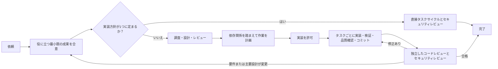

# codex-workflows

[](https://developers.openai.com/codex/cli)
[](https://developers.openai.com/codex/skills/)
[](https://opensource.org/licenses/MIT)

[English](README.md) | [简体中文](README.zh-CN.md) | **日本語** | [Español](README.es.md) | [한국어](README.ko.md) | [Português (Brasil)](README.pt-BR.md)

規模の大きなプロダクト開発では、Codexがユーザーの求める範囲を越えて、技術的な一貫性を追い求めてしまうことがあります。あらゆるエッジケースを処理し、すべての経路を決定論的にしようとすると、合意した成果には不要なはずの変更が、ユーザーから見える挙動にまで及びかねません。

codex-workflowsは、作業を「合意した最小限の成果」の内側に収めます。変更してよいユーザー向けの挙動と、変えてはいけないものを明確にし、完了前には根拠を求めます。その境界内の実装詳細は、リポジトリを踏まえてCodexが可逆的な選択を行います。

ワークフローは、[OpenAI Codex CLI](https://developers.openai.com/codex/cli)向けのAgent Skillsとカスタムエージェントとしてインストールされます。メインのCodexセッションが、設計前にスコープと概算コストを確認し、進行管理とレビュー判断を担い、承認済みの作業を実装から独立検証まで進めます。

---

## Codexをそのまま使うのではだめ？

範囲が明確な修正、使い捨ての検証、単発スクリプトなら、Codexを直接使うほうが適しています。求める結果と安全な実装範囲がすでにはっきりしている場合は、そのほうが速く、コストも抑えられます。

技術的な選択がプロダクトの範囲やユーザー向けの挙動を変えうる場合、あるいは判断を別のコンテキストへ引き継ぐ必要がある場合には、codex-workflowsを使ってください。

たとえば、既存の認証経路を拡張する依頼から、技術的にはきれいでも別の認証方式、より広いバリデーション、新しいレスポンス契約が生まれることがあります。フロントエンドが対応し、テストも通っていても、ユーザーには承認されていない挙動が提供されてしまいます。

codex-workflowsは、実行中を通してこうした拡大を抑えます。

| 制御 | 変わること |
|---|---|
| スコープ | 依頼内容を、目指す成果、明示的な除外事項、既存コード、実装の概算コストと照合します。コストに見合わない作業は、アーキテクチャになる前に取り除きます。入り込んでしまった場合は、後からでも削ります。 |
| フェーズゲート | 要件・設計・計画の成果物を確認し、合格したものだけが次のフェーズを開始できます。新しいエージェントは、長い会話から意図を組み立て直すのではなく、承認済みの判断と必要な根拠を読みます。 |
| 実行 | 実装を許可すると、Codexがタスク一式を自律的に実行します。各タスクは実装コミットの前に、対象を絞った検証と該当するリポジトリチェックを通過します。 |
| 完了 | 独立したコードレビューとセキュリティレビューで、完成した変更が承認済みの範囲に収まり、重大な問題がないことを確認します。必須の修正は同じ実装・品質サイクルに戻します。 |

このワークフローは、Codexを直接使う場合よりエージェント呼び出しとトークンを多く消費します。合意した成果を守る価値が、そのコストを上回るときに使ってください。すべてのチェックまでは必要ない変更なら、[ライトモード](#ライトモード)で実行するチェックを減らせます。

Codexが対応できるというだけで、エッジケースへの対応が必要になるわけではありません。追加のバリデーション、決定論的な挙動、新しい抽象化は、承認済みの要件や観測可能な契約を守るため、または実際に確認された不具合に対処するためのものでなければなりません。逆も同じです。ある設計判断が成果に必要な範囲を超えていると分かれば、文書に書かれているという理由だけで残すことはありません。

### 実際のワークフロー例

[mcp-imageへのBytePlus Seedreamプロバイダー統合](https://github.com/shinpr/mcp-image/pull/114)では、18ファイルにまたがって3つ目の外部画像プロバイダーを追加しました。8つの計画済みタスクを通じ、プロバイダー固有の実装を発展させながら、公開MCPリクエスト、クライアント、ファイル保存、ファイルURIの各契約は変えませんでした。

マージ前に実サービスを使って評価し、最終的なモデルルーティング、プロンプト上限、タイムアウト、レスポンス処理を確定しました。独立レビューでは、上限のないファイル読み込み、バリデーションの迂回、ブロッキングするFIFOパス、APIキー正規化の不整合も発見されました。4件すべてを修正し、19ファイル・303件のテストに加え、リトライなしの実プロバイダー呼び出しにも合格しました。8つのタスクと4つの修正を通じ、承認済みの公開契約は維持されました。

---

## クイックスタート

Node.js 22以降と、最新の[Codex CLI](https://developers.openai.com/codex/cli)が必要です。

### インストールと実行

```bash
cd your-project
npx codex-workflows install
```

Codex CLIでレシピを呼び出します。

```
$recipe-implement JWTによるユーザー認証を追加する
```

`$`を付けるとスキルを明示的に呼び出せます。利用できるワークフローは、`$recipe-`まで入力すると確認できます。

### 目的に合う入口を選ぶ

| やりたいこと | 最初に使うもの |
|---|---|
| 変更を一貫して仕上げ、バックエンド・フロントエンド・フルスタックの振り分けを任せる | `$recipe-implement` |
| 先に設計し、実装はあとで行う | `$recipe-design` → `$recipe-plan` → `$recipe-build` |
| React / TypeScriptのWebフロントエンドを設計・実装する | `$recipe-front-design` → `$recipe-front-plan` → `$recipe-front-build` |
| バックエンドとReactフロントエンドを別々に設計するフローへ直接進む | `$recipe-fullstack-implement` |
| 設計どおりに実装されているかレビューする | `$recipe-review` または `$recipe-front-review` |
| リポジトリ固有の品質ルールを定義・更新する | `$recipe-quality-profile` |
| コードを変えずに問題を調査する | `$recipe-diagnose` |
| 使い捨ての検証や単発スクリプトを実行する | Codexを直接使う |

---

## 仕組み


```mermaid
flowchart LR
    A[依頼] --> B[役に立つ最小限の成果を合意]
    B --> C{実装方針が1つに定まるか？}
    C -->|はい| S[直接タスクサイクルとセキュリティレビュー]
    S --> L[完了]
    C -->|いいえ| D[調査・設計・レビュー]
    D --> E[依存関係を踏まえて作業を計画]
    E --> F[実装を許可]
    F --> H[タスクごとに実装・検証・品質確認・コミット]
    H --> K[独立したコードレビューとセキュリティレビュー]
    K -->|修正あり| H
    K -->|要件または主要設計が変更| B
    K -->|合格| L[完了]
```

どの経路を通るかは、ファイル数やCodexが見つけたエッジケースの数ではなく、独立したプロダクト判断・設計判断の数で決まります。

システム内の一領域で既存パターンに沿って実現できる1つの成果なら、確定済みタスクからそのまま実装へ進み、品質チェックとセキュリティチェックを行います。複数領域の連携や長く残る設計判断が必要な変更では、先にレビュー済みのDesign DocとWork Planを用意し、判断の内容に応じてUI SpecやADRも作成します。個別の設計判断が必要な複数の成果を含む変更では、明示的に省略しない限りPRDも作成します。ADRを作るのは、長く残る選択に実質的に異なる案が2つ以上ある場合だけです。統合テストやE2Eテストを選ぶのも、より安価なテストでは連携を証明できない場合だけです。

実装が許可されると、メインセッションがタスク、対象を絞った検証、該当するリポジトリチェック、タスクごとの実装コミットを実行します。問題はまず、承認済み文書とリポジトリの根拠に基づいて解決します。ユーザーから見える挙動はプロダクト上の境界であり、内部的な整合性のために実装側が勝手に変えてよいものではありません。メインセッションが確認を求めるのは、新しいプロダクト要件、ユーザーが求めたことや除外したことの変更、ユーザーだけが持つ権限、または未承認の不可逆操作が必要になったときだけです。より小さい実装で同じ成果を達成できると分かっただけでは確認しませんし、すでに出した許可を取り直すこともしません。第三者の承認、本番環境へのアクセス、リリース作業を、実装を完了するための条件として加えることもありません。

### ライトモード

```
$recipe-implement ライトモードで。レポート画面に並べ替えできる表を追加する
```

ライトモードは、どのレシピでも依頼文の中で指定できます。フェーズと承認ポイントは変わらず、Codexが実行するチェックだけが減ります。Design Docをリポジトリや他のDesign Docと照合する作業と、セキュリティレビューは行いません。リポジトリチェックはコミットごとではなく最後のタスクの後に1回だけ実行し、最終コードレビューは通常どおり行います。ライトモードは、Codexに解除を頼むまでそのセッションの間ずっと有効です。

---

## インストール

### インストール方法

現在のプロジェクトへインストールします。

```bash
cd your-project
npx codex-workflows install
```

次のファイルがプロジェクトへコピーされます。

- `.agents/skills/`: Codexスキル（基礎スキルとレシピ）
- `.codex/agents/`: サブエージェントのTOML定義
- 管理対象ファイルを追跡するマニフェスト

すべてのプロジェクトでワークフローを使うには、ユーザー単位の`CODEX_HOME`へインストールします。

```bash
npx codex-workflows install --user
```

スキルは`$CODEX_HOME/skills/`、エージェントは`$CODEX_HOME/agents/`へインストールされます。`CODEX_HOME`が未設定の場合は`~/.codex`が使われます。

### エージェントをカスタマイズする

エージェント定義は通常のTOMLファイルです。プロジェクト単位でインストールした場合は`.codex/agents/`、ユーザー単位でインストールした場合は`$CODEX_HOME/agents/`のファイルを編集します。`model`、`sandbox_mode`、`developer_instructions`を変更できます。編集したファイルは、後述のとおりアップデート時にも保持されます。

### 更新

```bash
# 変更内容を確認
npx codex-workflows update --dry-run

# 更新を適用
npx codex-workflows update

# ユーザー単位のインストールを更新
npx codex-workflows update --user
```

ローカルで編集したファイルは、アップデート時にも保持されます。各ファイルをインストール時のハッシュと比較し、変更済みのものは更新をスキップします。アップデートでファイルが移動した場合も、ローカル変更は移動先のファイルに引き継がれます。代替なしで廃止された変更済みファイルは、`.codex-workflows-preserved/<version>/`へ移動します。新しいファイルは自動的に追加されます。

```bash
# インストール済みバージョンを確認
npx codex-workflows status

# ユーザー単位のインストールを確認
npx codex-workflows status --user
```

---

## ワークフローレシピ一覧

Codexでは`$recipe-name`でレシピを呼び出します。`$recipe-`まで入力し、タブ補完を使うと利用可能なレシピを確認できます。

<details>
<summary>レシピの入口をすべて表示</summary>

### バックエンド・一般

| レシピ | 内容 | 用途 |
|--------|------|------|
| `$recipe-implement` | レイヤー判定を含む開発ライフサイクル全体（バックエンド/フロントエンド/フルスタック） | 新機能（汎用エントリーポイント） |
| `$recipe-design` | 要件 → 規模に応じたプロダクト・設計文書 | プロダクト設計、アーキテクチャ設計 |
| `$recipe-plan` | Design Doc → 必要な統合/E2Eテストのひな型 → Work Plan | 承認済みDesign Docからの計画 |
| `$recipe-prepare-implementation` | 承認済みWork Planに必要な既存のリポジトリ内ツールを準備 | 明示的なセットアップ依頼、または必要なタスク機能が利用できない場合 |
| `$recipe-build` | ステップ間の検証を含むバックエンドタスクの実行 | バックエンド実装の再開 |
| `$recipe-review` | 実装範囲、Design Doc準拠、コード品質、セキュリティをレビューし、ユーザーが承認した修正を適用 | 実装後の確認 |
| `$recipe-quality-profile` | リポジトリ固有の品質ルールを`docs/project-context/quality.yaml`に定義・更新 | 品質ルールの設定・保守 |
| `$recipe-diagnose` | 問題調査 → 障害点の検証 → 解決策 | 不具合調査 |
| `$recipe-reverse-engineer` | 既存コードからPRDとDesign Docを生成 | レガシーシステムの文書化 |
| `$recipe-add-integration-tests` | Design Docをもとに統合/E2Eテストを追加 | 既存コードのテスト拡充 |
| `$recipe-update-doc` | 既存のDesign Doc / PRD / ADRをレビュー付きで更新 | 仕様変更、文書メンテナンス |

### フロントエンド（React/TypeScript）

| レシピ | 内容 | 用途 |
|--------|------|------|
| `$recipe-front-design` | 要件 → 規模に応じたUI・設計文書 | フロントエンドのプロダクト設計・アーキテクチャ設計 |
| `$recipe-front-adjust` | リポジトリ、提供資料、必要な外部根拠に基づく、範囲を絞ったUI調整 | 実装後の部分的なUI変更 |
| `$recipe-front-plan` | フロントエンドDesign Doc → 必要な統合/E2Eテストのひな型 → Work Plan | フロントエンドの計画フェーズ |
| `$recipe-front-build` | 対象を絞った検証と品質チェックを含むフロントエンドタスクの実行 | フロントエンド実装の再開 |
| `$recipe-front-review` | フロントエンドの範囲、準拠状況、コード品質、セキュリティをレビューし、ユーザーが承認したReact修正を適用 | フロントエンド実装後の確認 |

### フルスタック（レイヤー横断）

| レシピ | 内容 | 用途 |
|--------|------|------|
| `$recipe-fullstack-implement` | レイヤーごとにDesign Docを分ける開発ライフサイクル全体 | レイヤーをまたぐ機能 |
| `$recipe-fullstack-build` | レイヤーに応じたエージェント振り分けを含むタスク実行 | フルスタック実装の再開 |

</details>

## 作業状態

レシピは、Work Plan、実装Task File、一時的なレビュー修正・テスト追加用Task Fileの作業領域として`docs/plans/`を使います。一時ファイルもレビュー対象にしたい場合を除き、プロジェクトの`.gitignore`に次を追加してください。

```gitignore
docs/plans/
```

PRD、ADR、UI Spec、Design Docは長期的に残すプロジェクト文書であり、コミット対象です。

---

## 同梱のガイダンス

レシピを使わない通常の対話でも、これらのガイダンスはCodexに読み込まれます。ちょっとしたバグ修正にも、フルワークフローと同じ根本原因・スコープ・検証の基準が適用されます。

<details>
<summary>基礎スキルを表示</summary>

| スキル | 提供するもの |
|-------|--------------|
| `coding-rules` | コード品質、関数設計、エラー処理、リファクタリング |
| `testing` | 適切な規模のTDD、観測可能な検証方法の選択、テストの完全性、リポジトリ所定の検証 |
| `ai-development-guide` | 根拠に基づく原因分析、影響範囲の適切な評価、該当する品質保証 |
| `reviewee-judgment` | レビュー指摘を修正作業に変える前の、根拠に基づく評価 |
| `documentation-criteria` | 文書作成ルールとテンプレート（PRD、ADR、Design Doc、Work Plan） |
| `requirement-convergence` | 設計前に行う成果・要件レイヤー・ユーザー指定の除外事項・概算コストの整理 |
| `implementation-approach` | 直接的なMVP、根拠のある拡張、削減、分割、検証境界 |
| `integration-e2e-testing` | 必要な実連携を証明する統合/E2Eテストだけを選び、設計する方法 |
| `external-resource-context` | 現在の判断に必要な外部情報源を1つに絞って確認する方法 |
| `llm-friendly-context` | 後続エージェントが迷わず使える、明確なプロンプト、引き継ぎ、生成物、Task File、レビュー指摘 |
| `subagent-delegation` | サブエージェントに作業を最後まで任せ、判断が必要なときに相談を受ける |
| `subagents-orchestration-guide` | マルチエージェントの連携、ワークフローの進行、指針に沿った自律実行 |

Webフロントエンドで使うTypeScript向けには、Reactアプリケーションを含む追加資料（`coding-rules/references/typescript.md`、`testing/references/typescript.md`）も同梱されています。バックエンドTypeScriptには適用されません。

</details>

---

## エコシステム

[Nautilus](https://github.com/shinpr/nautilus)はプロダクトのアイデアを検証してPRDにまとめ、[linear-prism](https://github.com/shinpr/linear-prism)は承認済みの要件を実装可能なLinearのissueへ整理します。[claude-code-workflows](https://github.com/shinpr/claude-code-workflows)は同じアプローチをClaude Code向けに提供し、codex-workflowsと同じプロジェクトにインストールできます。[outcome-doctor](https://github.com/shinpr/agent-clinic)は、Codexの実装方針が目的に対して過不足ないかをJevで検査します。TypeSafeのAPIキーが必要です。

### Astraを効率よく使いたい場合

ワークフロー全体をAstraで走らせると、利用枠をすぐ使い切ります。[codex-subagent-playbook](https://github.com/shinpr/codex-subagent-playbook)はサブエージェントごとにモデルを選ぶCodexプラグインで、結果に差が出る場面だけでAstraを使えます。

<details>
<summary>セットアップ（2ステップ）</summary>

メインのCodexセッションはSol、またはAstraをlow reasoning effortで動かします。どのサブエージェントにAstraを割り当て、どれを軽いモデルで動かすかはプラグインのスキルが判断します。実装はLunaが担当します。

**1. プラグインをインストールする**

```bash
codex plugin marketplace add shinpr/codex-subagent-playbook
```

`/plugins`を開き、**Subagent Playbook**を選んでインストールします。

**2. このリポジトリの`subagent-delegation`スキルを無効化する**

このリポジトリとプラグインは、どちらも委譲用のスキルを持ちます。優先順位はなく、どちらが読み込まれるかはセッションごとに変わります。どちらが読み込まれたかは表示されず、エラーにもならないため、実行するたびに挙動が変わります。`~/.codex/config.toml`を開き、インストールした`subagent-delegation`スキルを指すエントリを1つ追加します。

`--user`でインストールした場合:

```toml
[[skills.config]]
path = "/Users/you/.codex/skills/subagent-delegation/SKILL.md"
enabled = false
```

プロジェクトへインストールした場合:

```toml
[[skills.config]]
path = "/absolute/path/to/your-project/.agents/skills/subagent-delegation/SKILL.md"
enabled = false
```

パスはフルパスで書きます。`~`や環境変数は使えません。

ワークフローの使い方は変わりません。スキルが適切なタイミングで読み込まれ、タスクに合ったモデルが使われます。

</details>

---

## 設計の背景

<details>
<summary>ワークフロー設計の参考資料</summary>

- [Why LLMs Are Bad at 'First Try' and Great at Verification](https://www.norsica.jp/blog/llm-verification-over-generation)：複雑な作業では、一度で生成するよりレビューサイクルとセッション分離のほうが信頼できる理由
- [When Better Models Make Old Agent Workflows Worse](https://www.norsica.jp/blog/when-better-models-make-old-agent-workflows-worse)：モデル内部の進め方を縛らず、境界と根拠を守るワークフロー制約が必要な理由
- [Reasoning Effort Is Not a Quality Setting](https://www.norsica.jp/blog/reasoning-effort-is-not-a-quality-setting)：広い技術探索に価値があるのは、フェーズ内で余分な作業を選別できる場合だけである理由
- [Stop Putting Everything in AGENTS.md](https://www.norsica.jp/blog/stop-putting-everything-in-agents-md)：`AGENTS.md`を簡潔に保ち、ルール・文書・タスク指示を利用箇所の近くへ置くべき理由

</details>

---

## ライセンス

MIT License。利用、変更、再配布は自由です。

---

[@shinpr](https://github.com/shinpr)が開発・メンテナンスしています。
