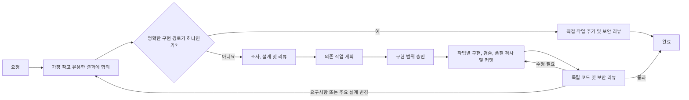

# codex-workflows

[](https://developers.openai.com/codex/cli)
[](https://developers.openai.com/codex/skills/)
[](https://opensource.org/licenses/MIT)

[English](README.md) | [简体中文](README.zh-CN.md) | [日本語](README.ja.md) | [Español](README.es.md) | **한국어** | [Português (Brasil)](README.pt-BR.md)

규모가 큰 제품 작업에서 Codex는 사용자가 원하는 수준을 넘어 기술적 일관성을 좇을 때가 있습니다. 모든 엣지 케이스를 처리하고 모든 경로의 결과를 결정적으로 만들다 보면, 합의한 목표에 필요하지 않은데도 사용자가 보는 동작까지 바뀔 수 있습니다.

codex-workflows는 작업을 승인된 최소한의 결과 안에 머물게 합니다. 사용자에게 보이는 동작 중 무엇을 바꿔도 되는지, 무엇은 그대로 두어야 하는지 확인하고, 완료 전에 근거를 요구합니다. 그 경계 안에서 Codex는 저장소를 바탕으로 되돌리기 쉬운 구현 세부 사항을 선택합니다.

워크플로는 [OpenAI Codex CLI](https://developers.openai.com/codex/cli)의 Agent Skills와 사용자 정의 에이전트로 설치됩니다. 메인 Codex 세션이 설계 전에 범위와 대략적인 비용을 확인하고, 진행 상황과 리뷰 판단을 책임지며, 승인된 작업을 구현부터 독립 검증까지 이어갑니다.

---

## Codex를 바로 쓰면 안 되나요?

범위가 명확한 수정, 일회성 실험, 한 번 쓰고 버릴 스크립트라면 Codex를 직접 사용하는 편이 낫습니다. 원하는 결과와 안전한 구현 경계가 이미 분명하다면 더 빠르고 비용도 적게 듭니다.

기술적 선택이 제품 범위나 사용자에게 보이는 동작을 바꿀 수 있거나, 어떤 결정을 여러 컨텍스트에 걸쳐 유지해야 한다면 codex-workflows를 사용하세요.

예를 들어 기존 인증 경로를 확장해 달라는 요청이 기술적으로 더 깔끔한 두 번째 인증 방식, 더 넓은 검증, 새로운 응답 계약으로 번질 수 있습니다. 프런트엔드가 이에 맞춰 바뀌고 테스트가 모두 통과하더라도, 사용자는 승인받은 적 없는 동작을 받게 됩니다.

codex-workflows는 실행 내내 이런 범위 확장을 제어합니다.

| 제어 항목 | 달라지는 점 |
|---|---|
| 범위 | 요청을 원하는 결과, 명시적 제외 사항, 기존 코드, 대략적인 구현 비용과 비교합니다. 비용만큼 가치가 없는 작업은 아키텍처가 되기 전에 제거합니다. |
| 단계 게이트 | 요구사항, 설계, 계획 결과물을 확인한 뒤에만 다음 단계를 허용합니다. 새 에이전트는 긴 대화에서 의도를 다시 추측하는 대신 승인된 결정과 필요한 근거를 읽습니다. |
| 실행 | 구현이 승인되면 Codex가 작업 묶음을 자율적으로 수행합니다. 각 작업은 구현 커밋 전에 해당 작업에 맞춘 검증과 저장소에서 요구하는 검사를 통과합니다. |
| 완료 | 독립적인 코드 리뷰와 보안 리뷰를 통해 완성된 변경이 승인 범위를 벗어나지 않았고 중대한 문제가 없는지 확인합니다. 반드시 필요한 수정은 같은 구현·품질 주기로 돌려보냅니다. |

이 워크플로는 Codex를 직접 실행할 때보다 더 많은 에이전트 호출과 토큰을 사용합니다. 승인된 결과를 지키는 일이 그 비용보다 중요할 때 사용하세요.

Codex가 처리할 수 있다는 이유만으로 모든 엣지 케이스가 작업 대상이 되는 것은 아닙니다. 추가 검증, 결정적인 동작, 새로운 추상화는 승인된 요구사항이나 관찰 가능한 계약을 지키거나, 실제로 확인된 장애에 대응하기 위한 것이어야 합니다.

### 실제 실행 사례

[mcp-image의 BytePlus Seedream 공급자 연동](https://github.com/shinpr/mcp-image/pull/114)은 18개 파일에 걸쳐 세 번째 외부 이미지 공급자를 추가했습니다. 공급자별 구현을 발전시키는 동안에도, 계획된 8개 작업은 공개 MCP 요청, 클라이언트, 파일 저장, 파일 URI 계약을 그대로 유지했습니다.

병합 전 실제 서비스 평가를 통해 최종 모델 라우팅, 프롬프트 제한, 타임아웃, 응답 처리를 확정했습니다. 독립 리뷰에서는 제한 없는 파일 읽기, 검증 우회, 블로킹 FIFO 경로, 일관되지 않은 API 키 정규화도 발견했습니다. 네 가지를 모두 수정했고, PR은 19개 파일의 303개 테스트와 재시도 없는 실제 공급자 호출을 통과했습니다. 8개 작업과 4개 수정 내내 승인된 공개 계약은 바뀌지 않았습니다.

---

## 빠른 시작

Node.js 22 이상과 최신 [Codex CLI](https://developers.openai.com/codex/cli)가 필요합니다.

### 설치 및 실행

```bash
cd your-project
npx codex-workflows install
```

그다음 Codex CLI에서 레시피를 호출합니다.

```
$recipe-implement JWT 사용자 인증 추가
```

`$`는 스킬을 명시적으로 호출한다는 뜻입니다. `$recipe-`를 입력하면 사용 가능한 워크플로를 볼 수 있습니다.

### 목적에 맞는 경로 선택

| 필요한 작업 | 시작할 레시피 |
|---|---|
| 백엔드, API, CLI 또는 일반 변경을 처음부터 끝까지 구현 | `$recipe-implement` |
| 먼저 설계하고 나중에 구현 | `$recipe-design` → `$recipe-plan` → `$recipe-build` |
| React / TypeScript 웹 프런트엔드를 설계하고 구현 | `$recipe-front-design` → `$recipe-front-plan` → `$recipe-front-build` |
| 백엔드와 React 프런트엔드 변경을 함께 구현 | `$recipe-fullstack-implement` |
| 설계에 맞게 구현되었는지 리뷰 | `$recipe-review` 또는 `$recipe-front-review` |
| 저장소별 리뷰 규칙 정의 또는 업데이트 | `$recipe-quality-profile` |
| 코드를 바꾸지 않고 문제 조사 | `$recipe-diagnose` |
| 일회성 실험이나 단발성 스크립트 실행 | Codex 직접 사용 |

---

## 작동 방식



어떤 경로를 택할지는 파일 수나 Codex가 찾아낸 엣지 케이스의 수가 아니라, 서로 독립적인 제품 및 설계 결정의 수로 정합니다.

| 규모 | 변경에 필요한 것 | 진행 방식 |
|------|------------------|-----------|
| 소 | 시스템의 한 부분에서 기존 패턴을 따르는 하나의 결과 | 확정된 작업 → 구현 → 품질 및 보안 검사 |
| 중 | 시스템 여러 부분의 조율이나 오래 유지할 설계 결정이 필요한 하나의 결과 | 리뷰된 Design Doc과 필요시 UI Spec / ADR → 선정된 통합/E2E 검증 → 리뷰된 Work Plan → 자율 작업 주기 → 최종 검증 |
| 대 | 별도의 설계 결정이 필요한 여러 결과 | 리뷰된 PRD와 Design Doc, 필요시 UI Spec / ADR → 선정된 통합/E2E 검증 → 리뷰된 Work Plan → 자율 작업 주기 → 최종 검증 |

ADR은 현재 범위에 속하고 오래 유지되는 선택에 실질적으로 다른 대안이 둘 이상 있을 때만 만듭니다. 해당 선택이 여러 개면 ADR을 함께 리뷰합니다. 통합 또는 E2E 테스트도 더 저렴한 테스트로 필요한 상호작용을 증명할 수 없을 때만 선택합니다. 둘 다 필요하지 않은 변경도 있습니다.

제품이나 저장소 구현에 영향을 주는 결정만 장기 프로젝트 문서로 남깁니다. 제3자 승인, 운영 환경 접근, 릴리스 실행, 무관한 운영 작업은 구현 게이트가 되지 않습니다.

구현 범위가 승인되면 오케스트레이터가 작업, 작업에 맞춘 검증, 적용 가능한 저장소 검사, 작업별 구현 커밋을 실행합니다. 문제는 먼저 승인 문서와 저장소 근거를 사용해 해결합니다. 사용자에게 보이는 동작은 제품 경계이므로 내부 일관성을 위해 구현이 임의로 조정할 수 없습니다. 새로운 제품 요구사항, 승인된 주요 설계 결정 변경, 사용자만 가진 권한, 승인하지 않은 되돌릴 수 없는 작업이 필요할 때만 사용자에게 묻습니다.

전문 에이전트는 작업에 꼭 필요한 문서와 경로만 받습니다. 필요한 범위의 구체적인 근거를 제공하지만 승인된 결과를 넓힐 권한은 없습니다.

### 새 컨텍스트에서도 결정이 유지되는 방식

컨텍스트를 분리하면 조사, 설계, 구현, 리뷰가 암묵적인 가정을 공유하는 일을 막을 수 있습니다. 포함된 [Work Plan 템플릿](.agents/skills/documentation-criteria/references/plan-template.md)은 각 구현 작업을 Design Doc의 해당 섹션과 인수 기준에 연결합니다.

```markdown
### P1-T1: 오류 응답 계약 유지

- **출처**: `docs/design/example-design.md`, API 계약, AC-2
- **범위**: 저장소 구현과 관련 집중 테스트 업데이트
- **의존성**: 없음
- **검증**: 계약 테스트를 실행하고 문서에 정의된 응답 형태 확인
```

[Task File Contract](.agents/skills/llm-friendly-context/references/task-template.md)는 출처, 의도한 결과, 대상 파일, 실행 가능한 검증을 구현 단계로 전달합니다. 테스트가 통과해도 중요한 동작을 증명하지 못할 수 있을 때만 `Verification Focus`를 추가합니다. 실행 후에는 커밋 전에 작업 변경 전체에 해당 저장소 검사를 적용합니다. 최종 리뷰어는 완성된 코드를 승인 문서와 대조합니다. 또한 승인 범위를 벗어난 구현이나 중대한 코드 품질 문제가 있는지 확인합니다. 수정이 채택되면 다음 리뷰에서는 해당 수정의 영향을 받을 수 있는 검사 항목에 집중합니다. `$recipe-quality-profile`을 실행하면 저장소의 근거를 바탕으로 `docs/project-context/quality.yaml`에 리뷰 규칙을 추가할 수 있습니다.

---

## 설치

### 요구 사항

- 최신 [Codex CLI](https://developers.openai.com/codex/cli)
- Node.js 22 이상

### 설치 방법

현재 프로젝트에 설치합니다.

```bash
cd your-project
npx codex-workflows install
```

다음 항목이 프로젝트에 복사됩니다.

- `.agents/skills/`: Codex 스킬(기초 스킬 + 레시피)
- `.codex/agents/`: 하위 에이전트 TOML 정의
- 관리 파일 추적용 매니페스트

모든 프로젝트에서 워크플로를 사용하려면 사용자 수준 `CODEX_HOME`에 설치하세요.

```bash
npx codex-workflows install --user
```

스킬은 `$CODEX_HOME/skills/`에, 에이전트는 `$CODEX_HOME/agents/`에 설치됩니다. `CODEX_HOME`이 없으면 기본값은 `~/.codex`입니다.

### 업데이트

```bash
# 변경 내용 미리 보기
npx codex-workflows update --dry-run

# 업데이트 적용
npx codex-workflows update

# 사용자 수준 설치 업데이트
npx codex-workflows update --user
```

업데이터는 로컬에서 수정한 파일을 보존합니다. 각 파일을 설치 시점의 해시와 비교하고, 바뀐 파일은 건너뜁니다. 버전별 업데이트 기록에 따라 이동과 삭제를 순서대로 적용하므로 로컬 변경도 이동된 파일의 현재 경로를 따라갑니다. 대체 파일 없이 제거된 수정 파일은 `.codex-workflows-preserved/<version>/`로 옮깁니다. 새 파일은 자동으로 추가됩니다.

```bash
# 설치된 버전 확인
npx codex-workflows status

# 사용자 수준 설치 확인
npx codex-workflows status --user
```

---

## 워크플로 레시피 목록

Codex에서 `$recipe-name`으로 레시피를 호출합니다. `$recipe-`를 입력하고 탭 자동 완성을 사용하면 모든 레시피를 볼 수 있습니다.

<details>
<summary>모든 레시피 진입점 보기</summary>

### 백엔드 및 일반

| 레시피 | 기능 | 사용 시점 |
|--------|------|-----------|
| `$recipe-implement` | 계층 판별을 포함한 전체 수명 주기(백엔드/프런트엔드/풀스택) | 새 기능(범용 진입점) |
| `$recipe-task` | 규칙 선택을 포함한 단일 작업 | 버그 수정, 작은 변경 |
| `$recipe-design` | 요구사항 → 규모에 맞춘 제품 및 설계 문서 | 제품 및 아키텍처 설계 |
| `$recipe-plan` | Design Doc → 필요한 통합/E2E 골격 → Work Plan | 승인된 Design Doc에서 계획 수립 |
| `$recipe-prepare-implementation` | 승인된 Work Plan에 필요한 기존 저장소 내부 도구 준비 | 명시적인 설정 요청 또는 필요한 작업 기능이 없을 때 |
| `$recipe-build` | 단계 사이 검증과 함께 백엔드 작업 실행 | 백엔드 구현 재개 |
| `$recipe-review` | 구현 범위, Design Doc 준수 여부, 코드 품질 및 보안을 리뷰하고 사용자가 승인한 수정 적용 | 구현 후 확인 |
| `$recipe-quality-profile` | `docs/project-context/quality.yaml`에 저장소별 리뷰 규칙 정의 또는 업데이트 | 리뷰 정책 설정 및 유지보수 |
| `$recipe-diagnose` | 문제 조사 → 장애 지점 검증 → 해결책 | 버그 조사 |
| `$recipe-reverse-engineer` | 기존 코드에서 PRD와 Design Doc 생성 | 레거시 시스템 문서화 |
| `$recipe-add-integration-tests` | Design Doc에서 통합/E2E 테스트 추가 | 기존 코드의 테스트 범위 확대 |
| `$recipe-update-doc` | 기존 Design Doc / PRD / ADR을 리뷰와 함께 업데이트 | 명세 변경, 문서 유지보수 |

### 프런트엔드(React/TypeScript)

| 레시피 | 기능 | 사용 시점 |
|--------|------|-----------|
| `$recipe-front-design` | 요구사항 → 규모에 맞춘 UI 및 설계 문서 | 프런트엔드 제품 및 아키텍처 설계 |
| `$recipe-front-adjust` | 저장소, 제공 자료 또는 필요한 외부 근거를 사용한 집중 UI 조정 | 구현 후의 좁은 UI 변경 |
| `$recipe-front-plan` | 프런트엔드 Design Doc → 필요한 통합/E2E 골격 → Work Plan | 프런트엔드 계획 단계 |
| `$recipe-front-build` | 작업에 맞춘 검증과 품질 검사를 포함한 프런트엔드 작업 실행 | 프런트엔드 구현 재개 |
| `$recipe-front-review` | 프런트엔드 범위, 준수 여부, 코드 품질 및 보안을 리뷰하고 사용자가 승인한 React 수정 적용 | 프런트엔드 구현 후 확인 |

### 풀스택(계층 간)

| 레시피 | 기능 | 사용 시점 |
|--------|------|-----------|
| `$recipe-fullstack-implement` | 계층별 별도 Design Doc을 사용하는 전체 수명 주기 | 계층을 넘나드는 기능 |
| `$recipe-fullstack-build` | 계층에 따라 에이전트를 배정해 작업 실행 | 풀스택 구현 재개 |

</details>

## 작업 상태

레시피는 Work Plan, 구현 Task File, 임시 리뷰 수정 또는 테스트 추가 Task File의 작업 상태로 `docs/plans/`를 사용합니다. 품질 승인을 받은 구현 커밋마다 작업 및 단계 진행 상황이 이곳에서 갱신되지만, 진행 파일 자체는 해당 커밋에 포함되지 않습니다. 팀이 이 임시 파일을 리뷰하려는 경우가 아니라면 프로젝트 `.gitignore`에 다음을 추가하세요.

```gitignore
docs/plans/
```

PRD, ADR, UI Spec, Design Doc은 장기 프로젝트 문서이므로 커밋해야 합니다.

---

## 포함된 가이드

레시피는 현재 작업에 필요한 저장소 맞춤형 지침을 불러옵니다. 보통은 이 스킬들을 직접 선택할 필요가 없습니다.

<details>
<summary>기초 스킬 보기</summary>

| 스킬 | 제공하는 내용 |
|------|---------------|
| `coding-rules` | 코드 품질, 함수 설계, 오류 처리, 리팩터링 |
| `testing` | 작업에 맞는 TDD, 관찰 가능한 검증 방법 선택, 테스트 무결성, 저장소 필수 검증 |
| `ai-development-guide` | 근거 기반 근본 원인, 적정한 영향 분석, 적용 가능한 품질 보증 |
| `reviewee-judgment` | 리뷰 의견을 수정 작업으로 만들기 전의 근거 기반 판단 |
| `documentation-criteria` | 문서 작성 규칙과 템플릿(PRD, ADR, Design Doc, Work Plan) |
| `requirement-convergence` | 설계 전 결과, 요구사항 계층, 사용자 결정 제외 사항, 대략적 비용 정리 |
| `implementation-approach` | 직접 MVP, 근거 있는 확장, 축소, 분할, 검증 경계 |
| `integration-e2e-testing` | 필요한 실제 상호작용을 증명하는 통합/E2E 테스트만 선택하고 설계 |
| `external-resource-context` | 현재 결정에 필요한 외부 근거 하나만 선별해 확인 |
| `llm-friendly-context` | 후속 에이전트를 위한 명확한 프롬프트, 인수인계, 산출물, Task File, 리뷰 의견 |
| `task-analyzer` | 작업 의도 분석, 유형 분류, 스킬 선택 |
| `subagents-orchestration-guide` | 다중 에이전트 조율, 워크플로 진행, 가이드에 따른 자율 실행 |

React 애플리케이션을 포함한 웹 프런트엔드 TypeScript용 참고 자료(`coding-rules/references/typescript.md`, `testing/references/typescript.md`)도 포함됩니다. 백엔드 TypeScript에는 적용되지 않습니다.

</details>

---

## 전문 에이전트

레시피 실행 중 Codex가 필요에 따라 다음 에이전트를 생성합니다. 역할을 미리 익힐 필요는 없습니다. 레시피가 분야에 맞는 에이전트로 작업을 보내고 오케스트레이터는 전체 흐름을 계속 관리합니다. 각 에이전트는 별도 컨텍스트에서 전문 지침과 명시된 필수 스킬을 사용합니다.

<details>
<summary>모든 전문 에이전트 역할 보기</summary>

### 문서 작성 에이전트

| 에이전트 | 역할 |
|----------|------|
| `requirement-analyzer` | 요청의 핵심 신호와 범위·비용 판단에 필요한 저장소 근거 정리 |
| `prd-creator` | PRD 작성 및 구조화 |
| `technical-designer` | 전체 ADR 묶음 또는 Design Doc 작성(백엔드/일반) |
| `technical-designer-frontend` | 프런트엔드 ADR 묶음 또는 Design Doc 작성(React) |
| `ui-spec-designer` | PRD와 선택적 프로토타입 코드에서 UI Specification 작성 |
| `codebase-analyzer` | 후속 기술 판단·최소한의 설계·검증에 필요한 사실만 저장소에서 수집 |
| `ui-analyzer` | 외부 자료(디자인 도구, 디자인 시스템 문서, 배포된 UI)와 프런트엔드 코드에서 UI 정보 수집 |
| `work-planner` | Design Doc에서 Work Plan 작성 |
| `document-reviewer` | 상위 요구사항과 설계 결정에 따라 문서 리뷰 |
| `design-sync` | 문서 간 일관성 검증 |

### 구현 에이전트

| 에이전트 | 역할 |
|----------|------|
| `task-decomposer` | Work Plan을 실행 가능한 최소 개수의 Task File로 변환 |
| `task-executor` | Task File 구현 및 작업에 맞춘 검증(백엔드) |
| `task-executor-frontend` | 적용 가능한 동작 중심 RTL 검증과 함께 React 구현 |
| `quality-fixer` | 적용 가능한 저장소 검사와 범위 내 품질 수정(백엔드) |
| `quality-fixer-frontend` | 적용 가능한 React, TypeScript, RTL, 번들 검사 및 수정 |
| `acceptance-test-generator` | 선택한 통합/E2E 테스트 골격 생성 |
| `integration-test-reviewer` | 테스트 품질 리뷰 |

### 분석 에이전트

| 에이전트 | 역할 |
|----------|------|
| `code-reviewer` | 완성된 구현을 승인 범위 및 기준 문서와 대조하고 중대한 코드 품질 문제를 확인 |
| `code-verifier` | 문서와 코드 일치 검증 |
| `security-reviewer` | 구현 후 보안 준수 리뷰 |
| `rule-advisor` | 레시피 밖의 단독 작업을 위한 스킬 선택 |
| `scope-discoverer` | 역문서화를 위한 코드베이스 범위 조사와 PRD 단위 구성 |
| `technical-spike` | 설계 판단에 영향을 주는 효과나 비용 한 가지를 제한된 범위에서 검증 |

### 진단 에이전트

| 에이전트 | 역할 |
|----------|------|
| `investigator` | 근거 수집, 경로 매핑, 장애 지점 발견 |
| `verifier` | 경로 범위 검증 및 장애 지점 독립 평가 |
| `solver` | 장단점을 고려한 해결책 도출 |

</details>

---

## 프로젝트 구조

설치 후 프로젝트에는 다음 항목이 생깁니다.

<details>
<summary>설치된 구조 보기</summary>

```
your-project/
├── .agents/skills/           # Codex 스킬
│   ├── coding-rules/         # 기초 가이드
│   ├── testing/
│   ├── ai-development-guide/
│   ├── reviewee-judgment/
│   ├── documentation-criteria/
│   ├── requirement-convergence/
│   ├── implementation-approach/
│   ├── integration-e2e-testing/
│   ├── external-resource-context/
│   ├── llm-friendly-context/
│   ├── task-analyzer/
│   ├── subagents-orchestration-guide/
│   └── recipe-*/             # 워크플로 진입점($recipe-*)
├── .codex/agents/            # 하위 에이전트 TOML 정의
│   ├── requirement-analyzer.toml
│   ├── technical-designer.toml
│   ├── ui-analyzer.toml
│   ├── task-executor.toml
│   └── ... (총 26개 에이전트)
└── docs/                     # 레시피를 사용하면서 생성
    ├── prd/
    ├── design/
    ├── adr/
    ├── ui-spec/
    └── plans/
        └── tasks/
```

</details>

---

## 함께 사용할 수 있는 도구

제품 아이디어를 더 탐색하거나 검증해야 한다면 [Nautilus](https://github.com/shinpr/nautilus)로 관련 가설을 확인하고 그 결과를 PRD로 정리할 수 있습니다. 승인된 PRD를 `$recipe-implement`나 `$recipe-design`에 전달하세요.

요구사항이 이미 Linear나 기존 PRD에 있다면 [linear-prism](https://github.com/shinpr/linear-prism)이 코드베이스를 읽어 구현 가능한 Linear 이슈로 나누고 이슈 간 의존 관계를 기록할 수 있습니다. 승인된 이슈를 `$recipe-design`의 입력으로 사용하세요.

---

## 자주 묻는 질문

**Q: 어떤 모델에서 사용할 수 있나요?**

A: 현재 GPT 모델을 기준으로 설계되었습니다. 에이전트별 TOML 파일에서 모델을 설정할 수 있습니다.

**Q: 에이전트를 사용자 정의할 수 있나요?**

A: 네. `.codex/agents/`의 TOML 파일을 편집해 `model`, `sandbox_mode`, `developer_instructions`를 바꿀 수 있습니다. 각 에이전트의 필수 스킬은 `developer_instructions`에 적혀 있습니다. 로컬에서 수정한 파일은 `npx codex-workflows update`를 실행해도 보존됩니다.

사용자 수준 설치에서는 `$CODEX_HOME/agents/`의 파일을 편집하고 `npx codex-workflows update --user`를 사용하세요. 설치 후 수정한 사용자 수준 파일도 같은 방식으로 보존됩니다.

**Q: `$recipe-implement`와 `$recipe-fullstack-implement`는 무엇이 다른가요?**

A: `$recipe-implement`는 범용 진입점입니다. 먼저 requirement-analyzer를 실행하고 요청과 저장소 범위에서 영향을 받는 계층을 확인한 다음 백엔드, 프런트엔드, 풀스택 흐름으로 자동 분기합니다. `$recipe-fullstack-implement`는 판별을 생략하고 풀스택 흐름(계층별 Design Doc, design-sync, 계층 맞춤 작업 실행)으로 바로 들어갑니다. 잘 모르겠다면 `$recipe-implement`를, 기능이 두 계층에 걸친다는 사실을 알고 있다면 `$recipe-fullstack-implement`를 사용하세요.

**Q: MCP 서버와 함께 사용할 수 있나요?**

A: 네. Codex 스킬과 하위 에이전트는 [MCP](https://developers.openai.com/codex/mcp)와 함께 작동합니다. 스킬은 지침 계층에서, MCP는 도구 전송 계층에서 작동합니다. 에이전트 TOML에 `mcp_servers`가 없으면 사용자 정의 에이전트가 부모의 `mcp_servers`를 상속합니다. 에이전트 전용 서버나 도구 필터링이 필요할 때만 에이전트별 MCP 설정을 추가하세요.

**Q: claude-code-workflows와는 어떤 관계인가요?**

A: [claude-code-workflows](https://github.com/shinpr/claude-code-workflows)는 Claude Code용 대응 프로젝트입니다. 두 저장소는 같은 워크플로 철학을 공유하되 각 도구의 기본 확장 지점에 맞게 구현되어 있습니다. codex-workflows는 에이전트 정의를 `.codex/agents/`에, Claude Code는 자체 `.claude/` 디렉터리에 설치하므로 한 프로젝트에서 함께 사용할 수 있습니다.

**Q: 하위 에이전트가 멈춘 것처럼 보이면 어떻게 하나요?**

A: 메인 Codex 세션이 진행을 책임집니다. 반환된 근거를 확인하고, 사용할 수 없는 결과는 다시 시도하거나 수정하며, 영향받지 않은 작업은 계속 진행합니다. 하위 에이전트 하나의 결과만으로 워크플로가 중단되지는 않습니다.

---

## 설계 배경

<details>
<summary>워크플로 설계의 참고 자료</summary>

- [Why LLMs Are Bad at 'First Try' and Great at Verification](https://www.norsica.jp/blog/llm-verification-over-generation): 복잡한 작업에서 한 번에 생성하는 것보다 리뷰 주기와 세션 분리가 더 신뢰할 수 있는 이유
- [When Better Models Make Old Agent Workflows Worse](https://www.norsica.jp/blog/when-better-models-make-old-agent-workflows-worse): 모델 내부 경로를 규정하지 않으면서 워크플로 제약이 경계와 근거를 지켜야 하는 이유
- [Reasoning Effort Is Not a Quality Setting](https://www.norsica.jp/blog/reasoning-effort-is-not-a-quality-setting): 단계가 추가 작업을 선택하고 버릴 수 있을 때만 폭넓은 기술 탐색이 유용한 이유
- [Stop Putting Everything in AGENTS.md](https://www.norsica.jp/blog/stop-putting-everything-in-agents-md): `AGENTS.md`는 간결하게 유지하고 규칙, 문서, 작업 지침은 사용 지점 가까이에 두어야 하는 이유

</details>

---

## 라이선스

MIT License. 자유롭게 사용, 수정, 배포할 수 있습니다.

---

[@shinpr](https://github.com/shinpr)가 개발하고 유지보수합니다.
