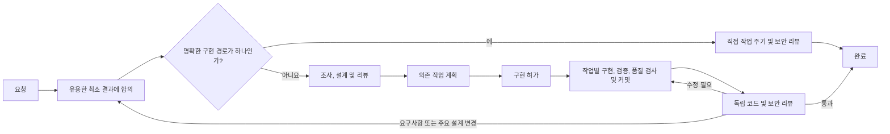

# codex-workflows

[](https://developers.openai.com/codex/cli)
[](https://developers.openai.com/codex/skills/)
[](https://opensource.org/licenses/MIT)

[English](README.md) | [简体中文](README.zh-CN.md) | [日本語](README.ja.md) | [Español](README.es.md) | **한국어** | [Português (Brasil)](README.pt-BR.md)

규모가 큰 제품 작업에서 Codex는 사용자가 원하는 수준을 넘어 기술적 일관성을 좇을 때가 있습니다. 모든 엣지 케이스를 처리하고 모든 경로의 결과를 결정적으로 만들다 보면, 합의한 목표에 필요하지 않은데도 사용자가 보는 동작까지 바뀔 수 있습니다.

codex-workflows는 작업을 승인된 최소한의 결과 안에 머물게 합니다. 사용자에게 보이는 동작 중 무엇을 바꿔도 되는지, 무엇은 그대로 두어야 하는지 확인하고, 완료 전에 근거를 요구합니다. 그 경계 안에서 Codex는 저장소를 바탕으로 되돌리기 쉬운 구현 세부 사항을 선택합니다.

워크플로는 [OpenAI Codex CLI](https://developers.openai.com/codex/cli)의 Agent Skills와 사용자 정의 에이전트로 설치됩니다. 메인 Codex 세션이 설계 전에 범위와 대략적인 비용을 확인하고, 진행 상황과 리뷰 판단을 책임지며, 승인된 작업을 구현부터 독립 검증까지 이어갑니다.

---

## Codex를 바로 쓰면 안 되나요?

범위가 명확한 수정, 일회성 실험, 한 번 쓰고 버릴 스크립트라면 Codex를 직접 사용하는 편이 낫습니다. 원하는 결과와 안전한 구현 경계가 이미 분명하다면 더 빠르고 비용도 적게 듭니다.

기술적 선택이 제품 범위나 사용자에게 보이는 동작을 바꿀 수 있거나, 어떤 결정을 여러 컨텍스트에 걸쳐 유지해야 한다면 codex-workflows를 사용하세요.

예를 들어 기존 인증 경로를 확장해 달라는 요청이 기술적으로 더 깔끔한 두 번째 인증 방식, 더 넓은 검증, 새로운 응답 계약으로 번질 수 있습니다. 프런트엔드가 이에 맞춰 바뀌고 테스트가 모두 통과하더라도, 사용자는 승인받은 적 없는 동작을 받게 됩니다.

codex-workflows는 실행 내내 이런 범위 확장을 제어합니다.

| 제어 항목 | 달라지는 점 |
|---|---|
| 범위 | 요청을 원하는 결과, 명시적 제외 사항, 기존 코드, 대략적인 구현 비용과 비교합니다. 비용만큼 가치가 없는 작업은 아키텍처가 되기 전에 제거하고, 그래도 들어왔다면 나중에라도 덜어냅니다. |
| 단계 게이트 | 요구사항, 설계, 계획 결과물을 확인한 뒤에만 다음 단계를 허용합니다. 새 에이전트는 긴 대화에서 의도를 다시 추측하는 대신 승인된 결정과 필요한 근거를 읽습니다. |
| 실행 | 구현을 허가하면 Codex가 작업 묶음을 자율적으로 수행합니다. 각 작업은 구현 커밋 전에 해당 작업에 맞춘 검증과 저장소에서 요구하는 검사를 통과합니다. |
| 완료 | 독립적인 코드 리뷰와 보안 리뷰를 통해 완성된 변경이 승인 범위를 벗어나지 않았고 중대한 문제가 없는지 확인합니다. 반드시 필요한 수정은 같은 구현·품질 주기로 돌려보냅니다. |

이 워크플로는 Codex를 직접 실행할 때보다 더 많은 에이전트 호출과 토큰을 사용합니다. 승인된 결과를 지키는 일이 그 비용보다 중요할 때 사용하세요. 모든 검사가 필요하지 않은 변경이라면 [라이트 모드](#라이트-모드)로 검사를 줄일 수 있습니다.

Codex가 처리할 수 있다는 이유만으로 모든 엣지 케이스가 작업 대상이 되는 것은 아닙니다. 추가 검증, 결정적인 동작, 새로운 추상화는 승인된 요구사항이나 관찰 가능한 계약을 지키거나, 실제로 확인된 장애에 대응하기 위한 것이어야 합니다. 반대의 경우도 마찬가지입니다. 어떤 설계 결정이 결과에 필요한 범위를 넘는다고 드러나면, 문서에 이미 적혀 있다는 이유로 지키지 않고 제거합니다.

### 실제 실행 사례

[mcp-image의 BytePlus Seedream 공급자 연동](https://github.com/shinpr/mcp-image/pull/114)은 18개 파일에 걸쳐 세 번째 외부 이미지 공급자를 추가했습니다. 공급자별 구현을 발전시키는 동안에도, 계획된 8개 작업은 공개 MCP 요청, 클라이언트, 파일 저장, 파일 URI 계약을 그대로 유지했습니다.

병합 전 실제 서비스 평가를 통해 최종 모델 라우팅, 프롬프트 제한, 타임아웃, 응답 처리를 확정했습니다. 독립 리뷰에서는 제한 없는 파일 읽기, 검증 우회, 블로킹 FIFO 경로, 일관되지 않은 API 키 정규화도 발견했습니다. 네 가지를 모두 수정했고, PR은 19개 파일의 303개 테스트와 재시도 없는 실제 공급자 호출을 통과했습니다. 8개 작업과 4개 수정 내내 승인된 공개 계약은 바뀌지 않았습니다.

---

## 빠른 시작

Node.js 22 이상과 최신 [Codex CLI](https://developers.openai.com/codex/cli)가 필요합니다.

### 설치 및 실행

```bash
cd your-project
npx codex-workflows install
```

그다음 Codex CLI에서 레시피를 호출합니다.

```
$recipe-implement JWT 사용자 인증 추가
```

`$`는 스킬을 명시적으로 호출한다는 뜻입니다. `$recipe-`를 입력하면 사용 가능한 워크플로를 볼 수 있습니다.

### 목적에 맞는 경로 선택

| 필요한 작업 | 시작할 레시피 |
|---|---|
| 변경을 처음부터 끝까지 진행하고 백엔드, 프런트엔드 또는 풀스택 경로 선택은 워크플로에 맡기기 | `$recipe-implement` |
| 먼저 설계하고 나중에 구현 | `$recipe-design` → `$recipe-plan` → `$recipe-build` |
| React / TypeScript 웹 프런트엔드를 설계하고 구현 | `$recipe-front-design` → `$recipe-front-plan` → `$recipe-front-build` |
| 백엔드와 React 프런트엔드를 각각 설계하는 흐름으로 바로 시작 | `$recipe-fullstack-implement` |
| 설계에 맞게 구현되었는지 리뷰 | `$recipe-review` 또는 `$recipe-front-review` |
| 저장소별 품질 규칙 정의 또는 업데이트 | `$recipe-quality-profile` |
| 코드를 바꾸지 않고 문제 조사 | `$recipe-diagnose` |
| 일회성 실험이나 단발성 스크립트 실행 | Codex 직접 사용 |

---

## 작동 방식


```mermaid
flowchart LR
    A[요청] --> B[유용한 최소 결과에 합의]
    B --> C{명확한 구현 경로가 하나인가?}
    C -->|예| S[직접 작업 주기 및 보안 리뷰]
    S --> L[완료]
    C -->|아니요| D[조사, 설계 및 리뷰]
    D --> E[의존 작업 계획]
    E --> F[구현 허가]
    F --> H[작업별 구현, 검증, 품질 검사 및 커밋]
    H --> K[독립 코드 및 보안 리뷰]
    K -->|수정 필요| H
    K -->|요구사항 또는 주요 설계 변경| B
    K -->|통과| L[완료]
```

어떤 경로를 택할지는 파일 수나 Codex가 찾아낸 엣지 케이스의 수가 아니라, 서로 독립적인 제품 및 설계 결정의 수로 정합니다.

시스템의 한 부분에서 기존 패턴을 따르는 하나의 결과라면 확정된 작업으로 바로 넘어가, 품질 및 보안 검사와 함께 구현합니다. 시스템 여러 부분의 조율이나 오래 유지할 설계 결정이 필요한 변경은 먼저 리뷰된 Design Doc과 Work Plan을 만들고, 결정에 따라 UI Spec이나 ADR을 더합니다. 별도의 설계 결정이 필요한 여러 결과를 담은 변경에는 PRD도 만듭니다. PRD는 생략하도록 선택할 수 있습니다. ADR은 오래 유지되는 선택에 실질적으로 다른 대안이 둘 이상 있을 때만 만들고, 통합 또는 E2E 테스트는 더 저렴한 테스트로 상호작용을 증명할 수 없을 때만 선택합니다.

구현이 허가되면 메인 세션이 작업, 작업에 맞춘 검증, 적용 가능한 저장소 검사, 작업별 구현 커밋을 실행합니다. 문제는 먼저 승인 문서와 저장소 근거를 사용해 해결합니다. 사용자에게 보이는 동작은 제품 경계이므로 내부 일관성을 위해 구현이 임의로 조정할 수 없습니다. 메인 세션은 새로운 제품 요구사항, 사용자가 요청했거나 제외한 내용의 변경, 사용자만 가진 권한, 허가하지 않은 되돌릴 수 없는 작업이 필요할 때만 사용자에게 묻습니다. 더 적은 작업으로 같은 결과를 내는 방법을 찾은 것은 여기에 해당하지 않고, 이미 준 허가를 다시 받지도 않습니다. 제3자 승인, 운영 환경 접근, 릴리스 실행은 구현 완료 조건에 추가하지 않습니다.

### 라이트 모드

```
$recipe-implement 라이트 모드. 리포트 페이지에 정렬 가능한 표 추가
```

어떤 레시피든 요청에 라이트 모드를 지정하면 됩니다. 단계와 승인 지점은 그대로이고, Codex가 실행하는 검사만 줄어듭니다. Design Doc을 저장소나 다른 Design Doc과 대조하지 않으며, 보안 리뷰도 생략합니다. 저장소 검사는 커밋할 때마다가 아니라 마지막 작업이 끝난 뒤 한 번 실행하며, 최종 코드 리뷰는 그대로 진행합니다. 라이트 모드는 Codex에게 해제를 요청할 때까지 해당 세션에서 계속 적용됩니다.

---

## 설치

### 설치 방법

현재 프로젝트에 설치합니다.

```bash
cd your-project
npx codex-workflows install
```

다음 항목이 프로젝트에 복사됩니다.

- `.agents/skills/`: Codex 스킬(기초 스킬 + 레시피)
- `.codex/agents/`: 하위 에이전트 TOML 정의
- 관리 파일 추적용 매니페스트

모든 프로젝트에서 워크플로를 사용하려면 사용자 수준 `CODEX_HOME`에 설치하세요.

```bash
npx codex-workflows install --user
```

스킬은 `$CODEX_HOME/skills/`에, 에이전트는 `$CODEX_HOME/agents/`에 설치됩니다. `CODEX_HOME`이 없으면 기본값은 `~/.codex`입니다.

### 에이전트 사용자 정의

에이전트 정의는 일반 TOML 파일입니다. 프로젝트 수준 설치에서는 `.codex/agents/`의 파일을, 사용자 수준 설치에서는 `$CODEX_HOME/agents/`의 파일을 수정하세요. `model`, `sandbox_mode`, `developer_instructions`를 변경할 수 있습니다. 수정한 파일은 아래 설명처럼 업데이트 시에도 보존됩니다.

### 업데이트

```bash
# 변경 내용 미리 보기
npx codex-workflows update --dry-run

# 업데이트 적용
npx codex-workflows update

# 사용자 수준 설치 업데이트
npx codex-workflows update --user
```

업데이터는 로컬에서 수정한 파일을 보존합니다. 각 파일을 설치 시점의 해시와 비교하고, 바뀐 파일은 건너뜁니다. 업데이트로 파일이 이동하면 로컬 변경도 새 경로로 함께 옮겨집니다. 대체 파일 없이 제거된 수정 파일은 `.codex-workflows-preserved/<version>/`로 옮깁니다. 새 파일은 자동으로 추가됩니다.

```bash
# 설치된 버전 확인
npx codex-workflows status

# 사용자 수준 설치 확인
npx codex-workflows status --user
```

제거하려면 `npx codex-workflows uninstall`을 실행하세요. 사용자 수준 설치라면 `--user`를 붙입니다. 로컬에서 수정한 파일은 삭제되지 않습니다.

---

## 워크플로 레시피 목록

Codex에서 `$recipe-name`으로 레시피를 호출합니다. `$recipe-`를 입력하고 탭 자동 완성을 사용하면 모든 레시피를 볼 수 있습니다.

<details>
<summary>모든 레시피 진입점 보기</summary>

### 백엔드 및 일반

| 레시피 | 기능 | 사용 시점 |
|--------|------|-----------|
| `$recipe-implement` | 계층 판별을 포함한 전체 수명 주기(백엔드/프런트엔드/풀스택) | 새 기능(범용 진입점) |
| `$recipe-design` | 요구사항 → 규모에 맞춘 제품 및 설계 문서 | 제품 및 아키텍처 설계 |
| `$recipe-plan` | Design Doc → 필요한 통합/E2E 골격 → Work Plan | 승인된 Design Doc에서 계획 수립 |
| `$recipe-prepare-implementation` | 승인된 Work Plan에 필요한 기존 저장소 내부 도구 준비 | 명시적인 설정 요청 또는 필요한 작업 기능이 없을 때 |
| `$recipe-build` | 단계 사이 검증과 함께 백엔드 작업 실행 | 백엔드 구현 재개 |
| `$recipe-review` | 구현 범위, Design Doc 준수 여부, 코드 품질 및 보안을 리뷰하고 사용자가 승인한 수정 적용 | 구현 후 확인 |
| `$recipe-quality-profile` | `docs/project-context/quality.yaml`에 저장소별 품질 규칙 정의 또는 업데이트 | 품질 규칙 설정 및 유지보수 |
| `$recipe-diagnose` | 문제 조사 → 장애 지점 검증 → 해결책 | 버그 조사 |
| `$recipe-reverse-engineer` | 기존 코드에서 PRD와 Design Doc 생성 | 레거시 시스템 문서화 |
| `$recipe-add-integration-tests` | Design Doc에서 통합/E2E 테스트 추가 | 기존 코드의 테스트 범위 확대 |
| `$recipe-update-doc` | 기존 Design Doc / PRD / ADR을 리뷰와 함께 업데이트 | 명세 변경, 문서 유지보수 |

### 프런트엔드(React/TypeScript)

| 레시피 | 기능 | 사용 시점 |
|--------|------|-----------|
| `$recipe-front-design` | 요구사항 → 규모에 맞춘 UI 및 설계 문서 | 프런트엔드 제품 및 아키텍처 설계 |
| `$recipe-front-adjust` | 저장소, 제공 자료 또는 필요한 외부 근거를 사용한 집중 UI 조정 | 구현 후의 좁은 UI 변경 |
| `$recipe-front-plan` | 프런트엔드 Design Doc → 필요한 통합/E2E 골격 → Work Plan | 프런트엔드 계획 단계 |
| `$recipe-front-build` | 작업에 맞춘 검증과 품질 검사를 포함한 프런트엔드 작업 실행 | 프런트엔드 구현 재개 |
| `$recipe-front-review` | 프런트엔드 범위, 준수 여부, 코드 품질 및 보안을 리뷰하고 사용자가 승인한 React 수정 적용 | 프런트엔드 구현 후 확인 |

### 풀스택(계층 간)

| 레시피 | 기능 | 사용 시점 |
|--------|------|-----------|
| `$recipe-fullstack-implement` | 계층별 별도 Design Doc을 사용하는 전체 수명 주기 | 계층을 넘나드는 기능 |
| `$recipe-fullstack-build` | 계층에 따라 에이전트를 배정해 작업 실행 | 풀스택 구현 재개 |

</details>

## 작업 상태

레시피는 Work Plan, 구현 Task File, 임시 리뷰 수정 또는 테스트 추가 Task File의 작업 상태로 `docs/plans/`를 사용합니다. 팀이 이 임시 파일을 리뷰하려는 경우가 아니라면 프로젝트 `.gitignore`에 다음을 추가하세요.

```gitignore
docs/plans/
```

PRD, ADR, UI Spec, Design Doc은 장기 프로젝트 문서이므로 커밋해야 합니다.

---

## 포함된 가이드

이 지침은 레시피를 쓰지 않을 때도 적용됩니다. 일반 대화에서도 Codex가 불러오기 때문에, 간단한 버그 수정에도 전체 워크플로와 같은 근본 원인·범위·검증 기준이 적용됩니다.

<details>
<summary>기초 스킬 보기</summary>

| 스킬 | 제공하는 내용 |
|------|---------------|
| `coding-rules` | 코드 품질, 함수 설계, 오류 처리, 리팩터링 |
| `testing` | 작업에 맞는 TDD, 관찰 가능한 검증 방법 선택, 테스트 무결성, 저장소 필수 검증 |
| `ai-development-guide` | 근거 기반 근본 원인, 적정한 영향 분석, 적용 가능한 품질 보증 |
| `reviewee-judgment` | 리뷰 의견을 수정 작업으로 만들기 전의 근거 기반 판단 |
| `documentation-criteria` | 문서 작성 규칙과 템플릿(PRD, ADR, Design Doc, Work Plan) |
| `requirement-convergence` | 설계 전 결과, 요구사항 계층, 사용자 결정 제외 사항, 대략적 비용 정리 |
| `implementation-approach` | 직접 MVP, 근거 있는 확장, 축소, 분할, 검증 경계 |
| `integration-e2e-testing` | 필요한 실제 상호작용을 증명하는 통합/E2E 테스트만 선택하고 설계 |
| `external-resource-context` | 현재 결정에 필요한 외부 근거 하나만 선별해 확인 |
| `llm-friendly-context` | 후속 에이전트를 위한 명확한 프롬프트, 인수인계, 산출물, Task File, 리뷰 의견 |
| `subagent-delegation` | 하위 에이전트에 작업 완료까지 맡기고, 판단이 필요할 때 상의 |
| `subagents-orchestration-guide` | 다중 에이전트 조율, 워크플로 진행, 가이드에 따른 자율 실행 |

React 애플리케이션을 포함한 웹 프런트엔드 TypeScript용 참고 자료(`coding-rules/references/typescript.md`, `testing/references/typescript.md`)도 포함됩니다. 백엔드 TypeScript에는 적용되지 않습니다.

</details>

---

## 에코시스템

[Nautilus](https://github.com/shinpr/nautilus)는 제품 아이디어를 검증해 PRD로 만들고, [linear-prism](https://github.com/shinpr/linear-prism)은 승인된 요구사항을 바로 구현할 수 있는 Linear 이슈로 정리합니다. [claude-code-workflows](https://github.com/shinpr/claude-code-workflows)는 같은 접근 방식을 Claude Code에 적용하며 codex-workflows와 같은 프로젝트에 설치할 수 있습니다. [outcome-doctor](https://github.com/shinpr/agent-clinic)는 Codex의 구현 방침이 목적에 비해 과하거나 부족하지 않은지 Jev로 검사합니다. TypeSafe API 키가 필요합니다.

### Astra를 효율적으로 쓰려면

워크플로 전체를 Astra로 실행하면 사용 한도를 금방 소진합니다. [codex-subagent-playbook](https://github.com/shinpr/codex-subagent-playbook)은 하위 에이전트마다 모델을 고르는 Codex 플러그인이라, 결과에 차이가 나는 작업에만 Astra를 씁니다.

<details>
<summary>설정(2단계)</summary>

메인 Codex 세션은 Sol로 실행하거나, reasoning effort를 low로 설정한 Astra로 실행합니다. 어떤 하위 에이전트에 Astra를 쓰고 어떤 것을 더 가벼운 모델로 돌릴지는 플러그인 스킬이 결정합니다. 구현은 Luna가 맡습니다.

**1. 플러그인 설치**

```bash
codex plugin marketplace add shinpr/codex-subagent-playbook
```

`/plugins`를 열고 **Subagent Playbook**을 찾아 설치하세요.

**2. 이 저장소의 `subagent-delegation` 스킬 비활성화**

이 저장소와 플러그인은 둘 다 위임 스킬을 제공하며, 어느 쪽도 우선하지 않습니다. 세션마다 어느 쪽이 로드되는지 달라지고, 어느 쪽이 로드됐는지 표시되지도 오류가 나지도 않아서 실행할 때마다 동작이 달라질 수 있습니다. `~/.codex/config.toml`을 열고 설치한 `subagent-delegation` 스킬을 가리키는 항목 하나를 추가하세요.

`--user`로 설치한 경우:

```toml
[[skills.config]]
path = "/Users/you/.codex/skills/subagent-delegation/SKILL.md"
enabled = false
```

프로젝트에 설치한 경우:

```toml
[[skills.config]]
path = "/absolute/path/to/your-project/.agents/skills/subagent-delegation/SKILL.md"
enabled = false
```

경로는 전체 경로로 적습니다. `~`나 환경 변수는 쓸 수 없습니다.

워크플로 사용 방식은 그대로입니다. 스킬이 필요한 시점에 로드되고, 작업에 맞는 모델이 사용됩니다.

</details>

---

## 설계 배경

<details>
<summary>워크플로 설계의 참고 자료</summary>

- [Why LLMs Are Bad at 'First Try' and Great at Verification](https://www.norsica.jp/blog/llm-verification-over-generation): 복잡한 작업에서 한 번에 생성하는 것보다 리뷰 주기와 세션 분리가 더 신뢰할 수 있는 이유
- [When Better Models Make Old Agent Workflows Worse](https://www.norsica.jp/blog/when-better-models-make-old-agent-workflows-worse): 모델 내부 경로를 규정하지 않으면서 워크플로 제약이 경계와 근거를 지켜야 하는 이유
- [Reasoning Effort Is Not a Quality Setting](https://www.norsica.jp/blog/reasoning-effort-is-not-a-quality-setting): 단계가 추가 작업을 선택하고 버릴 수 있을 때만 폭넓은 기술 탐색이 유용한 이유
- [Stop Putting Everything in AGENTS.md](https://www.norsica.jp/blog/stop-putting-everything-in-agents-md): `AGENTS.md`는 간결하게 유지하고 규칙, 문서, 작업 지침은 사용 지점 가까이에 두어야 하는 이유

</details>

---

## 라이선스

MIT License. 자유롭게 사용, 수정, 배포할 수 있습니다.

---

[@shinpr](https://github.com/shinpr)가 개발하고 유지보수합니다.
