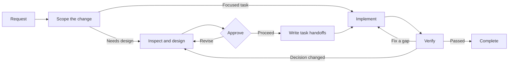

# codex-workflows

[](https://developers.openai.com/codex/cli)
[](https://developers.openai.com/codex/skills/)
[](https://opensource.org/licenses/MIT)

Repeatable software development workflows for [OpenAI Codex CLI](https://developers.openai.com/codex/cli) that keep scope and design decisions traceable through implementation, tests, and review.

Codex can implement a well-scoped task directly. codex-workflows is for changes where the harder problem is keeping analysis, design, implementation, and final verification aligned after the first answer.

Each phase delegates to task-specific subagents and hands off through explicit repository artifacts. The workflow inspects the existing codebase, selects the smallest sufficient process, pauses at decision boundaries, implements one task at a time, and checks whether the finished work still matches the agreed requirements.

---

## Quick Start

### Choose a path

| What do you need? | Start with |
|---|---|
| Deliver a backend, API, CLI, or general change end to end | `$recipe-implement` |
| Complete a focused task without staged design handoffs | `$recipe-task` |
| Design first and implement later | `$recipe-design` → `$recipe-plan` → `$recipe-build` |
| Design and build a React / TypeScript web frontend | `$recipe-front-design` → `$recipe-front-plan` → `$recipe-front-build` |
| Deliver a backend and React frontend change together | `$recipe-fullstack-implement` |
| Review an implementation against its design | `$recipe-review` or `$recipe-front-review` |
| Investigate a problem without changing code | `$recipe-diagnose` |
| Run a throwaway experiment or one-shot script | Use Codex directly |

### Install and run

```bash
cd your-project
npx codex-workflows install
```

Then in Codex CLI:

```
$recipe-implement Add user authentication with JWT
```

`$` is Codex CLI's syntax for invoking a skill explicitly. Type `$recipe-` to see all available recipes via tab completion.

---

## Why use a development workflow?

Codex can carry a large plan to completion. The harder problem is keeping a larger change coherent after the first answer.

Consider a hypothetical authentication change. Analysis finds that the existing authentication path should be extended. During implementation, a second mechanism looks convenient, the response contract changes with it, and the frontend adapts to the new shape. Every local edit may look reasonable and every test may pass, while the result no longer matches the approach the team approved.

codex-workflows keeps the existing path as the default, requires evidence for new design surface, and carries the agreed contract into tasks, tests, and final review. If implementation discovers that the contract must change, the workflow returns to the relevant decision instead of silently expanding the change.

This costs more agent calls and tokens than direct execution. Use it when scope drift, lost decisions, or an unreviewed contract change would cost more than the workflow. For a throwaway experiment, one-shot script, or other work where traceability is not valuable, use Codex directly.

Because the workflows are installed into the repository, contributors can use the same recipes, agents, and review boundaries without rebuilding them in each prompt.

---

## How It Works



The converged requirement and structural decision burden decide the route. File count is supporting evidence, not a threshold, so repository layout alone cannot inflate a task:

| Scale | Structural signal | What happens |
|-------|-------------------|--------------|
| Small | One reversible outcome within an existing boundary | Simplified plan → direct implementation |
| Medium | One outcome crosses a boundary or needs a durable decision | Design Doc → work plan → task execution |
| Large | Independent outcomes, layer-specific designs, or staged migration/rollout | PRD when required → ADR when required → Design Doc → test skeletons when required → work plan → task execution |

After work plan approval, Codex tracks the execution steps, implements each task with focused verification, runs repository quality checks, and creates one commit per task. A design deviation, unresolved contract, or out-of-scope write pauses execution for a decision.

Recipes pass explicit inputs and repository artifacts to subagents instead of relying on the accumulated implementation conversation. Generation and review therefore use separate task-specific contexts, while the governing decisions remain inspectable in the repository.

### A handoff you can inspect

The included [Work Plan template](.agents/skills/documentation-criteria/references/plan-template.md) requires every implementation-relevant Design Doc item to have a covering task or an explicit gap:

```markdown
| Source Design Doc | DD Section | DD Item | Category | Covered By Task(s) | Gap Status | Notes |
|---|---|---|---|---|---|---|
| docs/design/example-design.md | API contract | Preserve the error response shape | contract-change | P2-T1 | covered | |
| docs/design/example-design.md | Verification | Exercise cache invalidation | verification | - | gap | Add a covering task before approval |
```

The [Task template](.agents/skills/documentation-criteria/references/task-template.md) then carries protected conditions, allowed actions, binding decisions, observable contract values, proof obligations, and yes-or-no completion checks into implementation. Final review reads the governing documents and completed diff rather than relying on the implementation conversation.

### A real workflow run

[The BytePlus Seedream provider integration in mcp-image](https://github.com/shinpr/mcp-image/pull/114) was an 18-file change that added a third external image provider while preserving the provider-neutral MCP request, client, file-save, and file-URI contracts. The workflow divided the implementation into eight planned tasks and carried provider routing, capability differences, external-call boundaries, and verification obligations through design, implementation, and review.

The resulting integration could move directly into live evaluation through the production MCP path. That evaluation established the final model routing, prompt-generation limit, timeout, and response handling without changing the public MCP contract. Independent reviews also returned the implementation for an unbounded file read, a runtime validation bypass, a blocking FIFO path, and inconsistent API-key normalization. All four findings were fixed before merge, and the PR passed all 303 tests across 19 files plus a no-retry live provider call.

---

## Installation

### Requirements

- [Codex CLI](https://developers.openai.com/codex/cli) (latest)
- Node.js >= 22

### Install

Install into the current project:

```bash
cd your-project
npx codex-workflows install
```

This copies into your project:
- `.agents/skills/` — Codex skills (foundational + recipes)
- `.codex/agents/` — Subagent TOML definitions
- Manifest file for tracking managed files

To make the workflows available to Codex across all projects, install them into
your user-level `CODEX_HOME` instead:

```bash
npx codex-workflows install --user
```

This installs skills into `$CODEX_HOME/skills/` and agents into
`$CODEX_HOME/agents/`. When `CODEX_HOME` is not set, it defaults to `~/.codex`.

### Update

```bash
# Preview what will change
npx codex-workflows update --dry-run

# Apply updates
npx codex-workflows update

# Update a user-level installation
npx codex-workflows update --user
```

Files you've modified locally are preserved — the updater compares each file against its hash at install time and skips any file you've changed. New files from the update are added automatically.

```bash
# Check installed version
npx codex-workflows status

# Check a user-level installation
npx codex-workflows status --user
```

---

## Workflow Recipe Reference

Invoke recipes with `$recipe-name` in Codex. Type `$recipe-` and use tab completion to see all available recipes.

<details>
<summary>View all recipe entry points</summary>

### Backend & General

| Recipe | What it does | When to use |
|--------|-------------|-------------|
| `$recipe-implement` | Full lifecycle with layer routing (backend/frontend/fullstack) | New features — universal entry point |
| `$recipe-task` | Single task with rule selection | Bug fixes, small changes |
| `$recipe-design` | Requirements → ADR/Design Doc | Architecture planning |
| `$recipe-plan` | Design Doc → test skeletons → work plan | Planning phase, including nullable E2E skeleton handling |
| `$recipe-prepare-implementation` | Verify work plan readiness and resolve prep gaps | Pre-build check that the plan is implementable |
| `$recipe-build` | Execute backend tasks with validation between steps | Resume backend implementation |
| `$recipe-review` | Design Doc compliance and security validation with auto-fixes | Post-implementation check |
| `$recipe-diagnose` | Problem investigation → failure-point verification → solution | Bug investigation |
| `$recipe-reverse-engineer` | Generate PRD + Design Docs from existing code | Legacy system documentation |
| `$recipe-add-integration-tests` | Add integration/E2E tests from Design Doc | Test coverage for existing code |
| `$recipe-update-doc` | Update existing Design Doc / PRD / ADR with review | Spec changes, document maintenance |

### Frontend (React/TypeScript)

| Recipe | What it does | When to use |
|--------|-------------|-------------|
| `$recipe-front-design` | Requirements → UI Spec → frontend Design Doc | Frontend architecture planning |
| `$recipe-front-adjust` | Implemented UI adjustment with external context and verification | Focused UI changes after implementation |
| `$recipe-front-plan` | Frontend Design Doc → test skeletons → work plan | Frontend planning phase |
| `$recipe-front-build` | Execute frontend tasks with RTL + quality checks | Resume frontend implementation |
| `$recipe-front-review` | Frontend compliance and security validation with React-specific fixes | Frontend post-implementation check |

### Fullstack (Cross-Layer)

| Recipe | What it does | When to use |
|--------|-------------|-------------|
| `$recipe-fullstack-implement` | Full lifecycle with separate Design Docs per layer | Cross-layer features |
| `$recipe-fullstack-build` | Execute tasks with layer-aware agent routing | Resume cross-layer implementation |

</details>

## Working State

Recipes use `docs/plans/` as ephemeral working state for work plans, decomposed task files, prep tasks, review-fix tasks, and intermediate analysis files. Add it to your project's `.gitignore` unless your team intentionally wants to review those transient files:

```gitignore
docs/plans/
```

PRDs, ADRs, UI Specs, and Design Docs are durable project documents and are intended to be committed.

---

## Included Guidance

Recipes load the repository-aware guidance required for the current task. You rarely need to select these skills directly.

<details>
<summary>View foundational skills</summary>

| Skill | What it provides |
|-------|-----------------|
| `coding-rules` | Code quality, function design, error handling, refactoring |
| `testing` | TDD Red-Green-Refactor, test types, AAA pattern, mocking |
| `ai-development-guide` | Anti-patterns, debugging (5 Whys), quality check workflow |
| `documentation-criteria` | Document creation rules and templates (PRD, ADR, Design Doc, Work Plan) |
| `requirement-convergence` | Outcome, requirement layers, user-authored exclusions, and rough structural cost before design |
| `implementation-approach` | Strategy selection: vertical / horizontal / hybrid slicing |
| `integration-e2e-testing` | Integration/E2E test design, value-based selection, review criteria |
| `external-resource-context` | Access methods for design sources, design systems, API schemas, and verification environments |
| `llm-friendly-context` | Clear prompts, handoffs, generated artifacts, task files, and review findings for downstream agents |
| `task-analyzer` | Task analysis, scale estimation, skill selection |
| `subagents-orchestration-guide` | Multi-agent coordination, workflow flows, guided autonomous execution |

Web-frontend references are included for TypeScript used in web frontend work, including React applications (`coding-rules/references/typescript.md`, `testing/references/typescript.md`). They do not apply to backend TypeScript.

</details>

---

## Specialized Agents

Codex spawns these as needed during recipe execution. You do not need to learn them first; recipes route work to the right agents automatically. Each agent runs in its own context with specialized instructions and skill configurations.

<details>
<summary>View all specialized agent roles</summary>

### Document Creation Agents

| Agent | Role |
|-------|------|
| `requirement-analyzer` | Requirement convergence, rough cost, and structural work scale determination |
| `prd-creator` | PRD creation and structuring |
| `technical-designer` | ADR and Design Doc creation (backend) |
| `technical-designer-frontend` | Frontend ADR and Design Doc creation (React) |
| `ui-spec-designer` | UI Specification from PRD and optional prototype code |
| `codebase-analyzer` | Existing codebase analysis before Design Doc creation |
| `ui-analyzer` | UI facts from external resources (design tools, design-system docs, deployed UI) and frontend code |
| `work-planner` | Work plan creation from Design Docs |
| `document-reviewer` | Document consistency and approval |
| `design-sync` | Cross-document consistency verification |

### Implementation Agents

| Agent | Role |
|-------|------|
| `task-decomposer` | Work plan → atomic task files |
| `task-executor` | TDD implementation following task files (backend) |
| `task-executor-frontend` | React implementation with Testing Library |
| `quality-fixer` | Quality checks and fixes until all pass (backend) |
| `quality-fixer-frontend` | React-specific quality checks (TypeScript, RTL, bundle) |
| `acceptance-test-generator` | Test skeleton generation from acceptance criteria |
| `integration-test-reviewer` | Test quality review |

### Analysis Agents

| Agent | Role |
|-------|------|
| `code-reviewer` | Design Doc compliance validation |
| `code-verifier` | Document-code consistency verification |
| `security-reviewer` | Security compliance review after implementation |
| `rule-advisor` | Skill selection for standalone work not already governed by a recipe |
| `scope-discoverer` | Codebase scope discovery for reverse docs, including PRD unit grouping |

### Diagnosis Agents

| Agent | Role |
|-------|------|
| `investigator` | Evidence collection, path mapping, and failure-point discovery |
| `verifier` | Path coverage validation and independent failure-point evaluation |
| `solver` | Solution derivation with tradeoff analysis |

</details>

---

## Project Structure

After installation, your project gets:

<details>
<summary>View installed files</summary>

```
your-project/
├── .agents/skills/           # Codex skills
│   ├── coding-rules/         # Foundational (auto-loaded)
│   ├── testing/
│   ├── ai-development-guide/
│   ├── documentation-criteria/
│   ├── requirement-convergence/
│   ├── implementation-approach/
│   ├── integration-e2e-testing/
│   ├── external-resource-context/
│   ├── task-analyzer/
│   ├── subagents-orchestration-guide/
│   ├── recipe-implement/     # Recipes ($recipe-*)
│   ├── recipe-design/
│   ├── recipe-build/
│   ├── recipe-front-adjust/
│   ├── recipe-plan/
│   ├── recipe-prepare-implementation/
│   ├── recipe-review/
│   ├── recipe-diagnose/
│   ├── recipe-task/
│   ├── recipe-update-doc/
│   ├── recipe-reverse-engineer/
│   └── recipe-add-integration-tests/
├── .codex/agents/            # Subagent TOML definitions
│   ├── requirement-analyzer.toml
│   ├── technical-designer.toml
│   ├── ui-analyzer.toml
│   ├── task-executor.toml
│   └── ... (25 agents total)
└── docs/                     # Created as you use the recipes
    ├── prd/
    ├── design/
    ├── adr/
    ├── ui-spec/
    └── plans/
        └── tasks/
```

</details>

---

## Works With

If your requirements already live in Linear or an existing PRD, [linear-prism](https://github.com/shinpr/linear-prism) can decompose them into implementation-ready tasks by reading the codebase, making dependencies explicit, and preserving Design Doc boundaries.

Those tasks can then be passed into `$recipe-design` to enter the design phase with clearer scope and better task visibility.

---

## FAQ

**Q: What models does this work with?**

A: Designed for the latest GPT models. Lightweight subagents (e.g. rule-advisor) can use smaller models for faster analysis. Models are configurable per agent in the TOML files.

**Q: Can I customize the agents?**

A: Yes. Edit the TOML files in `.codex/agents/` — change model, sandbox_mode, developer_instructions, or skills.config. Files you modify locally are preserved during `npx codex-workflows update`.

For a user-level installation, edit the files in `$CODEX_HOME/agents/` and use
`npx codex-workflows update --user`. User-level files modified after installation
are preserved in the same way.

**Q: What's the difference between `$recipe-implement` and `$recipe-fullstack-implement`?**

A: `$recipe-implement` is the universal entry point. It runs requirement-analyzer first, detects affected layers from the codebase, and automatically routes to backend, frontend, or fullstack flow. `$recipe-fullstack-implement` skips the detection and goes straight into the fullstack flow (separate Design Docs per layer, design-sync, layer-aware task execution). Use `$recipe-implement` when you're not sure; use `$recipe-fullstack-implement` when you know upfront that the feature spans both layers.

**Q: Does this work with MCP servers?**

A: Yes. Codex skills and subagents work alongside [MCP](https://developers.openai.com/codex/mcp) — skills operate at the instruction layer while MCP operates at the tool transport layer. Custom agents inherit parent `mcp_servers` when the agent TOML omits `mcp_servers`; add agent-local MCP config only for agent-specific servers or tool filtering.

**Q: How is this related to claude-code-workflows?**

A: [claude-code-workflows](https://github.com/shinpr/claude-code-workflows) is the Claude Code counterpart. The repositories share the same workflow philosophy, adapted to each tool's native extension points. They can coexist in the same project because Codex uses `.agents/skills/`, `.codex/agents/`, and `AGENTS.md`, while Claude Code uses its own `.claude/` files and `CLAUDE.md`.

**Q: What if a subagent seems stuck?**

A: Long waits can be normal in this workflow because many subagents perform substantial multi-step work. The orchestrator keeps ownership of the pending deliverable, continues waiting for the required output, and uses diagnostics only to confirm missing inputs or restate the pending deliverable. User direction remains the boundary for interrupting that work.

---

## Design Rationale

<details>
<summary>Background reading behind the workflow design</summary>

- [Planning Is the Real Superpower of Agentic Coding](https://www.norsica.jp/blog/planning-superpower-agentic-coding) — why explicit planning turns large-task execution from raw generation into verification against a design and task breakdown
- [Why LLMs Are Bad at 'First Try' and Great at Verification](https://www.norsica.jp/blog/llm-verification-over-generation) — why review loops and session separation are more reliable than first-shot generation on complex work
- [Stop Putting Everything in AGENTS.md](https://www.norsica.jp/blog/stop-putting-everything-in-agents-md) — why `AGENTS.md` should stay lean while rules, docs, and task instructions live near the point of use

</details>

---

## License

MIT License — free to use, modify, and distribute.

---

Built and maintained by [@shinpr](https://github.com/shinpr)
