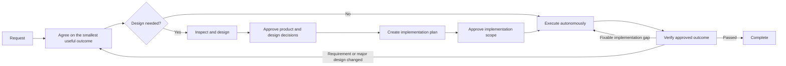

# codex-workflows

[](https://developers.openai.com/codex/cli)
[](https://developers.openai.com/codex/skills/)
[](https://opensource.org/licenses/MIT)

codex-workflows keeps Codex focused on the smallest approved outcome while preserving its implementation autonomy.

On non-trivial work, Codex can implement every requested detail or introduce a larger solution than the product outcome requires.

codex-workflows is a repository-installed set of Agent Skills and custom agents for [OpenAI Codex CLI](https://developers.openai.com/codex/cli). It checks the scope before design and records the approved outcome for use during implementation and review. The main Codex session coordinates specialist agents and resolves implementation details from repository evidence.

---

## Why not use Codex directly?

Direct Codex is the better fit for a well-scoped fix, disposable experiment, or one-shot script. It is faster and cheaper when the intended outcome and safe implementation boundary are already clear.

Use codex-workflows when the scope needs explicit review and approval.

For example, a request to extend an existing authentication path can drift into adding a second mechanism and changing the response contract. The frontend may adapt and the tests may pass even though the result no longer matches the approved design.

codex-workflows controls that expansion at three points:

| When | What changes |
|---|---|
| Before approval | The workflow compares the request with the desired outcome, explicit exclusions, the existing code, and rough implementation cost. It removes work that does not earn its cost and chooses only the documents and tests the change needs. |
| Across agent handoffs | Approved requirements and design decisions live in repository documents and task files. A new agent reads those decisions instead of reconstructing intent from a long conversation. |
| After approval | The orchestrator evaluates agent results and review findings against the approved outcome. It applies useful corrections, declines scope-expanding suggestions with evidence, and lets Codex resolve implementation details autonomously. |

This workflow uses more agent calls and tokens than direct execution. Use it when protecting the approved outcome is worth that cost.

### A real workflow run

[The BytePlus Seedream provider integration in mcp-image](https://github.com/shinpr/mcp-image/pull/114) added a third external image provider across 18 files. Eight planned tasks kept the public MCP request, client, file-save, and file-URI contracts unchanged while the provider-specific implementation evolved.

Before merge, live evaluation established the final model routing, prompt limits, timeout, and response handling. Independent reviews also caught an unbounded file read, a validation bypass, a blocking FIFO path, and inconsistent API-key normalization. All four were fixed, and the PR passed 303 tests across 19 files plus a no-retry live provider call. Across the eight tasks and four fixes, the approved public contracts stayed unchanged.

---

## Quick Start

### Install and run

```bash
cd your-project
npx codex-workflows install
```

Then invoke a recipe in Codex CLI:

```
$recipe-implement Add user authentication with JWT
```

`$` invokes a skill explicitly. Type `$recipe-` to see the available workflows.

### Choose a path

| What do you need? | Start with |
|---|---|
| Deliver a backend, API, CLI, or general change end to end | `$recipe-implement` |
| Complete a focused task without staged design handoffs | `$recipe-task` |
| Design first and implement later | `$recipe-design` → `$recipe-plan` → `$recipe-build` |
| Design and build a React / TypeScript web frontend | `$recipe-front-design` → `$recipe-front-plan` → `$recipe-front-build` |
| Deliver a backend and React frontend change together | `$recipe-fullstack-implement` |
| Review an implementation against its design | `$recipe-review` or `$recipe-front-review` |
| Investigate a problem without changing code | `$recipe-diagnose` |
| Run a throwaway experiment or one-shot script | Use Codex directly |

---

## How It Works



The number of independent product and design decisions determines the route. File count does not:

| Scale | What the change needs | What happens |
|-------|-----------------------|--------------|
| Small | One outcome that follows an existing pattern in one part of the system | One task file → implementation |
| Medium | One outcome that needs coordination across parts of the system or a lasting design decision | UI Spec / ADR when required → Design Doc → select useful integration/E2E tests → Work Plan → implementation |
| Large | Multiple outcomes that need separate design decisions | PRD → UI Spec / ADR when required → Design Doc → select useful integration/E2E tests → Work Plan → implementation |

ADR creation starts from a current-scope technical choice with at least two credible materially distinct options and durable impact. Structural scale supplies context; every qualifying choice gets its own ADR, and the complete set is reviewed together.

For Medium and Large work, an integration or E2E test is selected only when it proves a component, process, browser, or service interaction that a cheaper test cannot. Selecting none is valid.

The documents record only decisions that affect the product or repository implementation. Third-party approval, production access, release execution, and unrelated operational work do not become implementation gates.

After the implementation scope is approved, the orchestrator runs the tasks, focused verification, applicable repository checks, and one implementation commit per task. It resolves problems from the approved documents and repository evidence first. It asks you only when progress requires a new product requirement, a change to a major approved design decision, authority only you hold, or an irreversible action you did not authorize.

Specialist agents receive the exact documents and paths needed for their work. They do not depend on the accumulated implementation conversation.

### A handoff you can inspect

The included [Work Plan template](.agents/skills/documentation-criteria/references/plan-template.md) ties each implementation task to its Design Doc section and acceptance criteria:

```markdown
### P1-T1: Preserve the error response contract

- **Source**: `docs/design/example-design.md`, API contract, AC-2
- **Scope**: Update the repository implementation and its focused tests
- **Depends on**: none
- **Verification**: Run the contract test and observe the documented response shape
```

The [Task File Contract](.agents/skills/llm-friendly-context/references/task-template.md) carries the source, intended result, target files, and executable verification into implementation. It adds a `Verification Focus` only when a test could pass without proving one important behavior. Final review checks the approved documents against the completed diff.

---

## Installation

### Requirements

- [Codex CLI](https://developers.openai.com/codex/cli) (latest)
- Node.js >= 22

### Install

Install into the current project:

```bash
cd your-project
npx codex-workflows install
```

This copies into your project:
- `.agents/skills/`: Codex skills (foundational + recipes)
- `.codex/agents/`: Subagent TOML definitions
- Manifest file for tracking managed files

To make the workflows available to Codex across all projects, install them into
your user-level `CODEX_HOME` instead:

```bash
npx codex-workflows install --user
```

This installs skills into `$CODEX_HOME/skills/` and agents into
`$CODEX_HOME/agents/`. When `CODEX_HOME` is not set, it defaults to `~/.codex`.

### Update

```bash
# Preview what will change
npx codex-workflows update --dry-run

# Apply updates
npx codex-workflows update

# Update a user-level installation
npx codex-workflows update --user
```

The updater preserves files you have modified locally. It compares each file against its hash at install time and skips changed files. Versioned update history applies file moves and deletions in order, so local changes follow a moved file to its current path. Modified files retired without a replacement are moved to `.codex-workflows-preserved/<version>/`. New files from the update are added automatically.

```bash
# Check installed version
npx codex-workflows status

# Check a user-level installation
npx codex-workflows status --user
```

---

## Workflow Recipe Reference

Invoke recipes with `$recipe-name` in Codex. Type `$recipe-` and use tab completion to see all available recipes.

<details>
<summary>View all recipe entry points</summary>

### Backend & General

| Recipe | What it does | When to use |
|--------|-------------|-------------|
| `$recipe-implement` | Full lifecycle with layer routing (backend/frontend/fullstack) | New features (universal entry point) |
| `$recipe-task` | Single task with rule selection | Bug fixes, small changes |
| `$recipe-design` | Requirements → scale-selected product and design documents | Product and architecture design |
| `$recipe-plan` | Design Doc → selective integration/E2E skeletons → work plan | Planning phase from an approved Design Doc |
| `$recipe-prepare-implementation` | Set up dependencies, local services, and test tools using existing project commands | Explicit setup request or a required local tool is unavailable |
| `$recipe-build` | Execute backend tasks with validation between steps | Resume backend implementation |
| `$recipe-review` | Design Doc compliance and security validation with optional approved corrections | Post-implementation check |
| `$recipe-diagnose` | Problem investigation → failure-point verification → solution | Bug investigation |
| `$recipe-reverse-engineer` | Generate PRD + Design Docs from existing code | Legacy system documentation |
| `$recipe-add-integration-tests` | Add integration/E2E tests from Design Doc | Test coverage for existing code |
| `$recipe-update-doc` | Update existing Design Doc / PRD / ADR with review | Spec changes, document maintenance |

### Frontend (React/TypeScript)

| Recipe | What it does | When to use |
|--------|-------------|-------------|
| `$recipe-front-design` | Requirements → scale-selected UI and design documents | Frontend product and architecture design |
| `$recipe-front-adjust` | Focused UI adjustment using repository, supplied, or required external evidence | Focused UI changes after implementation |
| `$recipe-front-plan` | Frontend Design Doc → selective integration/E2E skeletons → work plan | Frontend planning phase |
| `$recipe-front-build` | Execute frontend tasks with focused verification and quality checks | Resume frontend implementation |
| `$recipe-front-review` | Frontend compliance and security validation with optional approved React corrections | Frontend post-implementation check |

### Fullstack (Cross-Layer)

| Recipe | What it does | When to use |
|--------|-------------|-------------|
| `$recipe-fullstack-implement` | Full lifecycle with separate Design Docs per layer | Cross-layer features |
| `$recipe-fullstack-build` | Execute tasks with layer-aware agent routing | Resume cross-layer implementation |

</details>

## Working State

Recipes use `docs/plans/` as ephemeral working state for Work Plans, implementation Task Files, and temporary review-fix or test-addition Task Files. Task and phase progress is updated there after each quality-approved implementation commit, while those progress files stay outside that commit. Add the directory to your project's `.gitignore` unless your team intentionally wants to review those transient files:

```gitignore
docs/plans/
```

PRDs, ADRs, UI Specs, and Design Docs are durable project documents and are intended to be committed.

---

## Included Guidance

Recipes load the repository-aware guidance required for the current task. You rarely need to select these skills directly.

<details>
<summary>View foundational skills</summary>

| Skill | What it provides |
|-------|-----------------|
| `coding-rules` | Code quality, function design, error handling, refactoring |
| `testing` | Proportionate TDD, observable proof selection, test integrity, and repository-required verification |
| `ai-development-guide` | Evidence-backed root cause, proportionate impact analysis, and applicable quality assurance |
| `documentation-criteria` | Document creation rules and templates (PRD, ADR, Design Doc, Work Plan) |
| `requirement-convergence` | Outcome, requirement layers, user-decided exclusions, and rough cost before design |
| `implementation-approach` | Direct MVP, evidence-backed expansion, subtraction, slicing, and verification boundary |
| `integration-e2e-testing` | Selecting and designing only integration/E2E tests that prove a necessary real interaction |
| `external-resource-context` | Focused resolution of one external evidence source required by a current decision |
| `llm-friendly-context` | Clear prompts, handoffs, generated artifacts, task files, and review findings for downstream agents |
| `task-analyzer` | Task intent analysis, task type classification, skill selection |
| `subagents-orchestration-guide` | Multi-agent coordination, workflow flows, guided autonomous execution |

Web-frontend references are included for TypeScript used in web frontend work, including React applications (`coding-rules/references/typescript.md`, `testing/references/typescript.md`). They do not apply to backend TypeScript.

</details>

---

## Specialized Agents

Codex spawns these as needed during recipe execution. You do not need to learn them first; recipes route domain work to the relevant agents while the orchestrator retains workflow control. Each agent runs in its own context with specialized instructions and explicitly named required skills.

<details>
<summary>View all specialized agent roles</summary>

### Document Creation Agents

| Agent | Role |
|-------|------|
| `requirement-analyzer` | Compact request signals plus repository-backed scope and cost evidence for orchestrator decisions |
| `prd-creator` | PRD creation and structuring |
| `technical-designer` | Complete ADR-batch or Design Doc creation (backend/general) |
| `technical-designer-frontend` | Complete frontend ADR-batch or Design Doc creation (React) |
| `ui-spec-designer` | UI Specification from PRD and optional prototype code |
| `codebase-analyzer` | Compact repository evidence for option selection, minimal design, and verification |
| `ui-analyzer` | UI facts from external resources (design tools, design-system docs, deployed UI) and frontend code |
| `work-planner` | Work plan creation from Design Docs |
| `document-reviewer` | Document review against governing requirements and design decisions |
| `design-sync` | Cross-document consistency verification |

### Implementation Agents

| Agent | Role |
|-------|------|
| `task-decomposer` | Work plan → the fewest executable implementation task files |
| `task-executor` | Task-file implementation with focused verification (backend) |
| `task-executor-frontend` | React implementation with applicable behavior-focused RTL verification |
| `quality-fixer` | Applicable repository checks and in-scope quality repair (backend) |
| `quality-fixer-frontend` | Applicable React, TypeScript, RTL, and bundle checks and repair |
| `acceptance-test-generator` | Selected integration/E2E test skeleton generation |
| `integration-test-reviewer` | Test quality review |

### Analysis Agents

| Agent | Role |
|-------|------|
| `code-reviewer` | Design Doc compliance validation |
| `code-verifier` | Document-code consistency verification |
| `security-reviewer` | Security compliance review after implementation |
| `rule-advisor` | Skill selection for standalone work not already governed by a recipe |
| `scope-discoverer` | Codebase scope discovery for reverse docs, including PRD unit grouping |

### Diagnosis Agents

| Agent | Role |
|-------|------|
| `investigator` | Evidence collection, path mapping, and failure-point discovery |
| `verifier` | Path coverage validation and independent failure-point evaluation |
| `solver` | Solution derivation with tradeoff analysis |

</details>

---

## Project Structure

After installation, your project gets:

<details>
<summary>View installed layout</summary>

```
your-project/
├── .agents/skills/           # Codex skills
│   ├── coding-rules/         # Foundational guidance
│   ├── testing/
│   ├── ai-development-guide/
│   ├── documentation-criteria/
│   ├── requirement-convergence/
│   ├── implementation-approach/
│   ├── integration-e2e-testing/
│   ├── external-resource-context/
│   ├── llm-friendly-context/
│   ├── task-analyzer/
│   ├── subagents-orchestration-guide/
│   └── recipe-*/             # Workflow entry points ($recipe-*)
├── .codex/agents/            # Subagent TOML definitions
│   ├── requirement-analyzer.toml
│   ├── technical-designer.toml
│   ├── ui-analyzer.toml
│   ├── task-executor.toml
│   └── ... (25 agents total)
└── docs/                     # Created as you use the recipes
    ├── prd/
    ├── design/
    ├── adr/
    ├── ui-spec/
    └── plans/
        └── tasks/
```

</details>

---

## Works With

If your requirements already live in Linear or an existing PRD, [linear-prism](https://github.com/shinpr/linear-prism) can decompose them into implementation-ready tasks by reading the codebase, making dependencies explicit, and preserving Design Doc boundaries.

Those tasks can then be passed into `$recipe-design` to enter the design phase with clearer scope and better task visibility.

---

## FAQ

**Q: What models does this work with?**

A: Designed for current GPT models. Models are configurable per agent in the TOML files.

**Q: Can I customize the agents?**

A: Yes. Edit the TOML files in `.codex/agents/` to change `model`, `sandbox_mode`, or `developer_instructions`. Each agent names its required skills in `developer_instructions`. Files you modify locally are preserved during `npx codex-workflows update`.

For a user-level installation, edit the files in `$CODEX_HOME/agents/` and use
`npx codex-workflows update --user`. User-level files modified after installation
are preserved in the same way.

**Q: What's the difference between `$recipe-implement` and `$recipe-fullstack-implement`?**

A: `$recipe-implement` is the universal entry point. It runs requirement-analyzer first, uses the request and repository scope to identify affected layers, and automatically routes to backend, frontend, or fullstack flow. `$recipe-fullstack-implement` skips the detection and goes straight into the fullstack flow (separate Design Docs per layer, design-sync, layer-aware task execution). Use `$recipe-implement` when you're not sure; use `$recipe-fullstack-implement` when you know upfront that the feature spans both layers.

**Q: Does this work with MCP servers?**

A: Yes. Codex skills and subagents work alongside [MCP](https://developers.openai.com/codex/mcp). Skills operate at the instruction layer, while MCP operates at the tool transport layer. Custom agents inherit parent `mcp_servers` when the agent TOML omits `mcp_servers`; add agent-local MCP config only for agent-specific servers or tool filtering.

**Q: How is this related to claude-code-workflows?**

A: [claude-code-workflows](https://github.com/shinpr/claude-code-workflows) is the Claude Code counterpart. The repositories share the same workflow philosophy, adapted to each tool's native extension points. They can coexist in the same project because codex-workflows installs its agent definitions under `.codex/agents/` and Claude Code uses its own `.claude/` files.

**Q: What if a subagent seems stuck?**

A: The main Codex session owns progress. It inspects the returned evidence, retries or repairs unusable results, and continues unaffected work. A subagent result does not stop the workflow by itself.

---

## Design Rationale

<details>
<summary>Background reading behind the workflow design</summary>

- [Planning Is the Real Superpower of Agentic Coding](https://www.norsica.jp/blog/planning-superpower-agentic-coding): why explicit planning turns large-task execution from raw generation into verification against a design and task breakdown
- [Why LLMs Are Bad at 'First Try' and Great at Verification](https://www.norsica.jp/blog/llm-verification-over-generation): why review loops and session separation are more reliable than first-shot generation on complex work
- [Stop Putting Everything in AGENTS.md](https://www.norsica.jp/blog/stop-putting-everything-in-agents-md): why `AGENTS.md` should stay lean while rules, docs, and task instructions live near the point of use

</details>

---

## License

MIT License. Free to use, modify, and distribute.

---

Built and maintained by [@shinpr](https://github.com/shinpr)
