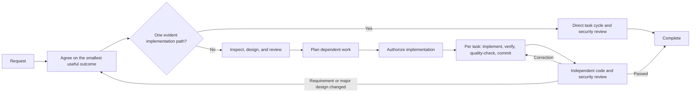

# codex-workflows

[](https://developers.openai.com/codex/cli)
[](https://developers.openai.com/codex/skills/)
[](https://opensource.org/licenses/MIT)

**English** | [简体中文](README.zh-CN.md) | [日本語](README.ja.md) | [Español](README.es.md) | [한국어](README.ko.md) | [Português (Brasil)](README.pt-BR.md)

On larger product work, Codex can pursue technical consistency beyond what the user needs. Handling every edge case and making each path deterministic can alter what users see even when the approved outcome does not require it.

codex-workflows keeps that work within the smallest approved outcome. It confirms which user-visible behavior may change, records what must not, and requires evidence before completion. Within those boundaries, Codex chooses reversible implementation details from the repository.

The workflows are installed as Agent Skills and custom agents for [OpenAI Codex CLI](https://developers.openai.com/codex/cli). The main Codex session checks scope and rough cost before design, owns progress and review decisions, and carries approved work through implementation and independent verification.

---

## Why not use Codex directly?

Direct Codex is the better fit for a well-scoped fix, disposable experiment, or one-shot script. It is faster and cheaper when the intended outcome and safe implementation boundary are already clear.

Use codex-workflows when technical choices can change the product scope, user-visible behavior, or a decision that needs to survive across contexts.

For example, a request to extend an existing authentication path can lead to a technically cleaner second mechanism, broader validation, and a new response contract. The frontend may adapt and the tests may pass, while users receive behavior that was never part of the approved change.

codex-workflows controls that expansion throughout the run:

| Control | What changes |
|---|---|
| Scope | The workflow compares the request with the desired outcome, explicit exclusions, the existing code, and rough implementation cost. Work that does not earn its cost is removed before it becomes architecture, and cut back later if it got in anyway. |
| Phase gates | Requirements, design, and planning outputs are checked before they can authorize the next phase. Fresh agents read the approved decisions and evidence they need instead of reconstructing intent from a long conversation. |
| Execution | Once you authorize implementation, Codex executes the task set autonomously. Each task passes its focused verification and applicable repository checks before its implementation commit. |
| Completion | Independent code and security reviews check that the completed change stays within the approved scope and has no serious problems. Required corrections return through the same implementation and quality cycle. |

This workflow uses more agent calls and tokens than direct execution. Use it when protecting the approved outcome is worth that cost. When a change does not need every check, [lite mode](#lite-mode) runs fewer of them.

An edge case does not require work simply because Codex can handle it. Additional validation, deterministic behavior, or a new abstraction must protect an approved requirement, an observable contract, or a demonstrated failure. This cuts both ways: when a design decision turns out to carry more than the outcome needs, the workflow removes it instead of defending it because a document already named it.

### A real workflow run

[The BytePlus Seedream provider integration in mcp-image](https://github.com/shinpr/mcp-image/pull/114) added a third external image provider across 18 files. Eight planned tasks kept the public MCP request, client, file-save, and file-URI contracts unchanged while the provider-specific implementation evolved.

Before merge, live evaluation established the final model routing, prompt limits, timeout, and response handling. Independent reviews also caught an unbounded file read, a validation bypass, a blocking FIFO path, and inconsistent API-key normalization. All four were fixed, and the PR passed 303 tests across 19 files plus a no-retry live provider call. Across the eight tasks and four fixes, the approved public contracts stayed unchanged.

---

## Quick Start

Requires Node.js 22 or later and the latest [Codex CLI](https://developers.openai.com/codex/cli).

### Install and run

```bash
cd your-project
npx codex-workflows install
```

Then invoke a recipe in Codex CLI:

```
$recipe-implement Add user authentication with JWT
```

`$` invokes a skill explicitly. Type `$recipe-` to see the available workflows.

### Choose a path

| What do you need? | Start with |
|---|---|
| Deliver a change end to end and let the workflow choose the backend, frontend, or fullstack path | `$recipe-implement` |
| Design first and implement later | `$recipe-design` → `$recipe-plan` → `$recipe-build` |
| Design and build a React / TypeScript web frontend | `$recipe-front-design` → `$recipe-front-plan` → `$recipe-front-build` |
| Start directly with separate backend and React frontend design flows | `$recipe-fullstack-implement` |
| Review an implementation against its design | `$recipe-review` or `$recipe-front-review` |
| Define or update repository-specific quality rules | `$recipe-quality-profile` |
| Investigate a problem without changing code | `$recipe-diagnose` |
| Run a throwaway experiment or one-shot script | Use Codex directly |

---

## How It Works


```mermaid
flowchart LR
    A[Request] --> B[Agree on the smallest useful outcome]
    B --> C{One evident implementation path?}
    C -->|Yes| S[Direct task cycle and security review]
    S --> L[Complete]
    C -->|No| D[Inspect, design, and review]
    D --> E[Plan dependent work]
    E --> F[Authorize implementation]
    F --> H[Per task: implement, verify, quality-check, commit]
    H --> K[Independent code and security review]
    K -->|Correction| H
    K -->|Requirement or major design changed| B
    K -->|Passed| L[Complete]
```

The number of independent product and design decisions determines the route, not file count or the number of edge cases Codex can identify.

A change with one outcome that follows an existing pattern in one part of the system goes straight to a confirmed task, then implementation with quality and security checks. A change that needs coordination across parts of the system or a lasting design decision first gets a reviewed Design Doc and Work Plan, plus a UI Spec or ADR when one of its decisions calls for it. A change with multiple outcomes that need separate design decisions also gets a PRD unless you choose to skip it. An ADR is written only when a lasting choice has at least two materially distinct options, and an integration or E2E test only when a cheaper test cannot prove the interaction.

Once implementation is authorized, the main session runs the tasks, focused verification, applicable repository checks, and one implementation commit per task. It resolves problems from the approved documents and repository evidence first. User-visible behavior remains a product boundary rather than something the implementation may adjust for internal consistency. The main session asks you only when progress requires a new product requirement, a change to something you asked for or ruled out, authority only you hold, or an irreversible action you did not authorize. Finding a smaller way to reach the same outcome is not one of those, and neither is re-confirming permission you have already given. The workflow does not add third-party approval, production access, or release execution as conditions for completing the implementation.

### Lite mode

```
$recipe-implement Lite mode. Add a sortable table to the reports page
```

Ask for lite mode in the request to any recipe. The phases and approval stops stay the same, but Codex runs fewer checks: Design Docs are not checked against the repository or against each other, and the security review is skipped. Repository checks run once after the last task instead of before every commit, and the final code review still runs. Lite mode stays on for the rest of the session until you ask Codex to drop it.

---

## Installation

### Install

Install into the current project:

```bash
cd your-project
npx codex-workflows install
```

This copies into your project:
- `.agents/skills/`: Codex skills (foundational + recipes)
- `.codex/agents/`: Subagent TOML definitions
- Manifest file for tracking managed files

To make the workflows available to Codex across all projects, install them into
your user-level `CODEX_HOME` instead:

```bash
npx codex-workflows install --user
```

This installs skills into `$CODEX_HOME/skills/` and agents into
`$CODEX_HOME/agents/`. When `CODEX_HOME` is not set, it defaults to `~/.codex`.

### Customize agents

Agent definitions are regular TOML files. For a project installation, edit files in `.codex/agents/`; for a user-level installation, edit files in `$CODEX_HOME/agents/`. You can change the `model`, `sandbox_mode`, or `developer_instructions`. Updates preserve files you have edited, as described below.

### Update

```bash
# Preview what will change
npx codex-workflows update --dry-run

# Apply updates
npx codex-workflows update

# Update a user-level installation
npx codex-workflows update --user
```

The updater preserves files you have modified locally. It compares each file against its hash at install time and skips changed files. When an update moves a file, your local changes follow it to the new path. Modified files retired without a replacement are moved to `.codex-workflows-preserved/<version>/`. New files from the update are added automatically.

```bash
# Check installed version
npx codex-workflows status

# Check a user-level installation
npx codex-workflows status --user
```

---

## Workflow Recipe Reference

Invoke recipes with `$recipe-name` in Codex. Type `$recipe-` and use tab completion to see all available recipes.

<details>
<summary>View all recipe entry points</summary>

### Backend & General

| Recipe | What it does | When to use |
|--------|-------------|-------------|
| `$recipe-implement` | Full lifecycle with layer routing (backend/frontend/fullstack) | New features (universal entry point) |
| `$recipe-design` | Requirements → scale-selected product and design documents | Product and architecture design |
| `$recipe-plan` | Design Doc → selective integration/E2E skeletons → work plan | Planning phase from an approved Design Doc |
| `$recipe-prepare-implementation` | Prepare existing repository-local tools needed by an approved Work Plan | Explicit setup request or a concrete task capability is unavailable |
| `$recipe-build` | Execute backend tasks with validation between steps | Resume backend implementation |
| `$recipe-review` | Review implementation scope, Design Doc compliance, code quality, and security; apply corrections approved by the user | Post-implementation check |
| `$recipe-quality-profile` | Define or update repository-specific quality rules in `docs/project-context/quality.yaml` | Set up or maintain quality rules |
| `$recipe-diagnose` | Problem investigation → failure-point verification → solution | Bug investigation |
| `$recipe-reverse-engineer` | Generate PRD + Design Docs from existing code | Legacy system documentation |
| `$recipe-add-integration-tests` | Add integration/E2E tests from Design Doc | Test coverage for existing code |
| `$recipe-update-doc` | Update existing Design Doc / PRD / ADR with review | Spec changes, document maintenance |

### Frontend (React/TypeScript)

| Recipe | What it does | When to use |
|--------|-------------|-------------|
| `$recipe-front-design` | Requirements → scale-selected UI and design documents | Frontend product and architecture design |
| `$recipe-front-adjust` | Focused UI adjustment using repository, supplied, or required external evidence | Focused UI changes after implementation |
| `$recipe-front-plan` | Frontend Design Doc → selective integration/E2E skeletons → work plan | Frontend planning phase |
| `$recipe-front-build` | Execute frontend tasks with focused verification and quality checks | Resume frontend implementation |
| `$recipe-front-review` | Review frontend scope, compliance, code quality, and security; apply React corrections approved by the user | Frontend post-implementation check |

### Fullstack (Cross-Layer)

| Recipe | What it does | When to use |
|--------|-------------|-------------|
| `$recipe-fullstack-implement` | Full lifecycle with separate Design Docs per layer | Cross-layer features |
| `$recipe-fullstack-build` | Execute tasks with layer-aware agent routing | Resume cross-layer implementation |

</details>

## Working State

Recipes use `docs/plans/` as ephemeral working state for Work Plans, implementation Task Files, and temporary review-fix or test-addition Task Files. Add the directory to your project's `.gitignore` unless your team intentionally wants to review those transient files:

```gitignore
docs/plans/
```

PRDs, ADRs, UI Specs, and Design Docs are durable project documents and are intended to be committed.

---

## Included Guidance

You don't need a recipe to benefit from these. Codex loads them in ordinary conversation too, so a quick bug fix gets the same root-cause, scope, and verification standards as a full workflow.

<details>
<summary>View foundational skills</summary>

| Skill | What it provides |
|-------|-----------------|
| `coding-rules` | Code quality, function design, error handling, refactoring |
| `testing` | Proportionate TDD, observable proof selection, test integrity, and repository-required verification |
| `ai-development-guide` | Evidence-backed root cause, proportionate impact analysis, and applicable quality assurance |
| `reviewee-judgment` | Evidence-backed evaluation of received findings before they generate revision work |
| `documentation-criteria` | Document creation rules and templates (PRD, ADR, Design Doc, Work Plan) |
| `requirement-convergence` | Outcome, requirement layers, user-decided exclusions, and rough cost before design |
| `implementation-approach` | Direct MVP, evidence-backed expansion, subtraction, slicing, and verification boundary |
| `integration-e2e-testing` | Selecting and designing only integration/E2E tests that prove a necessary real interaction |
| `external-resource-context` | Focused resolution of one external evidence source required by a current decision |
| `llm-friendly-context` | Clear prompts, handoffs, generated artifacts, task files, and review findings for downstream agents |
| `subagent-delegation` | Letting subagents finish assigned work and ask for input when a decision is needed |
| `subagents-orchestration-guide` | Multi-agent coordination, workflow flows, guided autonomous execution |

Web-frontend references are included for TypeScript used in web frontend work, including React applications (`coding-rules/references/typescript.md`, `testing/references/typescript.md`). They do not apply to backend TypeScript.

</details>

---

## Ecosystem

[Nautilus](https://github.com/shinpr/nautilus) validates product ideas and produces PRDs, while [linear-prism](https://github.com/shinpr/linear-prism) turns approved requirements into implementation-ready Linear issues. [claude-code-workflows](https://github.com/shinpr/claude-code-workflows) brings the same approach to Claude Code and can be installed alongside codex-workflows. [outcome-doctor](https://github.com/shinpr/agent-clinic) has Jev check whether Codex's implementation approach is more or less than the outcome needs, and requires a TypeSafe API key.

### Want to use Astra here?

Running a whole workflow on Astra burns through usage fast. [codex-subagent-playbook](https://github.com/shinpr/codex-subagent-playbook) is a Codex plugin that picks a model per subagent, so Astra is used only where it changes the outcome.

<details>
<summary>Setup (2 steps)</summary>

Run the main Codex session on Sol, or on Astra at low reasoning effort. The plugin's skills decide which subagents get Astra and which run on a cheaper model, and implementation goes to Luna.

**1. Install the plugin**

```bash
codex plugin marketplace add shinpr/codex-subagent-playbook
```

Open `/plugins`, find **Subagent Playbook**, and install it.

**2. Disable this repository's `subagent-delegation` skill**

This repository and the plugin each ship a delegation skill, and neither takes priority. Which one a session loads varies, and nothing reports it or errors out, so behavior drifts between runs. Open `~/.codex/config.toml` and add one entry pointing at the `subagent-delegation` skill you installed.

If you installed with `--user`:

```toml
[[skills.config]]
path = "/Users/you/.codex/skills/subagent-delegation/SKILL.md"
enabled = false
```

If you installed into a project:

```toml
[[skills.config]]
path = "/absolute/path/to/your-project/.agents/skills/subagent-delegation/SKILL.md"
enabled = false
```

Write the path out in full: `~` and environment variables do not work here.

Nothing changes in how you use the workflows. The plugin's skills load when they apply, and each task runs on a model that fits it.

</details>

---

## Design Rationale

<details>
<summary>Background reading behind the workflow design</summary>

- [Why LLMs Are Bad at 'First Try' and Great at Verification](https://www.norsica.jp/blog/llm-verification-over-generation): why review loops and session separation are more reliable than first-shot generation on complex work
- [When Better Models Make Old Agent Workflows Worse](https://www.norsica.jp/blog/when-better-models-make-old-agent-workflows-worse): why workflow constraints should protect boundaries and evidence without prescribing the model's internal path
- [Reasoning Effort Is Not a Quality Setting](https://www.norsica.jp/blog/reasoning-effort-is-not-a-quality-setting): why broader technical exploration is useful only when the phase can select and discard the extra work it finds
- [Stop Putting Everything in AGENTS.md](https://www.norsica.jp/blog/stop-putting-everything-in-agents-md): why `AGENTS.md` should stay lean while rules, docs, and task instructions live near the point of use

</details>

---

## License

MIT License. Free to use, modify, and distribute.

---

Built and maintained by [@shinpr](https://github.com/shinpr)
