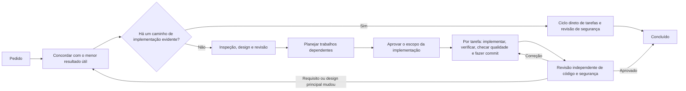

# codex-workflows

[](https://developers.openai.com/codex/cli)
[](https://developers.openai.com/codex/skills/)
[](https://opensource.org/licenses/MIT)

[English](README.md) | [简体中文](README.zh-CN.md) | [日本語](README.ja.md) | [Español](README.es.md) | [한국어](README.ko.md) | **Português (Brasil)**

Em trabalhos maiores de produto, o Codex pode buscar uma consistência técnica que vai além do que o usuário realmente precisa. Cobrir todos os casos extremos e tornar cada caminho determinístico parece rigoroso, mas pode alterar o que o usuário vê mesmo quando o resultado aprovado não exige isso.

O codex-workflows mantém o trabalho dentro do menor resultado aprovado. Primeiro, deixa claro quais comportamentos visíveis podem mudar e quais devem permanecer intactos; depois, exige evidências antes de considerar o trabalho concluído. Dentro desses limites, o Codex escolhe detalhes de implementação reversíveis com base no que já existe no repositório.

Os fluxos são instalados como Agent Skills e agentes personalizados para o [OpenAI Codex CLI](https://developers.openai.com/codex/cli). A sessão principal do Codex confirma o escopo e o custo aproximado antes do design, acompanha o andamento e decide como tratar as revisões, levando o trabalho aprovado da implementação até uma verificação independente.

---

## Por que não usar o Codex diretamente?

O Codex sozinho é mais indicado para uma correção bem delimitada, um experimento descartável ou um script pontual. Quando o resultado esperado e o limite seguro de implementação já estão claros, essa opção é mais rápida e econômica.

Use o codex-workflows quando uma escolha técnica puder ampliar o escopo do produto, alterar o comportamento percebido pelo usuário ou quando uma decisão precisar sobreviver à troca de contexto.

Por exemplo, um pedido para estender um fluxo de autenticação existente pode acabar criando um segundo mecanismo — tecnicamente mais elegante —, validações mais amplas e um novo contrato de resposta. O frontend pode se adaptar e todos os testes podem passar, mas o usuário recebe um comportamento que nunca foi aprovado.

O codex-workflows controla esse crescimento de escopo ao longo de toda a execução:

| Controle | O que muda |
|---|---|
| Escopo | O fluxo compara o pedido com o resultado desejado, as exclusões explícitas, o código existente e o custo aproximado de implementação. O trabalho que não justifica seu custo é removido antes de virar arquitetura. |
| Controles entre fases | Os resultados de requisitos, design e planejamento são revisados antes de autorizar a próxima fase. Novos agentes leem as decisões aprovadas e as evidências necessárias, em vez de reconstruir a intenção a partir de uma conversa longa. |
| Execução | Depois que o escopo de implementação é aprovado, o Codex executa o conjunto de tarefas de forma autônoma. Cada tarefa passa por sua verificação específica e pelas checagens aplicáveis do repositório antes do commit de implementação. |
| Conclusão | Revisões independentes de código e segurança confirmam que a mudança concluída permanece dentro do escopo aprovado e não contém falhas graves. As correções obrigatórias voltam ao mesmo ciclo de implementação e qualidade. |

Esse fluxo usa mais chamadas de agentes e mais tokens do que uma execução direta. Use-o quando proteger o resultado aprovado valer esse custo.

Um caso extremo não exige trabalho só porque o Codex sabe resolvê-lo. Validações adicionais, comportamento determinístico ou uma nova abstração precisam servir para proteger um requisito aprovado ou um contrato observável, ou para corrigir uma falha comprovada.

### Um caso real

A [integração do provedor BytePlus Seedream no mcp-image](https://github.com/shinpr/mcp-image/pull/114) adicionou um terceiro provedor externo de imagens em 18 arquivos. Oito tarefas planejadas permitiram evoluir a implementação específica do provedor sem alterar os contratos públicos de solicitação MCP, cliente, salvamento de arquivos ou URI de arquivo.

Antes do merge, uma avaliação com o serviço real definiu o roteamento final dos modelos, os limites do prompt, o timeout e o tratamento das respostas. Revisões independentes também encontraram uma leitura de arquivo sem limite, uma forma de contornar a validação, um caminho FIFO bloqueante e uma normalização inconsistente das chaves de API. Os quatro problemas foram corrigidos, e o PR passou por 303 testes em 19 arquivos, além de uma chamada real ao provedor sem novas tentativas. Os contratos públicos aprovados permaneceram intactos durante as oito tarefas e as quatro correções.

---

## Início rápido

Requer Node.js 22 ou mais recente e a versão mais atual do [Codex CLI](https://developers.openai.com/codex/cli).

### Instalar e executar

```bash
cd your-project
npx codex-workflows install
```

Depois, invoque um fluxo no Codex CLI:

```
$recipe-implement Adicione autenticação de usuários com JWT
```

O prefixo `$` invoca uma skill explicitamente. Digite `$recipe-` para ver os fluxos disponíveis.

### Escolha o ponto de partida

| O que você precisa? | Comece por |
|---|---|
| Entregar de ponta a ponta uma mudança de backend, API, CLI ou de propósito geral | `$recipe-implement` |
| Projetar agora e implementar depois | `$recipe-design` → `$recipe-plan` → `$recipe-build` |
| Projetar e construir um frontend web com React / TypeScript | `$recipe-front-design` → `$recipe-front-plan` → `$recipe-front-build` |
| Entregar juntos uma mudança de backend e outra de frontend React | `$recipe-fullstack-implement` |
| Revisar uma implementação com base no design | `$recipe-review` ou `$recipe-front-review` |
| Definir ou atualizar regras de revisão específicas do repositório | `$recipe-quality-profile` |
| Investigar um problema sem alterar o código | `$recipe-diagnose` |
| Fazer um experimento descartável ou um script pontual | Use o Codex diretamente |

---

## Como funciona



O caminho depende da quantidade de decisões independentes de produto e design, não do número de arquivos nem da quantidade de casos extremos que o Codex consegue identificar.

| Tamanho | O que a mudança exige | O que acontece |
|---------|-----------------------|----------------|
| Pequeno | Um resultado que segue um padrão existente em uma parte do sistema | Tarefa confirmada → implementação → checagens de qualidade e segurança |
| Médio | Um resultado que exige coordenação entre partes do sistema ou uma decisão de design duradoura | Design Doc revisado, mais UI Spec / ADR quando necessário → verificação de integração/E2E selecionada → Work Plan revisado → ciclos autônomos de tarefas → verificação final |
| Grande | Vários resultados que exigem decisões de design separadas | PRD e Design Docs revisados, mais UI Spec / ADR quando necessário → verificação de integração/E2E selecionada → Work Plan revisado → ciclos autônomos de tarefas → verificação final |

Um ADR só é criado para uma escolha duradoura dentro do escopo atual quando existem pelo menos duas opções materialmente diferentes. Se várias escolhas atenderem a esses critérios, seus ADRs são revisados em conjunto. Um teste de integração ou E2E só é escolhido quando um teste mais barato não consegue comprovar a interação necessária. Algumas mudanças não exigem nenhum dos dois.

Somente decisões que afetam o produto ou a implementação do repositório seguem para documentos permanentes do projeto. Aprovação de terceiros, acesso à produção, execução de releases e tarefas operacionais sem relação com a mudança não se tornam bloqueios de implementação.

Depois da aprovação do escopo, o orquestrador executa as tarefas, as verificações específicas, as checagens aplicáveis do repositório e um commit de implementação por tarefa. Primeiro, resolve problemas com base nos documentos aprovados e nas evidências do repositório. O comportamento percebido pelo usuário continua sendo um limite de produto: a implementação não pode ajustá-lo por conta própria em nome da consistência interna. O orquestrador só consulta o usuário quando avançar exige um novo requisito de produto, uma mudança em uma decisão principal já aprovada, uma autorização que apenas o usuário possui ou uma ação irreversível que não foi autorizada.

Os agentes especialistas recebem exatamente os documentos e caminhos necessários para o trabalho. Eles apresentam evidências específicas, mas não têm autoridade para ampliar o resultado aprovado.

### Como as decisões sobrevivem à troca de contexto

Separar os contextos evita que exploração, design, implementação e revisão compartilhem premissas de forma silenciosa. O [modelo de Work Plan](.agents/skills/documentation-criteria/references/plan-template.md) incluído associa cada tarefa de implementação à seção correspondente do Design Doc e aos critérios de aceite:

```markdown
### P1-T1: Preservar o contrato de respostas de erro

- **Fonte**: `docs/design/example-design.md`, contrato da API, AC-2
- **Escopo**: Atualizar a implementação do repositório e seus testes específicos
- **Dependências**: nenhuma
- **Verificação**: Executar o teste de contrato e observar o formato de resposta documentado
```

O [Task File Contract](.agents/skills/llm-friendly-context/references/task-template.md) leva para a implementação a fonte, o resultado esperado, os arquivos-alvo e uma verificação executável. Ele só acrescenta um `Verification Focus` quando um teste pode passar sem comprovar um comportamento importante. Após a execução, todas as checagens aplicáveis do repositório rodam sobre a mudança completa antes do commit. Os revisores finais comparam o código concluído com os documentos aprovados. Eles também procuram mudanças fora do escopo aprovado e problemas sérios de qualidade do código. Quando uma correção é aceita, a revisão seguinte se concentra nas verificações que ela pode afetar. Execute `$recipe-quality-profile` para definir outras regras de revisão em `docs/project-context/quality.yaml` com base nas evidências do próprio repositório.

---

## Instalação

### Requisitos

- [Codex CLI](https://developers.openai.com/codex/cli) (versão mais recente)
- Node.js >= 22

### Instalar

Instale no projeto atual:

```bash
cd your-project
npx codex-workflows install
```

Os seguintes itens serão copiados para o projeto:

- `.agents/skills/`: skills do Codex (fundamentos e fluxos)
- `.codex/agents/`: definições TOML dos subagentes
- Um manifesto para acompanhar os arquivos gerenciados

Para disponibilizar os fluxos em todos os projetos, instale-os no `CODEX_HOME` do usuário:

```bash
npx codex-workflows install --user
```

As skills são instaladas em `$CODEX_HOME/skills/` e os agentes em `$CODEX_HOME/agents/`. Quando `CODEX_HOME` não está definido, o padrão é `~/.codex`.

### Atualizar

```bash
# Visualizar as mudanças
npx codex-workflows update --dry-run

# Aplicar a atualização
npx codex-workflows update

# Atualizar uma instalação de usuário
npx codex-workflows update --user
```

O atualizador preserva os arquivos modificados localmente. Ele compara cada arquivo com o hash registrado na instalação e ignora os que mudaram. O histórico versionado de atualizações aplica movimentações e exclusões na ordem correta, de modo que as alterações locais acompanham um arquivo movido até o caminho atual. Arquivos modificados que forem removidos sem substituto são transferidos para `.codex-workflows-preserved/<version>/`. Arquivos novos são adicionados automaticamente.

```bash
# Consultar a versão instalada
npx codex-workflows status

# Consultar uma instalação de usuário
npx codex-workflows status --user
```

---

## Referência dos fluxos

No Codex, use `$recipe-name` para invocar um fluxo. Digite `$recipe-` e use o preenchimento com Tab para ver todas as opções.

<details>
<summary>Ver todos os pontos de entrada</summary>

### Backend e uso geral

| Fluxo | O que faz | Quando usar |
|-------|-----------|-------------|
| `$recipe-implement` | Ciclo completo com escolha de camada (backend/frontend/fullstack) | Novas funcionalidades (entrada universal) |
| `$recipe-task` | Uma tarefa com seleção de regras | Correções e mudanças pequenas |
| `$recipe-design` | Requisitos → documentos de produto e design conforme o porte | Design de produto e arquitetura |
| `$recipe-plan` | Design Doc → estruturas seletivas de testes de integração/E2E → Work Plan | Planejamento a partir de um Design Doc aprovado |
| `$recipe-prepare-implementation` | Prepara as ferramentas locais já existentes exigidas por um Work Plan aprovado | Pedido explícito de preparação ou recurso necessário indisponível |
| `$recipe-build` | Executa tarefas de backend com validação entre etapas | Retomar uma implementação de backend |
| `$recipe-review` | Revisa o escopo de implementação, a conformidade com o Design Doc, a qualidade do código e a segurança; aplica as correções aprovadas pelo usuário | Revisão após a implementação |
| `$recipe-quality-profile` | Define ou atualiza regras de revisão específicas do repositório em `docs/project-context/quality.yaml` | Configuração e manutenção das regras de revisão |
| `$recipe-diagnose` | Investigação → verificação do ponto de falha → solução | Investigação de bugs |
| `$recipe-reverse-engineer` | Gera PRD e Design Docs com base no código existente | Documentação de sistemas legados |
| `$recipe-add-integration-tests` | Adiciona testes de integração/E2E a partir do Design Doc | Ampliar a cobertura do código existente |
| `$recipe-update-doc` | Atualiza e revisa um Design Doc / PRD / ADR existente | Mudanças de especificação e manutenção de documentação |

### Frontend (React/TypeScript)

| Fluxo | O que faz | Quando usar |
|-------|-----------|-------------|
| `$recipe-front-design` | Requisitos → documentos de UI e design conforme o porte | Design de produto e arquitetura frontend |
| `$recipe-front-adjust` | Ajuste delimitado de UI com evidências do repositório, material fornecido ou fontes externas necessárias | Mudanças pontuais de UI após a implementação |
| `$recipe-front-plan` | Design Doc frontend → estruturas seletivas de integração/E2E → Work Plan | Fase de planejamento frontend |
| `$recipe-front-build` | Executa tarefas frontend com verificação específica e checagens de qualidade | Retomar uma implementação frontend |
| `$recipe-front-review` | Revisa o escopo, a conformidade, a qualidade do código e a segurança do frontend; aplica as correções React aprovadas pelo usuário | Revisão frontend após a implementação |

### Fullstack (entre camadas)

| Fluxo | O que faz | Quando usar |
|-------|-----------|-------------|
| `$recipe-fullstack-implement` | Ciclo completo com um Design Doc separado por camada | Funcionalidades que atravessam camadas |
| `$recipe-fullstack-build` | Executa tarefas encaminhando agentes conforme a camada | Retomar uma implementação fullstack |

</details>

## Estado de trabalho

Os fluxos usam `docs/plans/` como estado temporário para Work Plans, Task Files de implementação e Task Files provisórios de correção ou adição de testes. O progresso de tarefas e fases é atualizado ali depois de cada commit aprovado pelas checagens de qualidade, mas esses arquivos de estado não entram no commit. Adicione o diretório ao `.gitignore` do projeto, a menos que a equipe queira revisar deliberadamente esses arquivos transitórios:

```gitignore
docs/plans/
```

PRDs, ADRs, UI Specs e Design Docs são documentos permanentes do projeto e devem ser incluídos nos commits.

---

## Orientações incluídas

Cada fluxo carrega as orientações adaptadas ao repositório de que a tarefa atual precisa. Raramente é necessário selecionar essas skills manualmente.

<details>
<summary>Ver skills fundamentais</summary>

| Skill | O que oferece |
|-------|---------------|
| `coding-rules` | Qualidade de código, design de funções, tratamento de erros e refatoração |
| `testing` | TDD proporcional ao escopo, escolha de verificações observáveis, integridade dos testes e verificações exigidas pelo repositório |
| `ai-development-guide` | Causa raiz apoiada por evidências, análise de impacto proporcional ao escopo e garantia de qualidade aplicável |
| `reviewee-judgment` | Avaliação baseada em evidências antes que observações de revisão virem trabalho |
| `documentation-criteria` | Regras e modelos para PRD, ADR, Design Doc e Work Plan |
| `requirement-convergence` | Resultado, camadas de requisitos, exclusões decididas pelo usuário e custo aproximado antes do design |
| `implementation-approach` | MVP direto, expansão justificada, redução, divisão e limite de verificação |
| `integration-e2e-testing` | Seleção e design apenas dos testes de integração/E2E que comprovam uma interação real necessária |
| `external-resource-context` | Consulta direcionada a uma fonte externa necessária para a decisão atual |
| `llm-friendly-context` | Contexto claro para os agentes que o usarão depois: prompts, repasses, artefatos gerados, Task Files e observações de revisão |
| `task-analyzer` | Análise de intenção, classificação de tarefas e seleção de skills |
| `subagents-orchestration-guide` | Coordenação de múltiplos agentes, condução dos fluxos e execução autônoma guiada |

Também há referências para TypeScript de frontend web, incluindo aplicações React (`coding-rules/references/typescript.md` e `testing/references/typescript.md`). Elas não se aplicam a TypeScript de backend.

</details>

---

## Agentes especializados

O Codex cria esses agentes conforme a necessidade durante a execução dos fluxos. Não é preciso conhecer seus papéis antes: os fluxos encaminham o trabalho para o especialista adequado, enquanto o orquestrador mantém o controle geral. Cada agente trabalha em um contexto próprio, com instruções especializadas e skills obrigatórias nomeadas explicitamente.

<details>
<summary>Ver todos os agentes especializados</summary>

### Agentes de documentação

| Agente | Função |
|--------|--------|
| `requirement-analyzer` | Resume os sinais do pedido e as evidências do repositório necessárias para decisões de escopo e custo |
| `prd-creator` | Cria e estrutura PRDs |
| `technical-designer` | Cria um lote completo de ADRs ou um Design Doc (backend/geral) |
| `technical-designer-frontend` | Cria um lote completo de ADRs ou um Design Doc frontend (React) |
| `ui-spec-designer` | Cria uma UI Specification a partir do PRD e, opcionalmente, de código de protótipo |
| `codebase-analyzer` | Reúne do repositório apenas as informações necessárias para decisões técnicas, o design mais simples e a verificação |
| `ui-analyzer` | Levanta fatos sobre a UI a partir de recursos externos (ferramentas de design, documentação do design system e interfaces em produção) e do código frontend |
| `work-planner` | Cria o Work Plan a partir de Design Docs |
| `document-reviewer` | Revisa documentos com base nos requisitos e decisões de design que os regem |
| `design-sync` | Verifica a consistência entre documentos |

### Agentes de implementação

| Agente | Função |
|--------|--------|
| `task-decomposer` | Converte o Work Plan no menor número possível de Task Files executáveis |
| `task-executor` | Implementa Task Files com verificação específica (backend) |
| `task-executor-frontend` | Implementa React com a verificação comportamental RTL aplicável |
| `quality-fixer` | Executa as checagens aplicáveis do repositório e corrige problemas de qualidade dentro do escopo (backend) |
| `quality-fixer-frontend` | Executa e corrige checagens aplicáveis de React, TypeScript, RTL e bundle |
| `acceptance-test-generator` | Gera estruturas para os testes de integração/E2E selecionados |
| `integration-test-reviewer` | Revisa a qualidade dos testes |

### Agentes de análise

| Agente | Função |
|--------|--------|
| `code-reviewer` | Compara a implementação concluída com o escopo e os documentos aprovados, e aponta problemas sérios de qualidade do código |
| `code-verifier` | Verifica a consistência entre documentos e código |
| `security-reviewer` | Revisa a segurança depois da implementação |
| `rule-advisor` | Seleciona skills para tarefas avulsas fora dos fluxos existentes |
| `scope-discoverer` | Descobre o escopo do código para documentação reversa e agrupa unidades de PRD |
| `technical-spike` | Executa um teste empírico limitado para medir um efeito ou custo que pode mudar uma decisão de design |

### Agentes de diagnóstico

| Agente | Função |
|--------|--------|
| `investigator` | Coleta evidências, mapeia caminhos e encontra pontos de falha |
| `verifier` | Valida a cobertura dos caminhos e avalia falhas de forma independente |
| `solver` | Deriva soluções e analisa seus trade-offs |

</details>

---

## Estrutura do projeto

Após a instalação, o projeto recebe:

<details>
<summary>Ver a estrutura instalada</summary>

```
your-project/
├── .agents/skills/           # Skills do Codex
│   ├── coding-rules/         # Orientações fundamentais
│   ├── testing/
│   ├── ai-development-guide/
│   ├── reviewee-judgment/
│   ├── documentation-criteria/
│   ├── requirement-convergence/
│   ├── implementation-approach/
│   ├── integration-e2e-testing/
│   ├── external-resource-context/
│   ├── llm-friendly-context/
│   ├── task-analyzer/
│   ├── subagents-orchestration-guide/
│   └── recipe-*/             # Pontos de entrada ($recipe-*)
├── .codex/agents/            # Definições TOML dos subagentes
│   ├── requirement-analyzer.toml
│   ├── technical-designer.toml
│   ├── ui-analyzer.toml
│   ├── task-executor.toml
│   └── ... (26 agentes no total)
└── docs/                     # Criado conforme os fluxos são usados
    ├── prd/
    ├── design/
    ├── adr/
    ├── ui-spec/
    └── plans/
        └── tasks/
```

</details>

---

## Ferramentas relacionadas

Quando uma ideia de produto ainda precisa de descoberta ou validação, o [Nautilus](https://github.com/shinpr/nautilus) pode testar as premissas por trás dela e transformar os resultados em um PRD. Depois da aprovação, passe o PRD para `$recipe-implement` ou `$recipe-design`.

Se os requisitos já estiverem no Linear ou em um PRD existente, o [linear-prism](https://github.com/shinpr/linear-prism) pode ler o código, dividir o trabalho em issues do Linear prontas para implementação e registrar as dependências entre elas. Use uma issue aprovada como entrada para `$recipe-design`.

---

## Perguntas frequentes

**P: Com quais modelos funciona?**

R: O projeto foi criado para os modelos GPT atuais. O modelo pode ser configurado por agente nos arquivos TOML.

**P: Posso personalizar os agentes?**

R: Sim. Edite os arquivos TOML em `.codex/agents/` para alterar `model`, `sandbox_mode` ou `developer_instructions`. As skills obrigatórias de cada agente aparecem em `developer_instructions`. Os arquivos modificados localmente são preservados ao executar `npx codex-workflows update`.

Em uma instalação de usuário, edite os arquivos em `$CODEX_HOME/agents/` e use `npx codex-workflows update --user`. Arquivos de usuário alterados após a instalação são preservados da mesma forma.

**P: Qual é a diferença entre `$recipe-implement` e `$recipe-fullstack-implement`?**

R: `$recipe-implement` é o ponto de entrada universal. Primeiro ele executa requirement-analyzer, identifica as camadas afetadas com base no pedido e no escopo do repositório e encaminha automaticamente para o fluxo backend, frontend ou fullstack. `$recipe-fullstack-implement` pula essa detecção e entra direto no fluxo fullstack: Design Docs separados por camada, design-sync e execução de tarefas de acordo com a camada. Use `$recipe-implement` quando não tiver certeza e `$recipe-fullstack-implement` quando já souber que a funcionalidade envolve as duas camadas.

**P: Funciona com servidores MCP?**

R: Sim. As skills e os subagentes do Codex funcionam junto com o [MCP](https://developers.openai.com/codex/mcp). As skills operam na camada de instruções, enquanto o MCP opera na camada de transporte de ferramentas. Se o TOML do agente não definir `mcp_servers`, o agente personalizado herda os `mcp_servers` do pai. Adicione configuração MCP específica ao agente apenas quando precisar de servidores próprios ou filtragem de ferramentas.

**P: Como este projeto se relaciona com o claude-code-workflows?**

R: [claude-code-workflows](https://github.com/shinpr/claude-code-workflows) é o projeto equivalente para Claude Code. Os dois repositórios compartilham a mesma filosofia de fluxo, adaptada aos pontos de extensão nativos de cada ferramenta. Eles podem coexistir no mesmo projeto porque o codex-workflows instala as definições em `.codex/agents/`, enquanto o Claude Code usa seu próprio diretório `.claude/`.

**P: O que fazer se um subagente parecer travado?**

R: A sessão principal do Codex é responsável pelo andamento. Ela inspeciona as evidências recebidas, repete ou corrige resultados inutilizáveis e continua o trabalho não afetado. O resultado de um subagente, por si só, não interrompe o fluxo.

---

## Fundamentos do design

<details>
<summary>Leituras que fundamentam o design do fluxo</summary>

- [Why LLMs Are Bad at 'First Try' and Great at Verification](https://www.norsica.jp/blog/llm-verification-over-generation): por que ciclos de revisão e separação de sessões são mais confiáveis do que uma única geração em trabalhos complexos
- [When Better Models Make Old Agent Workflows Worse](https://www.norsica.jp/blog/when-better-models-make-old-agent-workflows-worse): por que as restrições do fluxo devem proteger limites e evidências sem prescrever o caminho interno do modelo
- [Reasoning Effort Is Not a Quality Setting](https://www.norsica.jp/blog/reasoning-effort-is-not-a-quality-setting): por que uma exploração técnica mais ampla só ajuda quando a fase consegue selecionar e descartar o trabalho adicional
- [Stop Putting Everything in AGENTS.md](https://www.norsica.jp/blog/stop-putting-everything-in-agents-md): por que o `AGENTS.md` deve permanecer enxuto, com regras, documentos e instruções perto do ponto de uso

</details>

---

## Licença

Licença MIT. Uso, modificação e distribuição são livres.

---

Criado e mantido por [@shinpr](https://github.com/shinpr).
