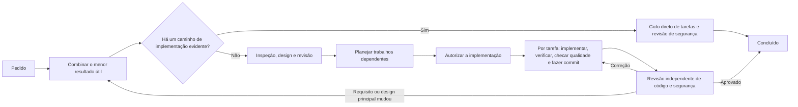

# codex-workflows

[](https://developers.openai.com/codex/cli)
[](https://developers.openai.com/codex/skills/)
[](https://opensource.org/licenses/MIT)

[English](README.md) | [简体中文](README.zh-CN.md) | [日本語](README.ja.md) | [Español](README.es.md) | [한국어](README.ko.md) | **Português (Brasil)**

Em trabalhos maiores de produto, o Codex pode buscar uma consistência técnica que vai além do que o usuário realmente precisa. Cobrir todos os casos extremos e tornar cada caminho determinístico pode alterar o que o usuário vê mesmo quando o resultado aprovado não exige isso.

O codex-workflows mantém o trabalho dentro do menor resultado aprovado. Primeiro, deixa claro quais comportamentos visíveis podem mudar e quais devem permanecer intactos; depois, exige evidências antes de considerar o trabalho concluído. Dentro desses limites, o Codex escolhe detalhes de implementação reversíveis com base no que já existe no repositório.

Os fluxos são instalados como Agent Skills e agentes personalizados para o [OpenAI Codex CLI](https://developers.openai.com/codex/cli). A sessão principal do Codex confirma o escopo e o custo aproximado antes do design, acompanha o andamento e decide como tratar as revisões, levando o trabalho aprovado da implementação até uma verificação independente.

---

## Por que não usar o Codex diretamente?

O Codex sozinho é mais indicado para uma correção bem delimitada, um experimento descartável ou um script pontual. Quando o resultado esperado e o limite seguro de implementação já estão claros, essa opção é mais rápida e econômica.

Use o codex-workflows quando uma escolha técnica puder ampliar o escopo do produto, alterar o comportamento percebido pelo usuário ou quando uma decisão precisar sobreviver à troca de contexto.

Por exemplo, um pedido para estender um fluxo de autenticação existente pode acabar criando um segundo mecanismo tecnicamente mais elegante, validações mais amplas e um novo contrato de resposta. O frontend pode se adaptar e todos os testes podem passar, mas o usuário recebe um comportamento que nunca foi aprovado.

O codex-workflows controla esse crescimento de escopo ao longo de toda a execução:

| Controle | O que muda |
|---|---|
| Escopo | O fluxo compara o pedido com o resultado desejado, as exclusões explícitas, o código existente e o custo aproximado de implementação. O trabalho que não justifica seu custo é removido antes de virar arquitetura e, se mesmo assim entrou, é cortado depois. |
| Controles entre fases | Os resultados de requisitos, design e planejamento são revisados antes de autorizar a próxima fase. Novos agentes leem as decisões aprovadas e as evidências necessárias, em vez de reconstruir a intenção a partir de uma conversa longa. |
| Execução | Depois que você autoriza a implementação, o Codex executa o conjunto de tarefas de forma autônoma. Cada tarefa passa por sua verificação específica e pelas checagens aplicáveis do repositório antes do commit de implementação. |
| Conclusão | Revisões independentes de código e segurança confirmam que a mudança concluída permanece dentro do escopo aprovado e não contém falhas graves. As correções obrigatórias voltam ao mesmo ciclo de implementação e qualidade. |

Esse fluxo usa mais chamadas de agentes e mais tokens do que uma execução direta. Use-o quando proteger o resultado aprovado valer esse custo. Quando uma mudança não precisa de todas as checagens, o [modo lite](#modo-lite) executa menos delas.

Um caso extremo não exige trabalho só porque o Codex sabe resolvê-lo. Validações adicionais, comportamento determinístico ou uma nova abstração precisam servir para proteger um requisito aprovado ou um contrato observável, ou para corrigir uma falha comprovada. E isso vale nos dois sentidos: se uma decisão de design acaba abrangendo mais do que o resultado exige, o fluxo a remove em vez de defendê-la só porque já está escrita em algum documento.

### Um caso real

A [integração do provedor BytePlus Seedream no mcp-image](https://github.com/shinpr/mcp-image/pull/114) adicionou um terceiro provedor externo de imagens em 18 arquivos. Oito tarefas planejadas permitiram evoluir a implementação específica do provedor sem alterar os contratos públicos de solicitação MCP, cliente, salvamento de arquivos ou URI de arquivo.

Antes do merge, uma avaliação com o serviço real definiu o roteamento final dos modelos, os limites do prompt, o timeout e o tratamento das respostas. Revisões independentes também encontraram uma leitura de arquivo sem limite, uma forma de contornar a validação, um caminho FIFO bloqueante e uma normalização inconsistente das chaves de API. Os quatro problemas foram corrigidos, e o PR passou por 303 testes em 19 arquivos, além de uma chamada real ao provedor sem novas tentativas. Os contratos públicos aprovados permaneceram intactos durante as oito tarefas e as quatro correções.

---

## Início rápido

Requer Node.js 22 ou mais recente e a versão mais atual do [Codex CLI](https://developers.openai.com/codex/cli).

### Instalar e executar

```bash
cd your-project
npx codex-workflows install
```

Depois, invoque um fluxo no Codex CLI:

```
$recipe-implement Adicione autenticação de usuários com JWT
```

O prefixo `$` invoca uma skill explicitamente. Digite `$recipe-` para ver os fluxos disponíveis.

### Escolha o ponto de partida

| O que você precisa? | Comece por |
|---|---|
| Entregar uma mudança de ponta a ponta e deixar o fluxo escolher entre backend, frontend e fullstack | `$recipe-implement` |
| Projetar agora e implementar depois | `$recipe-design` → `$recipe-plan` → `$recipe-build` |
| Projetar e construir um frontend web com React / TypeScript | `$recipe-front-design` → `$recipe-front-plan` → `$recipe-front-build` |
| Iniciar diretamente com fluxos de design separados para o backend e o frontend React | `$recipe-fullstack-implement` |
| Revisar uma implementação com base no design | `$recipe-review` ou `$recipe-front-review` |
| Definir ou atualizar regras de qualidade específicas do repositório | `$recipe-quality-profile` |
| Investigar um problema sem alterar o código | `$recipe-diagnose` |
| Fazer um experimento descartável ou um script pontual | Use o Codex diretamente |

---

## Como funciona


```mermaid
flowchart LR
    A[Pedido] --> B[Combinar o menor resultado útil]
    B --> C{Há um caminho de implementação evidente?}
    C -->|Sim| S[Ciclo direto de tarefas e revisão de segurança]
    S --> L[Concluído]
    C -->|Não| D[Inspeção, design e revisão]
    D --> E[Planejar trabalhos dependentes]
    E --> F[Autorizar a implementação]
    F --> H[Por tarefa: implementar, verificar, checar qualidade e fazer commit]
    H --> K[Revisão independente de código e segurança]
    K -->|Correção| H
    K -->|Requisito ou design principal mudou| B
    K -->|Aprovado| L[Concluído]
```

O caminho depende da quantidade de decisões independentes de produto e design, não do número de arquivos nem da quantidade de casos extremos que o Codex consegue identificar.

Uma mudança com um único resultado, que segue um padrão existente em uma parte do sistema, vai direto para uma tarefa confirmada e depois para a implementação, com checagens de qualidade e segurança. Uma mudança que exige coordenação entre partes do sistema ou uma decisão de design duradoura recebe antes um Design Doc e um Work Plan revisados, além de UI Spec ou ADR quando alguma de suas decisões pedir. Se a mudança tiver vários resultados que exigem decisões de design separadas, ela também recebe um PRD, a menos que você opte por omiti-lo. Um ADR só é criado quando uma escolha duradoura tem pelo menos duas opções substancialmente diferentes, e um teste de integração ou E2E só é escolhido quando um teste mais barato não consegue comprovar a interação.

Depois que a implementação é autorizada, a sessão principal executa as tarefas, as verificações específicas, as checagens aplicáveis do repositório e um commit de implementação por tarefa. Primeiro, resolve problemas com base nos documentos aprovados e nas evidências do repositório. O comportamento percebido pelo usuário continua sendo um limite de produto: a implementação não pode ajustá-lo por conta própria em nome da consistência interna. A sessão principal só consulta você quando avançar exige um novo requisito de produto, uma mudança em algo que você pediu ou descartou, uma autorização que só você tem ou uma ação irreversível que você não autorizou. Encontrar uma forma mais enxuta de chegar ao mesmo resultado não entra nessa lista, e pedir novamente uma permissão que você já concedeu também não. O fluxo não acrescenta aprovação de terceiros, acesso à produção nem execução de releases como condições para concluir a implementação.

### Modo lite

```
$recipe-implement Modo lite. Adicione uma tabela ordenável à página de relatórios
```

Peça o modo lite ao invocar qualquer fluxo. As fases e os pontos de aprovação continuam os mesmos, mas o Codex executa menos checagens: os Design Docs não são comparados com o repositório nem entre si, e a revisão de segurança é omitida. As checagens do repositório rodam uma única vez depois da última tarefa, em vez de antes de cada commit, e a revisão final do código continua sendo feita. O modo lite fica ativo pelo resto da sessão, até você pedir ao Codex para desativá-lo.

---

## Instalação

### Instalar

Instale no projeto atual:

```bash
cd your-project
npx codex-workflows install
```

Os seguintes itens serão copiados para o projeto:

- `.agents/skills/`: skills do Codex (fundamentos e fluxos)
- `.codex/agents/`: definições TOML dos subagentes
- Um manifesto para acompanhar os arquivos gerenciados

Para disponibilizar os fluxos em todos os projetos, instale-os no `CODEX_HOME` do usuário:

```bash
npx codex-workflows install --user
```

As skills são instaladas em `$CODEX_HOME/skills/` e os agentes em `$CODEX_HOME/agents/`. Quando `CODEX_HOME` não está definido, o padrão é `~/.codex`.

### Personalizar agentes

As definições dos agentes são arquivos TOML comuns. Em uma instalação de projeto, edite os arquivos em `.codex/agents/`; em uma instalação de usuário, edite os arquivos em `$CODEX_HOME/agents/`. É possível alterar `model`, `sandbox_mode` ou `developer_instructions`. Os arquivos editados são preservados nas atualizações, conforme explicado a seguir.

### Atualizar

```bash
# Visualizar as mudanças
npx codex-workflows update --dry-run

# Aplicar a atualização
npx codex-workflows update

# Atualizar uma instalação de usuário
npx codex-workflows update --user
```

O atualizador preserva os arquivos modificados localmente. Ele compara cada arquivo com o hash registrado na instalação e ignora os que mudaram. Quando uma atualização move um arquivo, suas alterações locais o acompanham até o novo caminho. Arquivos modificados que forem removidos sem substituto são transferidos para `.codex-workflows-preserved/<version>/`. Arquivos novos são adicionados automaticamente.

```bash
# Consultar a versão instalada
npx codex-workflows status

# Consultar uma instalação de usuário
npx codex-workflows status --user
```

Para desinstalar, execute `npx codex-workflows uninstall` (em uma instalação de usuário, acrescente `--user`). Arquivos modificados localmente não são apagados.

---

## Referência dos fluxos

No Codex, use `$recipe-name` para invocar um fluxo. Digite `$recipe-` e use o preenchimento com Tab para ver todas as opções.

<details>
<summary>Ver todos os pontos de entrada</summary>

### Backend e uso geral

| Fluxo | O que faz | Quando usar |
|-------|-----------|-------------|
| `$recipe-implement` | Ciclo completo com escolha de camada (backend/frontend/fullstack) | Novas funcionalidades (entrada universal) |
| `$recipe-design` | Requisitos → documentos de produto e design conforme o porte | Design de produto e arquitetura |
| `$recipe-plan` | Design Doc → estruturas seletivas de testes de integração/E2E → Work Plan | Planejamento a partir de um Design Doc aprovado |
| `$recipe-prepare-implementation` | Prepara as ferramentas já existentes no repositório exigidas por um Work Plan aprovado | Pedido explícito de preparação ou recurso necessário indisponível |
| `$recipe-build` | Executa tarefas de backend com validação entre etapas | Retomar uma implementação de backend |
| `$recipe-review` | Revisa o escopo de implementação, a conformidade com o Design Doc, a qualidade do código e a segurança; aplica as correções aprovadas pelo usuário | Revisão após a implementação |
| `$recipe-quality-profile` | Define ou atualiza regras de qualidade específicas do repositório em `docs/project-context/quality.yaml` | Configuração e manutenção das regras de qualidade |
| `$recipe-diagnose` | Investigação → verificação do ponto de falha → solução | Investigação de bugs |
| `$recipe-reverse-engineer` | Gera PRD e Design Docs com base no código existente | Documentação de sistemas legados |
| `$recipe-add-integration-tests` | Adiciona testes de integração/E2E a partir do Design Doc | Ampliar a cobertura do código existente |
| `$recipe-update-doc` | Atualiza e revisa um Design Doc / PRD / ADR existente | Mudanças de especificação e manutenção de documentação |

### Frontend (React/TypeScript)

| Fluxo | O que faz | Quando usar |
|-------|-----------|-------------|
| `$recipe-front-design` | Requisitos → documentos de UI e design conforme o porte | Design de produto e arquitetura frontend |
| `$recipe-front-adjust` | Ajuste delimitado de UI com evidências do repositório, material fornecido ou fontes externas necessárias | Mudanças pontuais de UI após a implementação |
| `$recipe-front-plan` | Design Doc frontend → estruturas seletivas de integração/E2E → Work Plan | Fase de planejamento frontend |
| `$recipe-front-build` | Executa tarefas frontend com verificação específica e checagens de qualidade | Retomar uma implementação frontend |
| `$recipe-front-review` | Revisa o escopo, a conformidade, a qualidade do código e a segurança do frontend; aplica as correções React aprovadas pelo usuário | Revisão frontend após a implementação |

### Fullstack (entre camadas)

| Fluxo | O que faz | Quando usar |
|-------|-----------|-------------|
| `$recipe-fullstack-implement` | Ciclo completo com um Design Doc separado por camada | Funcionalidades que atravessam camadas |
| `$recipe-fullstack-build` | Executa tarefas encaminhando agentes conforme a camada | Retomar uma implementação fullstack |

</details>

## Estado de trabalho

Os fluxos usam `docs/plans/` como estado temporário para Work Plans, Task Files de implementação e Task Files provisórios de correção ou adição de testes. Adicione o diretório ao `.gitignore` do projeto, a menos que a equipe queira revisar deliberadamente esses arquivos transitórios:

```gitignore
docs/plans/
```

PRDs, ADRs, UI Specs e Design Docs são documentos permanentes do projeto e devem ser incluídos nos commits.

---

## Orientações incluídas

Não é preciso invocar um fluxo para aproveitar essas skills. O Codex também as carrega em conversas comuns, então uma correção pequena segue os mesmos critérios de causa raiz, escopo e verificação usados em um fluxo completo.

<details>
<summary>Ver skills fundamentais</summary>

| Skill | O que oferece |
|-------|---------------|
| `coding-rules` | Qualidade de código, design de funções, tratamento de erros e refatoração |
| `testing` | TDD proporcional ao escopo, escolha de verificações observáveis, integridade dos testes e verificações exigidas pelo repositório |
| `ai-development-guide` | Causa raiz apoiada por evidências, análise de impacto proporcional ao escopo e garantia de qualidade aplicável |
| `reviewee-judgment` | Avaliação baseada em evidências antes que observações de revisão virem trabalho |
| `documentation-criteria` | Regras e modelos para PRD, ADR, Design Doc e Work Plan |
| `requirement-convergence` | Resultado, camadas de requisitos, exclusões decididas pelo usuário e custo aproximado antes do design |
| `implementation-approach` | MVP direto, expansão justificada, redução, divisão e limite de verificação |
| `integration-e2e-testing` | Seleção e design apenas dos testes de integração/E2E que comprovam uma interação real necessária |
| `external-resource-context` | Consulta direcionada a uma fonte externa necessária para a decisão atual |
| `llm-friendly-context` | Contexto claro para os agentes que o usarão depois: prompts, repasses, artefatos gerados, Task Files e observações de revisão |
| `subagent-delegation` | Delegar o trabalho a subagentes até a conclusão, com consultas quando for preciso tomar uma decisão |
| `subagents-orchestration-guide` | Coordenação de múltiplos agentes, condução dos fluxos e execução autônoma guiada |

Também há referências para TypeScript de frontend web, incluindo aplicações React (`coding-rules/references/typescript.md` e `testing/references/typescript.md`). Elas não se aplicam a TypeScript de backend.

</details>

---

## Ecossistema

O [Nautilus](https://github.com/shinpr/nautilus) valida ideias de produto e gera PRDs, enquanto o [linear-prism](https://github.com/shinpr/linear-prism) transforma requisitos aprovados em issues do Linear prontas para implementação. O [claude-code-workflows](https://github.com/shinpr/claude-code-workflows) aplica a mesma abordagem ao Claude Code e pode ser instalado no mesmo projeto que o codex-workflows. O [outcome-doctor](https://github.com/shinpr/agent-clinic) usa o Jev para verificar se a abordagem de implementação do Codex fica aquém ou além do objetivo, e precisa de uma chave de API da TypeSafe.

### Quer usar o Astra aqui?

Rodar um fluxo inteiro no Astra esgota o limite de uso rapidamente. O [codex-subagent-playbook](https://github.com/shinpr/codex-subagent-playbook) é um plugin do Codex que escolhe o modelo de cada subagente, então o Astra só é usado onde realmente faz diferença no resultado.

<details>
<summary>Configuração (2 passos)</summary>

Rode a sessão principal no Sol, ou no Astra com reasoning effort baixo. As skills do plugin decidem quais subagentes usam o Astra e quais rodam em um modelo mais barato; a implementação fica com o Luna.

**1. Instale o plugin**

```bash
codex plugin marketplace add shinpr/codex-subagent-playbook
```

Abra `/plugins`, encontre **Subagent Playbook** e instale.

**2. Desative a skill `subagent-delegation` deste repositório**

Este repositório e o plugin trazem cada um uma skill de delegação, e nenhuma tem prioridade. A skill carregada pode variar de uma sessão para outra, e nada indica qual delas foi usada nem acusa erro, então o comportamento também muda entre execuções. Abra `~/.codex/config.toml` e adicione uma entrada apontando para a skill `subagent-delegation` que você instalou.

Se instalou com `--user`:

```toml
[[skills.config]]
path = "/Users/you/.codex/skills/subagent-delegation/SKILL.md"
enabled = false
```

Se instalou em um projeto:

```toml
[[skills.config]]
path = "/absolute/path/to/your-project/.agents/skills/subagent-delegation/SKILL.md"
enabled = false
```

Escreva o caminho completo: `~` e variáveis de ambiente não funcionam aqui.

A forma de usar os fluxos não muda. As skills são carregadas no momento certo e cada tarefa roda no modelo adequado.

</details>

---

## Fundamentos do design

<details>
<summary>Leituras que fundamentam o design do fluxo</summary>

- [Why LLMs Are Bad at 'First Try' and Great at Verification](https://www.norsica.jp/blog/llm-verification-over-generation): por que ciclos de revisão e separação de sessões são mais confiáveis do que uma única geração em trabalhos complexos
- [When Better Models Make Old Agent Workflows Worse](https://www.norsica.jp/blog/when-better-models-make-old-agent-workflows-worse): por que as restrições do fluxo devem proteger limites e evidências sem prescrever o caminho interno do modelo
- [Reasoning Effort Is Not a Quality Setting](https://www.norsica.jp/blog/reasoning-effort-is-not-a-quality-setting): por que uma exploração técnica mais ampla só ajuda quando a fase consegue selecionar e descartar o trabalho adicional
- [Stop Putting Everything in AGENTS.md](https://www.norsica.jp/blog/stop-putting-everything-in-agents-md): por que o `AGENTS.md` deve permanecer enxuto, com regras, documentos e instruções perto do ponto de uso

</details>

---

## Licença

Licença MIT. Uso, modificação e distribuição são livres.

---

Criado e mantido por [@shinpr](https://github.com/shinpr).
