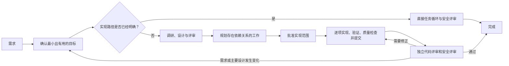

# codex-workflows

[](https://developers.openai.com/codex/cli)
[](https://developers.openai.com/codex/skills/)
[](https://opensource.org/licenses/MIT)

[English](README.md) | **简体中文** | [日本語](README.ja.md) | [Español](README.es.md) | [한국어](README.ko.md) | [Português (Brasil)](README.pt-BR.md)

面对规模较大的产品开发，Codex有时会为了技术上的一致性，把事情做得比用户真正需要的更多。穷尽所有边界情况、让每条路径都得到确定结果，看似严谨，却可能在既定目标并不要求的地方改变用户实际看到的行为。

codex-workflows把工作限制在“已确认的最小目标”之内。它先明确哪些用户可见行为允许改变、哪些绝不能动，并要求在结束前拿出验证依据。在这些边界内，Codex再结合仓库现状，选择容易回退的实现细节。

这些工作流以Agent Skills和自定义代理的形式安装到[OpenAI Codex CLI](https://developers.openai.com/codex/cli)中。主Codex会话在设计前确认范围和大致成本，负责推进工作并处理评审意见，再将获批的工作一路推进到实现和独立验证。

---

## 为什么不直接使用Codex？

如果只是范围明确的修复、一次性实验或临时脚本，直接使用Codex更合适。当预期结果和安全的实现边界已经很清楚时，这样更快，成本也更低。

如果技术选择可能改变产品范围、用户可见行为，或者某项决策需要跨上下文长期保留，就适合使用codex-workflows。

比如，“扩展现有认证流程”这项需求，可能逐渐演变成第二套认证机制、更宽泛的校验和新的响应约定。前端可以跟着适配，测试也都能通过，但用户最终得到的行为却从未经过确认。

codex-workflows会在整个执行过程中约束这种范围膨胀：

| 控制点 | 带来的变化 |
|---|---|
| 范围 | 工作流会对照预期结果、明确排除项、现有代码和大致实现成本来检查需求。投入与收益不相称的工作，会在演变成架构设计之前被删掉。 |
| 阶段门槛 | 需求、设计和计划的产出必须先通过检查，才能授权下一阶段。新代理直接读取已经批准的决策和所需依据，无须从一段很长的对话中重新猜测意图。 |
| 执行 | 实现范围获批后，Codex会自主完成整组任务。每项任务都要通过针对性验证和仓库要求的检查，之后才会提交实现。 |
| 完成 | 独立的代码评审和安全评审会确认最终改动未超出已批准范围，且不存在重大问题。必须修复的问题会回到同一套实现与质量流程。 |

与直接执行相比，这套工作流会调用更多代理、消耗更多token。只有当保护既定目标值得这笔成本时，才需要使用它。

Codex能处理某个边界情况，并不代表这项工作就有必要做。额外校验、确定性行为或新的抽象层，必须是为了保护已批准的需求或可观测契约，或者处理已经证实的故障。

### 一次真实的工作流运行

[mcp-image中的BytePlus Seedream提供商集成](https://github.com/shinpr/mcp-image/pull/114)跨18个文件加入了第三家外部图像服务。8项计划任务在逐步完善提供商特有实现的同时，始终没有改变公开的MCP请求、客户端、文件保存和文件URI契约。

合并前针对真实服务的评估确定了最终的模型路由、提示词上限、超时和响应处理方式。独立评审还发现了无上限文件读取、绕过校验、会阻塞的FIFO路径，以及API密钥规范化不一致等问题。这四项问题全部得到修复，PR最终通过了19个文件中的303项测试，以及一次不重试的真实服务调用。8项任务和4次修复从头到尾都没有改变已经批准的公开契约。

---

## 快速开始

需要Node.js 22或更高版本，以及最新的[Codex CLI](https://developers.openai.com/codex/cli)。

### 安装并运行

```bash
cd your-project
npx codex-workflows install
```

然后在Codex CLI中调用一个工作流：

```
$recipe-implement 使用JWT添加用户认证
```

`$`表示显式调用一项技能。输入`$recipe-`即可查看可用工作流。

### 选择合适的入口

| 你的目标 | 从这里开始 |
|---|---|
| 完整交付后端、API、CLI或一般改动 | `$recipe-implement` |
| 先完成设计，稍后再实现 | `$recipe-design` → `$recipe-plan` → `$recipe-build` |
| 设计并实现React / TypeScript Web前端 | `$recipe-front-design` → `$recipe-front-plan` → `$recipe-front-build` |
| 同时交付后端和React前端改动 | `$recipe-fullstack-implement` |
| 按照设计评审实现 | `$recipe-review` 或 `$recipe-front-review` |
| 定义或更新仓库专属评审规则 | `$recipe-quality-profile` |
| 调查问题但不修改代码 | `$recipe-diagnose` |
| 做一次性实验或临时脚本 | 直接使用Codex |

---

## 工作原理



决定采用哪条路径的，是互相独立的产品和设计决策数量，而不是文件数量，也不是Codex能找出多少边界情况。

| 规模 | 改动所需条件 | 执行方式 |
|------|--------------|----------|
| 小 | 一个目标，并且能在系统的某一部分沿用现有模式 | 确认任务 → 实现 → 质量和安全检查 |
| 中 | 一个目标，但需要系统多个部分相互配合，或需要作出长期保留的设计决策 | 已评审的Design Doc，必要时补充UI Spec / ADR → 选定集成/E2E验证 → 已评审的Work Plan → 自主任务循环 → 最终验证 |
| 大 | 多个目标，并且各自需要设计决策 | 已评审的PRD和Design Doc，必要时补充UI Spec / ADR → 选定集成/E2E验证 → 已评审的Work Plan → 自主任务循环 → 最终验证 |

只有当前范围中存在一项需要长期保留的选择，并且至少有两个实质不同的方案时，才会创建ADR。若有多项选择符合条件，会集中评审这些ADR。只有成本更低的测试无法证明所需交互时，才会选择集成或E2E测试。有些改动两者都不需要。

只有会影响产品或仓库实现的决策，才会写进需要长期保留的项目文档。第三方审批、生产环境权限、发布操作和无关的运维工作，不会变成实现阶段的门槛。

实现范围获批后，编排器会执行任务、针对性验证、适用的仓库检查，并为每项任务生成一次实现提交。遇到问题时，它会优先根据已批准的文档和仓库证据自行解决。用户可见行为始终是产品边界，不能为了内部一致性而由实现擅自调整。只有当继续推进需要新增产品需求、改变已批准的主要设计决策、使用只有你拥有的权限，或执行未经授权且无法撤销的操作时，编排器才会询问你。

专业代理只会收到为各自工作明确指定的文档和路径。它们负责提供与任务直接相关的依据，但无权扩大已经批准的目标。

### 如何让决策在新上下文中继续生效

将上下文分开，可以避免调研、设计、实现和评审在不知不觉间共享未经说明的前提。内置的[Work Plan模板](.agents/skills/documentation-criteria/references/plan-template.md)会把每项实现任务关联到Design Doc中的对应章节和验收标准：

```markdown
### P1-T1: 保持错误响应契约不变

- **来源**: `docs/design/example-design.md`，API契约，AC-2
- **范围**: 更新仓库实现及对应的针对性测试
- **依赖**: 无
- **验证**: 运行契约测试，确认响应结构符合文档
```

[Task File Contract](.agents/skills/llm-friendly-context/references/task-template.md)会把来源、预期结果、目标文件和可执行的验证方法传递到实现阶段。只有在测试可能通过、却没有证明某项关键行为时，才会增加`Verification Focus`。任务执行完毕后，完整改动必须在提交前通过适用的仓库检查。最终评审者会将完成的代码与已批准文档逐项对照，同时检查是否存在超出批准范围的实现或重大的代码质量问题。接受修正后，下一轮评审只聚焦于可能受该修正影响的检查项。运行`$recipe-quality-profile`，可根据仓库中的依据，在`docs/project-context/quality.yaml`中定义额外的专属评审规则。

---

## 安装

### 环境要求

- 最新版[Codex CLI](https://developers.openai.com/codex/cli)
- Node.js 22或更高版本

### 安装方式

安装到当前项目：

```bash
cd your-project
npx codex-workflows install
```

以下内容会被复制到项目中：

- `.agents/skills/`：Codex技能（基础技能和工作流）
- `.codex/agents/`：子代理TOML定义
- 用于跟踪托管文件的清单

如果希望所有项目都能使用这些工作流，请改为安装到用户级`CODEX_HOME`：

```bash
npx codex-workflows install --user
```

技能会安装到`$CODEX_HOME/skills/`，代理会安装到`$CODEX_HOME/agents/`。未设置`CODEX_HOME`时，默认使用`~/.codex`。

### 更新

```bash
# 预览变更
npx codex-workflows update --dry-run

# 应用更新
npx codex-workflows update

# 更新用户级安装
npx codex-workflows update --user
```

更新程序会保留你在本地修改过的文件。它会把每个文件与安装时的哈希值进行比较，并跳过已经改动的文件。带版本的更新历史会按顺序处理文件移动和删除，因此本地修改也会跟随文件移动到新路径。已修改但被移除且没有替代文件的内容，会转移到`.codex-workflows-preserved/<version>/`。新增文件则会自动加入。

```bash
# 查看已安装版本
npx codex-workflows status

# 查看用户级安装状态
npx codex-workflows status --user
```

---

## 工作流参考

在Codex中使用`$recipe-name`调用工作流。输入`$recipe-`并使用Tab补全，可以查看所有可用选项。

<details>
<summary>查看全部工作流入口</summary>

### 后端与通用开发

| 工作流 | 功能 | 适用场景 |
|--------|------|----------|
| `$recipe-implement` | 完整生命周期，并根据层次分流（后端/前端/全栈） | 新功能（通用入口） |
| `$recipe-task` | 单项任务，并自动选择规则 | 修复缺陷、小改动 |
| `$recipe-design` | 需求 → 根据规模选择产品和设计文档 | 产品与架构设计 |
| `$recipe-plan` | Design Doc → 按需生成集成/E2E测试骨架 → Work Plan | 根据已批准的Design Doc制定计划 |
| `$recipe-prepare-implementation` | 准备已批准Work Plan所需的现有仓库内工具 | 明确要求准备环境，或任务所需能力不可用 |
| `$recipe-build` | 执行后端任务，并在各步骤之间验证 | 继续后端实现 |
| `$recipe-review` | 评审实现范围、Design Doc符合性、代码质量和安全性，并应用用户批准的修正 | 实现后检查 |
| `$recipe-quality-profile` | 在`docs/project-context/quality.yaml`中定义或更新仓库专属评审规则 | 设置和维护评审策略 |
| `$recipe-diagnose` | 调查问题 → 验证故障点 → 提出解决方案 | 缺陷调查 |
| `$recipe-reverse-engineer` | 从现有代码生成PRD和Design Doc | 遗留系统文档化 |
| `$recipe-add-integration-tests` | 根据Design Doc添加集成/E2E测试 | 为现有代码补充测试 |
| `$recipe-update-doc` | 评审并更新已有Design Doc / PRD / ADR | 规格变更、文档维护 |

### 前端（React/TypeScript）

| 工作流 | 功能 | 适用场景 |
|--------|------|----------|
| `$recipe-front-design` | 需求 → 根据规模选择UI和设计文档 | 前端产品与架构设计 |
| `$recipe-front-adjust` | 根据仓库、已有资料或必要外部依据进行针对性UI调整 | 实现后的局部UI修改 |
| `$recipe-front-plan` | 前端Design Doc → 按需生成集成/E2E测试骨架 → Work Plan | 前端规划阶段 |
| `$recipe-front-build` | 执行前端任务，并进行针对性验证和质量检查 | 继续前端实现 |
| `$recipe-front-review` | 评审前端范围、符合性、代码质量和安全性，并应用用户批准的React修正 | 前端实现后检查 |

### 全栈（跨层）

| 工作流 | 功能 | 适用场景 |
|--------|------|----------|
| `$recipe-fullstack-implement` | 完整生命周期，每一层使用独立Design Doc | 跨层功能 |
| `$recipe-fullstack-build` | 根据层次把任务交给对应代理执行 | 继续全栈实现 |

</details>

## 工作状态

工作流使用`docs/plans/`存放临时状态，包括Work Plan、实现Task File，以及临时的评审修复或测试补充Task File。每次实现提交通过质量检查后，这里会更新任务和阶段进度，但这些进度文件不会进入实现提交。除非团队希望评审这些临时文件，否则请把该目录加入项目的`.gitignore`：

```gitignore
docs/plans/
```

PRD、ADR、UI Spec和Design Doc属于需要长期保存的项目文档，应当提交。

---

## 内置指导原则

工作流会自动加载当前任务所需、并且了解仓库约定的指导原则。通常不需要手动选择这些技能。

<details>
<summary>查看基础技能</summary>

| 技能 | 提供的能力 |
|------|------------|
| `coding-rules` | 代码质量、函数设计、错误处理、重构 |
| `testing` | 与任务规模相称的TDD、可观测验证方式选择、测试完整性和仓库规定的检查 |
| `ai-development-guide` | 基于证据的根因分析、合理的影响评估和适用的质量保证 |
| `reviewee-judgment` | 在评审意见转化为修改工作前，先根据证据进行判断 |
| `documentation-criteria` | 文档创建规则和模板（PRD、ADR、Design Doc、Work Plan） |
| `requirement-convergence` | 在设计前明确目标、需求层次、用户决定的排除项和大致成本 |
| `implementation-approach` | 直接MVP、有依据的扩展、删减、切分和验证边界 |
| `integration-e2e-testing` | 只选择和设计能够证明必要真实交互的集成/E2E测试 |
| `external-resource-context` | 针对当前决策，只查找并确认所需的一项外部依据 |
| `llm-friendly-context` | 供后续代理使用的清晰提示、交接内容、生成文档、Task File和评审意见 |
| `task-analyzer` | 分析任务意图、任务分类和技能选择 |
| `subagents-orchestration-guide` | 多代理协调、工作流推进和按既定指引自主执行 |

另有面向Web前端TypeScript（包括React应用）的参考资料：`coding-rules/references/typescript.md`和`testing/references/typescript.md`。这些内容不适用于后端TypeScript。

</details>

---

## 专业代理

执行工作流时，Codex会按需启动以下代理。你无须事先掌握这些角色：工作流会把不同领域的任务交给对应代理，编排器继续掌控整体流程。每个代理都有独立上下文、专业指令和明确列出的必需技能。

<details>
<summary>查看全部专业代理角色</summary>

### 文档创建代理

| 代理 | 职责 |
|------|------|
| `requirement-analyzer` | 整理需求中的关键信号，以及支持编排器判断范围和成本的仓库证据 |
| `prd-creator` | 创建并组织PRD |
| `technical-designer` | 创建完整ADR批次或Design Doc（后端/通用） |
| `technical-designer-frontend` | 创建完整的前端ADR批次或Design Doc（React） |
| `ui-spec-designer` | 根据PRD和可选原型代码创建UI Specification |
| `codebase-analyzer` | 从仓库中提取技术决策、精简设计和验证所需的关键信息 |
| `ui-analyzer` | 从外部资源（设计工具、设计系统文档、线上UI）和前端代码中整理UI事实 |
| `work-planner` | 根据Design Doc创建Work Plan |
| `document-reviewer` | 按照上层需求和设计决策评审文档 |
| `design-sync` | 验证不同文档之间的一致性 |

### 实现代理

| 代理 | 职责 |
|------|------|
| `task-decomposer` | 将Work Plan拆成数量最少、可以执行的Task File |
| `task-executor` | 根据Task File实现并完成针对性验证（后端） |
| `task-executor-frontend` | 实现React改动，并完成适用的行为型RTL验证 |
| `quality-fixer` | 执行适用的仓库检查，修复范围内的质量问题（后端） |
| `quality-fixer-frontend` | 执行并修复适用的React、TypeScript、RTL和打包检查 |
| `acceptance-test-generator` | 生成已选定的集成/E2E测试骨架 |
| `integration-test-reviewer` | 评审测试质量 |

### 分析代理

| 代理 | 职责 |
|------|------|
| `code-reviewer` | 对照批准范围和约束文档检查最终实现，并指出重大的代码质量问题 |
| `code-verifier` | 验证文档与代码的一致性 |
| `security-reviewer` | 实现后进行安全符合性评审 |
| `rule-advisor` | 为不受现有工作流管理的独立任务选择技能 |
| `scope-discoverer` | 为逆向文档发现代码库范围，并整理PRD单元 |
| `technical-spike` | 在有限范围内验证一项可能影响设计决策的效果或成本 |

### 诊断代理

| 代理 | 职责 |
|------|------|
| `investigator` | 收集证据、梳理路径并发现故障点 |
| `verifier` | 验证路径覆盖，并独立评估故障点 |
| `solver` | 权衡取舍，推导解决方案 |

</details>

---

## 项目结构

安装后，项目中会增加以下内容：

<details>
<summary>查看安装后的目录结构</summary>

```
your-project/
├── .agents/skills/           # Codex技能
│   ├── coding-rules/         # 基础指导原则
│   ├── testing/
│   ├── ai-development-guide/
│   ├── reviewee-judgment/
│   ├── documentation-criteria/
│   ├── requirement-convergence/
│   ├── implementation-approach/
│   ├── integration-e2e-testing/
│   ├── external-resource-context/
│   ├── llm-friendly-context/
│   ├── task-analyzer/
│   ├── subagents-orchestration-guide/
│   └── recipe-*/             # 工作流入口（$recipe-*）
├── .codex/agents/            # 子代理TOML定义
│   ├── requirement-analyzer.toml
│   ├── technical-designer.toml
│   ├── ui-analyzer.toml
│   ├── task-executor.toml
│   └── ...（共26个代理）
└── docs/                     # 使用工作流时创建
    ├── prd/
    ├── design/
    ├── adr/
    ├── ui-spec/
    └── plans/
        └── tasks/
```

</details>

---

## 配套工具

产品想法还需要进一步探索或验证时，可以用[Nautilus](https://github.com/shinpr/nautilus)检验相关假设，并将结果整理成PRD。PRD获批后，可将其交给`$recipe-implement`或`$recipe-design`。

如果需求已经记录在Linear或现有PRD中，[linear-prism](https://github.com/shinpr/linear-prism)可以结合代码库，将工作拆成可直接实施的Linear任务，并明确任务之间的依赖关系。获批的任务可作为`$recipe-design`的输入。

---

## 常见问题

**问：支持哪些模型？**

答：本项目面向当前的GPT模型设计。每个代理使用的模型都可以在TOML文件中配置。

**问：可以自定义代理吗？**

答：可以。编辑`.codex/agents/`中的TOML文件，即可修改`model`、`sandbox_mode`或`developer_instructions`。每个代理所需的技能都列在`developer_instructions`中。本地修改过的文件会在运行`npx codex-workflows update`时保留。

如果采用用户级安装，请编辑`$CODEX_HOME/agents/`中的文件，并使用`npx codex-workflows update --user`。安装后修改的用户级文件也会以同样方式保留。

**问：`$recipe-implement`和`$recipe-fullstack-implement`有什么区别？**

答：`$recipe-implement`是通用入口。它会先运行requirement-analyzer，根据需求和仓库范围判断受影响的层，再自动进入后端、前端或全栈流程。`$recipe-fullstack-implement`跳过判断，直接进入全栈流程（每层单独的Design Doc、design-sync，以及按层分配任务）。如果不确定该走哪条路径，请使用`$recipe-implement`；如果一开始就知道功能横跨前后端，请使用`$recipe-fullstack-implement`。

**问：能与MCP服务器一起使用吗？**

答：可以。Codex技能和子代理可以与[MCP](https://developers.openai.com/codex/mcp)同时使用。技能位于指令层，MCP位于工具传输层。代理TOML没有设置`mcp_servers`时，自定义代理会继承父级的`mcp_servers`；只有代理需要专属服务器或工具过滤时，才需要添加代理级MCP配置。

**问：它与claude-code-workflows有什么关系？**

答：[claude-code-workflows](https://github.com/shinpr/claude-code-workflows)是面向Claude Code的对应项目。两个仓库采用相同的工作流理念，再针对各自工具原生的扩展方式进行适配。它们可以安装在同一项目中，因为codex-workflows把代理定义放在`.codex/agents/`，Claude Code则使用自己的`.claude/`目录。

**问：子代理似乎卡住了怎么办？**

答：主Codex会话负责推进工作。它会检查返回的证据，对无法使用的结果重新尝试或修正，同时继续不受影响的其他工作。单个子代理的结果本身不会让整个工作流停止。

---

## 设计思路

<details>
<summary>了解工作流设计背后的资料</summary>

- [Why LLMs Are Bad at 'First Try' and Great at Verification](https://www.norsica.jp/blog/llm-verification-over-generation)：为什么面对复杂工作，评审循环和会话隔离比一次生成更可靠
- [When Better Models Make Old Agent Workflows Worse](https://www.norsica.jp/blog/when-better-models-make-old-agent-workflows-worse)：为什么工作流约束应保护边界和证据，而不是规定模型内部必须走哪条路径
- [Reasoning Effort Is Not a Quality Setting](https://www.norsica.jp/blog/reasoning-effort-is-not-a-quality-setting)：为什么只有当前阶段有能力筛选并放弃额外工作时，更广泛的技术探索才有价值
- [Stop Putting Everything in AGENTS.md](https://www.norsica.jp/blog/stop-putting-everything-in-agents-md)：为什么`AGENTS.md`应保持精简，而规则、文档和任务说明应靠近实际使用位置

</details>

---

## 许可证

MIT License。可自由使用、修改和分发。

---

由[@shinpr](https://github.com/shinpr)开发并维护。
