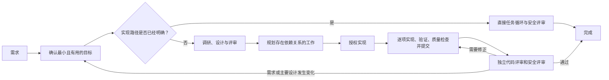

# codex-workflows

[](https://developers.openai.com/codex/cli)
[](https://developers.openai.com/codex/skills/)
[](https://opensource.org/licenses/MIT)

[English](README.md) | **简体中文** | [日本語](README.ja.md) | [Español](README.es.md) | [한국어](README.ko.md) | [Português (Brasil)](README.pt-BR.md)

面对规模较大的产品开发，Codex有时会为了技术上的一致性，把事情做得比用户真正需要的更多。穷尽所有边界情况、让每条路径都得到确定结果，可能在既定目标并不要求的地方改变用户实际看到的行为。

codex-workflows把工作限制在“已确认的最小目标”之内。它先明确哪些用户可见行为允许改变、哪些绝不能动，并要求在结束前拿出验证依据。在这些边界内，Codex再结合仓库现状，选择容易回退的实现细节。

这些工作流以Agent Skills和自定义代理的形式安装到[OpenAI Codex CLI](https://developers.openai.com/codex/cli)中。主Codex会话在设计前确认范围和大致成本，负责推进工作并处理评审意见，再将获批的工作一路推进到实现和独立验证。

---

## 为什么不直接使用Codex？

如果只是范围明确的修复、一次性实验或临时脚本，直接使用Codex更合适。当预期结果和安全的实现边界已经很清楚时，这样更快，成本也更低。

如果技术选择可能改变产品范围、用户可见行为，或者某项决策需要跨上下文长期保留，就适合使用codex-workflows。

比如，“扩展现有认证流程”这项需求，可能逐渐演变成第二套认证机制、更宽泛的校验和新的响应约定。前端可以跟着适配，测试也都能通过，但用户最终得到的行为却从未经过确认。

codex-workflows会在整个执行过程中约束这种范围膨胀：

| 控制点 | 带来的变化 |
|---|---|
| 范围 | 工作流会对照预期结果、明确排除项、现有代码和大致实现成本来检查需求。投入与收益不相称的工作，会在演变成架构设计之前被删掉；万一还是进来了，之后也会砍掉。 |
| 阶段门槛 | 需求、设计和计划的产出必须先通过检查，才能授权下一阶段。新代理直接读取已经批准的决策和所需依据，无须从一段很长的对话中重新猜测意图。 |
| 执行 | 你授权实现之后，Codex会自主完成整组任务。每项任务都要通过针对性验证和仓库要求的检查，之后才会提交实现。 |
| 完成 | 独立的代码评审和安全评审会确认最终改动未超出已批准范围，且不存在重大问题。必须修复的问题会回到同一套实现与质量流程。 |

与直接执行相比，这套工作流会调用更多代理、消耗更多token。只有当保护既定目标值得这笔成本时，才需要使用它。如果某项改动用不着全部检查，可以用[轻量模式](#轻量模式)少做一些检查。

Codex能处理某个边界情况，并不代表这项工作就有必要做。额外校验、确定性行为或新的抽象层，必须是为了保护已批准的需求或可观测契约，或者处理已经证实的故障。反过来也一样：如果某个设计决策最后超出了目标所需，工作流会将其删除，而不会仅仅因为它已经写进文档就继续保留。

### 一次真实的工作流运行

[mcp-image中的BytePlus Seedream提供商集成](https://github.com/shinpr/mcp-image/pull/114)跨18个文件加入了第三家外部图像服务。8项计划任务在逐步完善提供商特有实现的同时，始终没有改变公开的MCP请求、客户端、文件保存和文件URI契约。

合并前针对真实服务的评估确定了最终的模型路由、提示词上限、超时和响应处理方式。独立评审还发现了无上限文件读取、绕过校验、会阻塞的FIFO路径，以及API密钥规范化不一致等问题。这四项问题全部得到修复，PR最终通过了19个文件中的303项测试，以及一次不重试的真实服务调用。8项任务和4次修复从头到尾都没有改变已经批准的公开契约。

---

## 快速开始

需要Node.js 22或更高版本，以及最新的[Codex CLI](https://developers.openai.com/codex/cli)。

### 安装并运行

```bash
cd your-project
npx codex-workflows install
```

然后在Codex CLI中调用一个工作流：

```
$recipe-implement 使用JWT添加用户认证
```

`$`表示显式调用一项技能。输入`$recipe-`即可查看可用工作流。

### 选择合适的入口

| 你的目标 | 从这里开始 |
|---|---|
| 端到端交付改动，由工作流自动选择后端、前端或全栈路径 | `$recipe-implement` |
| 先完成设计，稍后再实现 | `$recipe-design` → `$recipe-plan` → `$recipe-build` |
| 设计并实现React / TypeScript Web前端 | `$recipe-front-design` → `$recipe-front-plan` → `$recipe-front-build` |
| 直接进入后端与React前端分别设计的流程 | `$recipe-fullstack-implement` |
| 按照设计评审实现 | `$recipe-review` 或 `$recipe-front-review` |
| 定义或更新仓库专属质量规则 | `$recipe-quality-profile` |
| 调查问题但不修改代码 | `$recipe-diagnose` |
| 做一次性实验或临时脚本 | 直接使用Codex |

---

## 工作原理


```mermaid
flowchart LR
    A[需求] --> B[确认最小且有用的目标]
    B --> C{实现路径是否已经明确？}
    C -->|是| S[直接任务循环与安全评审]
    S --> L[完成]
    C -->|否| D[调研、设计与评审]
    D --> E[规划存在依赖关系的工作]
    E --> F[授权实现]
    F --> H[逐项实现、验证、质量检查并提交]
    H --> K[独立代码评审和安全评审]
    K -->|需要修正| H
    K -->|需求或主要设计发生变化| B
    K -->|通过| L[完成]
```

决定采用哪条路径的，是互相独立的产品和设计决策数量，而不是文件数量，也不是Codex能找出多少边界情况。

只有一个目标、且能在系统某一部分沿用现有模式的改动，会直接进入已确认的任务，再进行实现以及质量和安全检查。需要系统多个部分相互配合，或需要作出长期保留的设计决策的改动，会先产出已评审的Design Doc和Work Plan；某项决策需要时，还会补充UI Spec或ADR。改动包含多个目标且各自需要设计决策时，还会加上PRD，除非你选择省略。只有当某项需要长期保留的选择至少有两个实质不同的方案时，才会创建ADR；只有成本更低的测试无法证明所需交互时，才会选择集成或E2E测试。

实现获得授权后，主会话会执行任务、针对性验证、适用的仓库检查，并为每项任务生成一次实现提交。遇到问题时，它会优先根据已批准的文档和仓库证据自行解决。用户可见行为始终是产品边界，不能为了内部一致性而由实现擅自调整。只有当继续推进需要新增产品需求、改动你提出过或排除过的内容、使用只有你拥有的权限，或执行未经授权且无法撤销的操作时，主会话才会询问你。找到能实现相同结果的更精简方案不属于需要询问的情况，已经给过的许可也不会再次确认。工作流不会把第三方审批、生产环境权限或发布操作加为完成实现的条件。

### 轻量模式

```
$recipe-implement 轻量模式。为报表页面添加可排序表格
```

在任意工作流的请求中说明使用轻量模式即可。阶段和需要你确认的节点不变，只是Codex会少做一些检查：不再对照仓库或其他Design Doc检查Design Doc，也会跳过安全评审。仓库检查改为在最后一项任务完成后统一运行一次，不再在每次提交前运行；最终的代码评审照常进行。在你让Codex停用之前，轻量模式会在本次会话中一直生效。

---

## 安装

### 安装方式

安装到当前项目：

```bash
cd your-project
npx codex-workflows install
```

以下内容会被复制到项目中：

- `.agents/skills/`：Codex技能（基础技能和工作流）
- `.codex/agents/`：子代理TOML定义
- 用于跟踪托管文件的清单

如果希望所有项目都能使用这些工作流，请改为安装到用户级`CODEX_HOME`：

```bash
npx codex-workflows install --user
```

技能会安装到`$CODEX_HOME/skills/`，代理会安装到`$CODEX_HOME/agents/`。未设置`CODEX_HOME`时，默认使用`~/.codex`。

### 自定义代理

代理定义都是普通的TOML文件。项目级安装请编辑`.codex/agents/`中的文件；用户级安装请编辑`$CODEX_HOME/agents/`中的文件。你可以修改`model`、`sandbox_mode`或`developer_instructions`。按照下文说明，更新程序会保留已编辑的文件。

### 更新

```bash
# 预览变更
npx codex-workflows update --dry-run

# 应用更新
npx codex-workflows update

# 更新用户级安装
npx codex-workflows update --user
```

更新程序会保留你在本地修改过的文件。它会把每个文件与安装时的哈希值进行比较，并跳过已经改动的文件。更新移动文件时，你的本地修改也会随之移到新路径。已修改但被移除且没有替代文件的内容，会转移到`.codex-workflows-preserved/<version>/`。新增文件则会自动加入。

```bash
# 查看已安装版本
npx codex-workflows status

# 查看用户级安装状态
npx codex-workflows status --user
```

如需卸载，请运行`npx codex-workflows uninstall`（用户级安装需加上`--user`）。你在本地修改过的文件不会被删除。

---

## 工作流参考

在Codex中使用`$recipe-name`调用工作流。输入`$recipe-`并使用Tab补全，可以查看所有可用选项。

<details>
<summary>查看全部工作流入口</summary>

### 后端与通用开发

| 工作流 | 功能 | 适用场景 |
|--------|------|----------|
| `$recipe-implement` | 完整生命周期，并根据层次分流（后端/前端/全栈） | 新功能（通用入口） |
| `$recipe-design` | 需求 → 根据规模选择产品和设计文档 | 产品与架构设计 |
| `$recipe-plan` | Design Doc → 按需生成集成/E2E测试骨架 → Work Plan | 根据已批准的Design Doc制定计划 |
| `$recipe-prepare-implementation` | 准备已批准Work Plan所需的现有仓库内工具 | 明确要求准备环境，或任务所需能力不可用 |
| `$recipe-build` | 执行后端任务，并在各步骤之间验证 | 继续后端实现 |
| `$recipe-review` | 评审实现范围、Design Doc符合性、代码质量和安全性，并应用用户批准的修正 | 实现后检查 |
| `$recipe-quality-profile` | 在`docs/project-context/quality.yaml`中定义或更新仓库专属质量规则 | 设置和维护质量规则 |
| `$recipe-diagnose` | 调查问题 → 验证故障点 → 提出解决方案 | 缺陷调查 |
| `$recipe-reverse-engineer` | 从现有代码生成PRD和Design Doc | 遗留系统文档化 |
| `$recipe-add-integration-tests` | 根据Design Doc添加集成/E2E测试 | 为现有代码补充测试 |
| `$recipe-update-doc` | 评审并更新已有Design Doc / PRD / ADR | 规格变更、文档维护 |

### 前端（React/TypeScript）

| 工作流 | 功能 | 适用场景 |
|--------|------|----------|
| `$recipe-front-design` | 需求 → 根据规模选择UI和设计文档 | 前端产品与架构设计 |
| `$recipe-front-adjust` | 根据仓库、已有资料或必要外部依据进行针对性UI调整 | 实现后的局部UI修改 |
| `$recipe-front-plan` | 前端Design Doc → 按需生成集成/E2E测试骨架 → Work Plan | 前端规划阶段 |
| `$recipe-front-build` | 执行前端任务，并进行针对性验证和质量检查 | 继续前端实现 |
| `$recipe-front-review` | 评审前端范围、符合性、代码质量和安全性，并应用用户批准的React修正 | 前端实现后检查 |

### 全栈（跨层）

| 工作流 | 功能 | 适用场景 |
|--------|------|----------|
| `$recipe-fullstack-implement` | 完整生命周期，每一层使用独立Design Doc | 跨层功能 |
| `$recipe-fullstack-build` | 根据层次把任务交给对应代理执行 | 继续全栈实现 |

</details>

## 工作状态

工作流使用`docs/plans/`存放临时状态，包括Work Plan、实现Task File，以及临时的评审修复或测试补充Task File。除非团队希望评审这些临时文件，否则请把该目录加入项目的`.gitignore`：

```gitignore
docs/plans/
```

PRD、ADR、UI Spec和Design Doc属于需要长期保存的项目文档，应当提交。

---

## 内置指导原则

不必调用工作流，也能用上这些指导原则。普通对话中 Codex 同样会加载它们，所以小的缺陷修复也会遵循和完整工作流相同的根因、范围和验证标准。

<details>
<summary>查看基础技能</summary>

| 技能 | 提供的能力 |
|------|------------|
| `coding-rules` | 代码质量、函数设计、错误处理、重构 |
| `testing` | 与任务规模相称的TDD、可观测验证方式选择、测试完整性和仓库规定的检查 |
| `ai-development-guide` | 基于证据的根因分析、合理的影响评估和适用的质量保证 |
| `reviewee-judgment` | 在评审意见转化为修改工作前，先根据证据进行判断 |
| `documentation-criteria` | 文档创建规则和模板（PRD、ADR、Design Doc、Work Plan） |
| `requirement-convergence` | 在设计前明确目标、需求层次、用户决定的排除项和大致成本 |
| `implementation-approach` | 直接MVP、有依据的扩展、删减、切分和验证边界 |
| `integration-e2e-testing` | 只选择和设计能够证明必要真实交互的集成/E2E测试 |
| `external-resource-context` | 针对当前决策，只查找并确认所需的一项外部依据 |
| `llm-friendly-context` | 供后续代理使用的清晰提示、交接内容、生成文档、Task File和评审意见 |
| `subagent-delegation` | 让子代理完成分配的工作，在需要决策时发起讨论 |
| `subagents-orchestration-guide` | 多代理协调、工作流推进和按既定指引自主执行 |

另有面向Web前端TypeScript（包括React应用）的参考资料：`coding-rules/references/typescript.md`和`testing/references/typescript.md`。这些内容不适用于后端TypeScript。

</details>

---

## 生态系统

[Nautilus](https://github.com/shinpr/nautilus)用于验证产品想法并产出PRD，[linear-prism](https://github.com/shinpr/linear-prism)则把已批准的需求整理成可直接实施的Linear任务。[claude-code-workflows](https://github.com/shinpr/claude-code-workflows)在Claude Code中采用同样的方法，并可与codex-workflows安装在同一项目中。[outcome-doctor](https://github.com/shinpr/agent-clinic)通过Jev检查Codex的实现方案相对目标是否过度或不足，需要TypeSafe API密钥。

### 想在这里用Astra？

整个工作流都用Astra跑，用量很快就会见底。[codex-subagent-playbook](https://github.com/shinpr/codex-subagent-playbook)是一个Codex插件，按子代理挑选模型，只在会改变结果的环节使用Astra。

<details>
<summary>设置（2步）</summary>

主Codex会话使用Sol，或使用reasoning effort设为low的Astra。哪些子代理用Astra、哪些用更便宜的模型，由插件的技能决定；实现交给Luna。

**1. 安装插件**

```bash
codex plugin marketplace add shinpr/codex-subagent-playbook
```

打开`/plugins`，找到**Subagent Playbook**并安装。

**2. 关闭本仓库的`subagent-delegation`技能**

本仓库和插件各自都带了委派技能，两者没有优先级之分。每个会话加载哪一个并不固定，也不会有任何提示或报错，因此每次运行的行为都可能不一样。打开`~/.codex/config.toml`，添加一条指向已安装的`subagent-delegation`技能的配置。

使用`--user`安装时：

```toml
[[skills.config]]
path = "/Users/you/.codex/skills/subagent-delegation/SKILL.md"
enabled = false
```

安装到项目时：

```toml
[[skills.config]]
path = "/absolute/path/to/your-project/.agents/skills/subagent-delegation/SKILL.md"
enabled = false
```

路径要写完整，这里不能用`~`或环境变量。

工作流的使用方式不变。技能会在需要时加载，每个任务都用合适的模型执行。

</details>

---

## 设计思路

<details>
<summary>了解工作流设计背后的资料</summary>

- [Why LLMs Are Bad at 'First Try' and Great at Verification](https://www.norsica.jp/blog/llm-verification-over-generation)：为什么面对复杂工作，评审循环和会话隔离比一次生成更可靠
- [When Better Models Make Old Agent Workflows Worse](https://www.norsica.jp/blog/when-better-models-make-old-agent-workflows-worse)：为什么工作流约束应保护边界和证据，而不是规定模型内部必须走哪条路径
- [Reasoning Effort Is Not a Quality Setting](https://www.norsica.jp/blog/reasoning-effort-is-not-a-quality-setting)：为什么只有当前阶段有能力筛选并放弃额外工作时，更广泛的技术探索才有价值
- [Stop Putting Everything in AGENTS.md](https://www.norsica.jp/blog/stop-putting-everything-in-agents-md)：为什么`AGENTS.md`应保持精简，而规则、文档和任务说明应靠近实际使用位置

</details>

---

## 许可证

MIT License。可自由使用、修改和分发。

---

由[@shinpr](https://github.com/shinpr)开发并维护。
